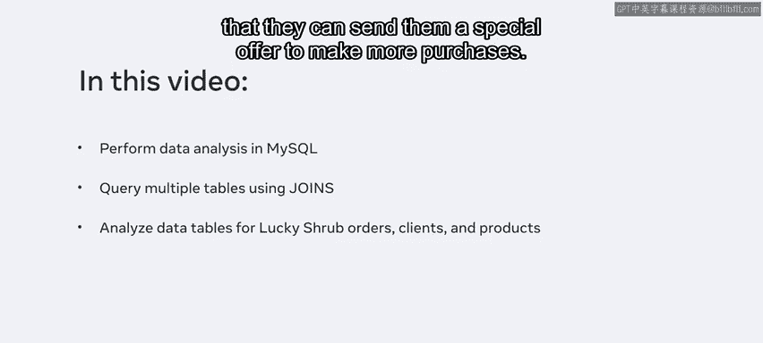
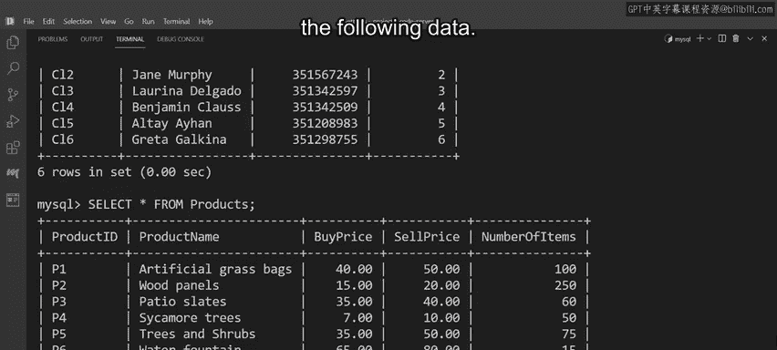

# 数据库工程师：P132：使用联接从多个表中提取数据 📊

在本节课中，我们将学习如何使用SQL的`JOIN`操作，从多个数据库表中提取和整合数据。我们将通过一个具体的商业案例，演示如何编写查询来满足复杂的业务需求。

在上一模块中，我们已经熟悉了数据分析的基本流程及其如何指导决策。本节中，我们来看看如何在MySQL中通过联接多个表来执行实际的数据分析。

## 业务场景概述

Lucky Shrub公司需要识别出所有在2020年9月5日之后，购买了特定产品线10件或以上商品的客户，以便向他们发送特别优惠，鼓励再次购买。同时，为了确保所有优惠都能被兑换，该产品当前库存必须至少有50件。

## 数据库表结构



以下是包含所需数据的三个数据库表：

*   **`orders` 表**：包含每笔订单的信息。
*   **`clients` 表**：包含每位客户的关键信息。
*   **`products` 表**：存储商店中所有产品的数据。

## 构建查询语句



我们可以使用`INNER JOIN`来联接这些表，并提取以下目标数据：来自`clients`表的`ClientID`和`ContactNumber`列，来自`orders`表的`OrderID`、`Quantity`和`Date`列，以及来自`products`表的`NumberOfItems`列（我们将其重命名为`ItemsInStock`）。

让我们开始构建查询。首先使用`SELECT`语句，并通过点符号指定要从每个表中选取的列。

```sql
SELECT
    clients.ClientID,
    clients.ContactNumber,
    orders.OrderID,
    orders.Quantity,
    orders.Date,
    products.NumberOfItems AS ItemsInStock
```

接下来，使用`FROM`关键字指定`clients`表作为主表，然后使用`INNER JOIN`子句在括号内将其与`orders`表和`products`表联接起来。

```sql
FROM clients
INNER JOIN (orders, products)
```

第一个联接基于`clients`表和`orders`表中共有的`ClientID`列创建。第二个联接基于`orders`表和`products`表各自的`ProductID`列创建。

```sql
ON clients.ClientID = orders.ClientID
AND orders.ProductID = products.ProductID
```

现在，添加`WHERE`子句来设置我们的筛选条件。在括号内，声明以下三个条件：

1.  客户必须购买了10件或以上的商品。
2.  所有购买必须发生在2020年9月5日之后。
3.  该商品当前库存必须至少有50件。

```sql
WHERE (orders.Quantity >= 10)
AND (orders.Date > '2020-09-05')
AND (products.NumberOfItems >= 50);
```

最后，执行查询。MySQL将从相关表中提取符合条件的数据并显示在屏幕上。

## 查询结果与应用

通过执行上述数据分析，你成功地从Lucky Shrub数据库的三个表中整合了信息。利用这些结果数据，公司可以精准地识别出符合条件的目标客户，并向他们发送特别优惠。


本节课中，我们一起学习了如何使用`INNER JOIN`联接多个数据库表，并结合`WHERE`子句实现复杂条件的数据查询。这是进行跨表数据分析、支持业务决策的核心技能。