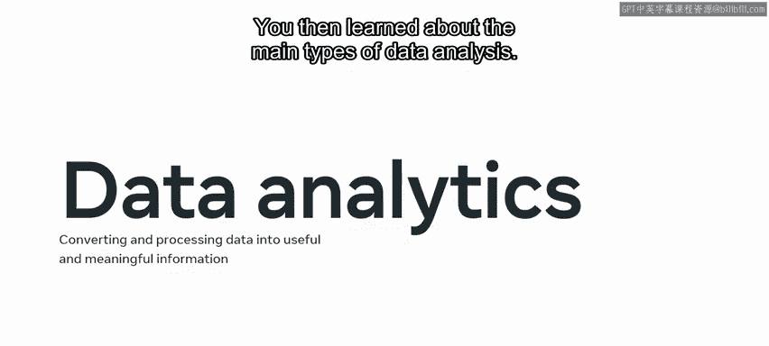
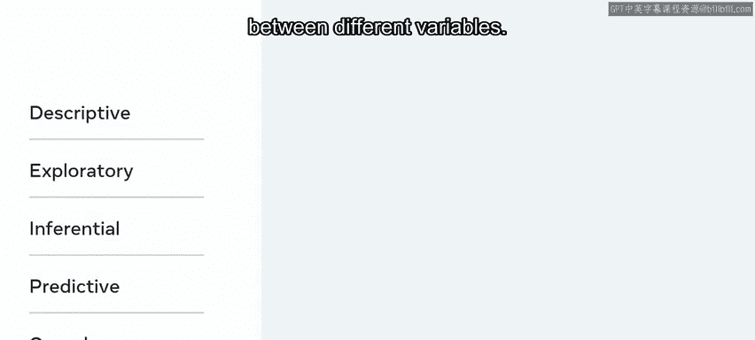
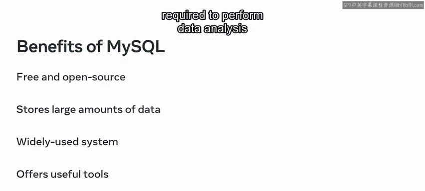
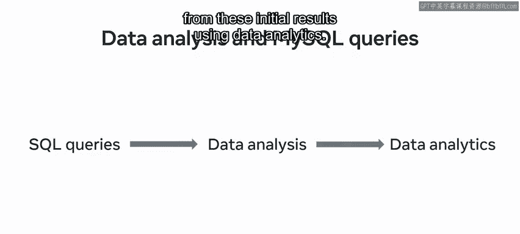
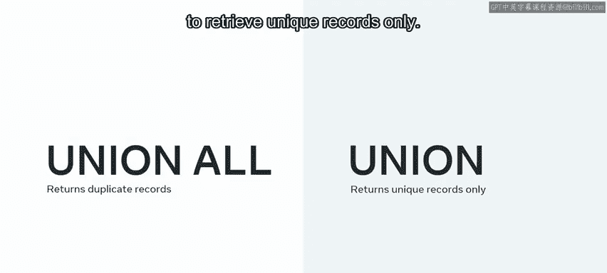
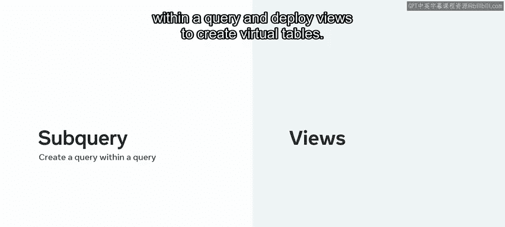
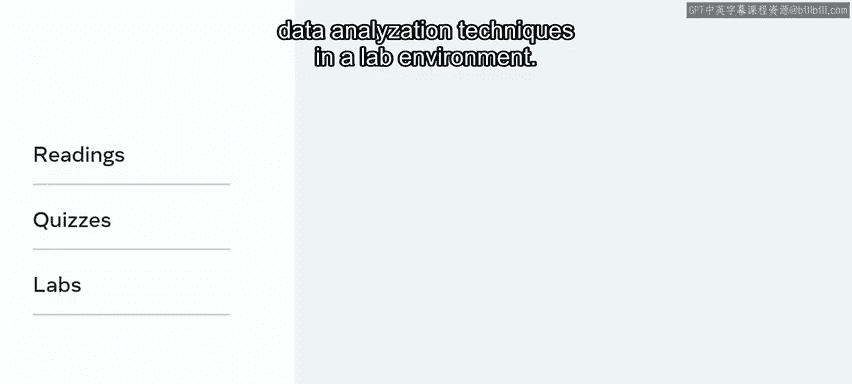

# 数据库工程师：模块三：MySQL数据分析模块小结 🎯

在本模块中，我们学习了如何评估MySQL在数据分析中的应用，并掌握了使用MySQL进行数据分析的核心技能。本节将对整个模块的关键知识点进行回顾和总结。

## 模块概述 📋

在模块三的课程中，我们主要探讨了MySQL在数据分析领域的角色与应用。我们首先学习了如何评估MySQL是否适合进行数据分析，然后深入实践了使用SQL查询进行数据分析的各种技术。

## 关键技能回顾

以下是你在本模块课程中获得的核心技能总结。

### 第一课：评估MySQL用于数据分析

在第一课中，你学习了如何评估MySQL用于数据分析。你现在能够解释，数据分析是通过将收集到的数据转换和处理成有用且有意义的信息，从而更进一步。这些信息随后被用来指导决策并对未来事件进行预测。

接着，你学习了数据分析的主要类型。以下是这些类型：

*   **描述性数据分析**：以描述性格式呈现数据。
*   **探索性数据分析**：用于建立不同变量之间的关系。
*   **推断性数据分析**：用于对更大的数据总体进行推断并得出一般性结论。
*   **预测性数据分析**：识别范式与模式。
*   **因果性数据分析**：探索不同变量之间关系的因果关系。

你还学习了使用MySQL作为数据库管理系统的优势，特别是在支持组织内决策者方面。MySQL的主要优势包括：

*   它是免费且开源的。
*   它能在关系系统中存储大量数据。
*   它在各种组织中广泛使用。
*   它为数据库工程师提供了对数据库中数据执行分析所需的工具。

同时，你也了解到MySQL在执行数据分析能力方面存在一些局限性。例如，它比其他一些工具功能稍弱，并且缺乏数据可视化工具。

### 第二课：在MySQL中执行数据分析

在第二课中，你学习了如何在MySQL中执行数据分析。完成本课后，你应该能够使用SQL查询执行基本的数据分析。在这个过程中，你使用一个或多个SQL查询从数据库中提取所需数据。这些SQL查询用于呈现数据分析结果的描述，并通过数据分析从这些初步结果中获得更深入的见解。

然后，我们探讨了可用于执行数据分析的不同类型的SQL查询。以下是核心操作：

*   你可以模拟**全外连接**，以在识别左右表匹配时返回两个表中的所有记录。这包括匹配的记录和不匹配的记录。
*   你还学习了可以使用 **`UNION ALL`** 运算符返回重复记录，或使用 **`UNION`** 运算符仅检索唯一记录。

然而，MySQL本身不支持全外连接，因此你必须使用左连接和右连接来模拟它。

你还可以使用函数来执行复杂的操作并返回不同的结果，并使用运算符过滤所需数据。以下是高级技术：

*   你可以利用**子查询**在一个查询中创建另一个查询。
*   你可以部署**视图**来创建虚拟表。

在学习这些课程的过程中，你还通过阅读材料加深了对主题的理解，在测验环境中测试了对优化技术的掌握程度，并在实验环境中展示了运用数据分析技术的能力。

## 总结 🏁

完成本模块后，你现在应该能够评估MySQL用于数据分析，并在MySQL中执行数据分析。出色的工作！我期待在下一模块中继续指导你学习。