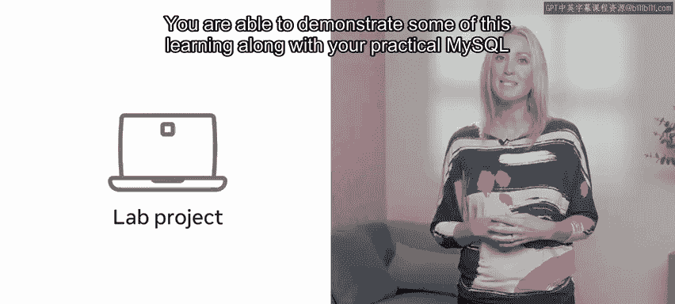
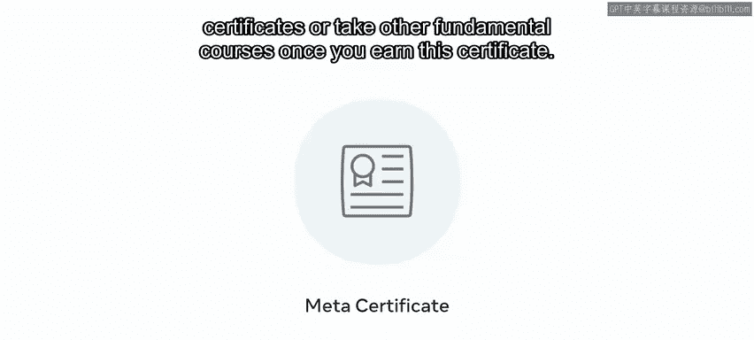

# Meta数据库工程师课程：P135：课程总结 🎉

在本节课中，我们将对Meta数据库工程师课程中关于MySQL的学习旅程进行总结，回顾已掌握的核心技能，并展望未来的学习路径。

---

你已经通过努力的学习到达了这里，并在此过程中掌握了许多新技能。你在MySQL的学习之旅中取得了巨大的进步，现在应该已经理解了MySQL中的高级主题。

你能够在实验项目中展示部分所学知识，以及你实用的MySQL技能集。现在，你应该能够在MySQL环境中部署函数和触发器，优化数据库，并使用SQL查询进行数据分析。随后的分级评估进一步检验了你对这些技能的掌握程度。

然而，你仍有更多知识需要学习。如果你觉得本课程有帮助并希望探索更多内容，那么为何不注册下一门课程呢？在每一门数据库工程师课程中，你都将持续发展你的技能集。

在最终的实验项目中，你将运用所学的一切知识，创建属于自己的功能完整的数据库系统。无论你是刚起步的技术专业人士、学生还是商业用户，课程结束时的项目都能证明你对数据库系统价值和能力的理解。

该实验通过实际应用来巩固你的能力。但实验还有另一个重要的益处：这意味着你将拥有一个可以放入作品集的、完全可操作的数据库。这可以向潜在雇主展示你的技能，不仅表明你积极主动且富有创新精神，也充分体现了你作为个人以及你新获得的知识。

当你完成本专业的所有课程后，你将获得一份证书。😊

数据库工程。该证书也可作为进阶到其他基于角色的证书的跳板。根据你的目标，你可以选择深入学习高级的基于角色的证书，或者在获得此证书后学习其他基础课程。

感谢你。很荣幸能与你一同踏上这段探索之旅。

祝未来一切顺利。😊

---

**本节课总结**

在本节课中，我们一起回顾了整个MySQL学习阶段的成果，包括掌握了部署**函数**与**触发器**、数据库优化和SQL数据分析等高级技能。我们了解了课程最终项目对巩固技能和构建作品集的重要性，并展望了获得证书后的持续学习路径。你的努力已为成为一名数据库工程师奠定了坚实的基础。