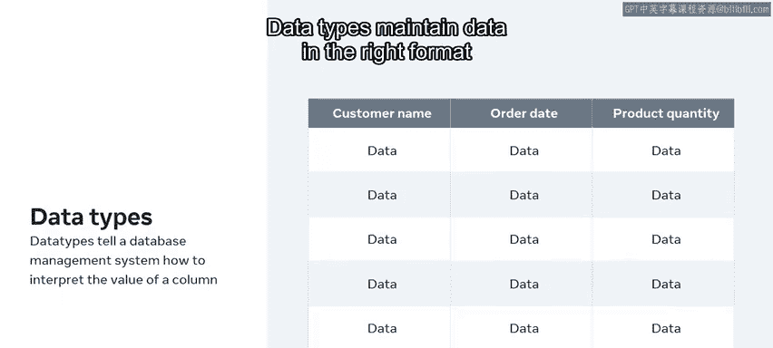
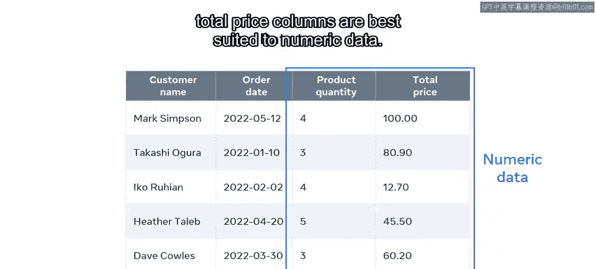
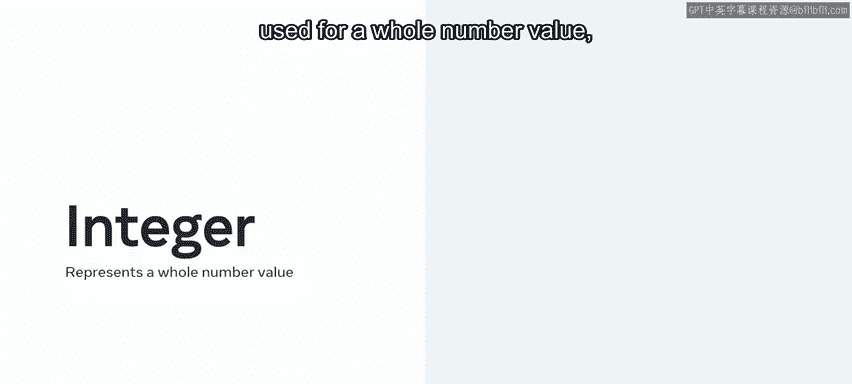
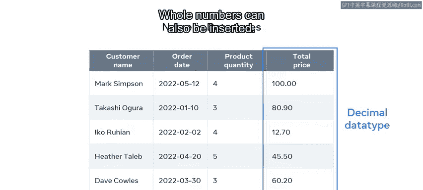

# 数据库工程师：P14：数值数据类型 📊

在本节课中，我们将要学习数据库中的数值数据类型。你将了解数据类型的核心概念，并学会区分整数和十进制这两种最常见的数值数据类型。

---

## 数据类型的核心概念

你可能知道数据库表以列和行的形式存储数据。但如何确保每一列都接受正确类型的数据？例如，确保你的“成本”列存储十进制数值，或者“产品数量”列接受正数。这正是数据类型的作用。通过数据类型，你可以确定表中每个字段接受何种数据。

在开始探索数值数据类型之前，我们先花点时间了解数据类型的概念。当你在数据库中创建表时，需要定义列名以及这些列将存放内容的数据类型。

数据类型告诉数据库管理系统（如MySQL）如何解释列的值。数据类型以正确的格式维护数据，并确保每列的值符合预期。

最常用的数据类型包括数值型、字符串型以及日期和时间型。让我们以在线商店数据库中的一个表为例。

该表通过名为“客户姓名”、“订单日期”、“产品”、“数量”和“总价”的列来收集信息。这些列中的每一列都必须以合适的数据类型存储数据。“客户姓名”列可以使用字符串数据。“订单日期”可以使用日期类型。而“产品数量”和“总价”列最适合使用数值数据。

---

## 数值数据类型简介

本视频的重点是数值数据类型。数值数据类型是一个通用术语，指代所有允许列在数据库中存储数字数据的特定数据类型。

数据库中两种最常见的数值数据类型是：
*   **整数数据类型**：用于存储整数值。
*   **十进制数据类型**：用于存储带有小数部分的数值。

回到我们之前的表格示例，“产品数量”列被定义为整数数据类型。这是因为它只保存整数。

虽然可以插入小数，但它们在数据库中总是会自动向上或向下舍入到最接近的整数。

而“总价”列是十进制类型。这是因为它保存小数。例如，一件价值 **$80.90** 的商品就是一个小数值。80 是整数部分，90 是小数部分。当然，也可以插入整数。

数据库会自动添加一个小数点以及一个值为0的小数部分。

---

## 整数与十进制数据类型的变体

在大多数数据库管理系统中，你会发现不同类型的整数和十进制数据类型。每种类型都旨在存储一个最小和最大的数值范围。

例如，在MySQL数据库管理系统中：
*   `TINYINT` 用于非常小的整数值，其可插入的最大可能值是 **255**。
*   而 `INT` 可用于存储非常大的数字，其可存储的最大值超过 **40亿**。

这些数据类型也可以接受负值和正值。

在某些数据库管理系统中，你还可以强制列只接受正数。这会增加它们可以存储的最大值。

---

## 总结

本节课中，我们一起学习了数据库中的数值数据类型。你现在应该能够解释数值数据类型，并且能够区分整数和十进制数据类型。干得漂亮！

