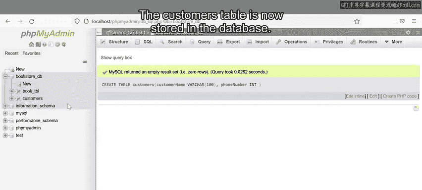

# 数据库工程师：P18：创建表语句 📝

在本节课中，我们将学习如何使用SQL语句在数据库中创建表。创建表是组织和管理数据的基础步骤，通过定义表的结构，我们可以有效地存储和检索信息。

## 概述

构建数据库涉及处理大量数据。如何组织数据以便准确找到所需信息并理解其含义？使用SQL，可以在数据库中创建表来保存和组织数据。本节将介绍如何使用SQL语法在数据库管理系统中创建表。

## SQL创建表语句语法

首先，我们来看SQL创建表语句的基本语法。语句以关键字`CREATE TABLE`开始，告知SQL需要创建新表。接着添加要创建的表名。最后，添加一对括号。在括号内，键入表中必须包含的每个列名及其相应的数据类型。


**语法示例：**
```sql
CREATE TABLE table_name (
    column1 datatype,
    column2 datatype,
    ...
);
```

## 创建表的前提条件

在熟悉语法后，我们来看实际操作。请注意，在创建表之前，服务器上必须已存在数据库。换句话说，如果没有数据库，就无法在其中创建表。

假设在本示例中，我们已经有一个准备使用的数据库。我将在书店数据库中创建一个客户表，用于存储客户数据，如姓名和电话号码。


## 创建客户表示例

以下是创建客户表的步骤。首先，编写包含`CREATE TABLE`命令的SQL语句，后跟表名（本例中为`customers`），然后添加一个开括号。在括号内，我们需要定义列。

**步骤详解：**
1.  **定义第一列**：列名为`customer_name`，数据类型为`VARCHAR`。`VARCHAR`表示该列可以存储任何类型的字符数据。在括号内添加一个数值，指定最大字符长度。
2.  **定义第二列**：添加逗号，然后写入第二列名`phone_number`。数据类型为`INT`，表示该列只能存储整数。
3.  **结束语句**：添加闭括号和分号。

**完整SQL语句：**
```sql
CREATE TABLE customers (
    customer_name VARCHAR(100),
    phone_number INT
);
```

## 执行语句


最后，执行该SQL语句。客户表现在已存储在数据库中。



## 总结

本节课中，我们一起学习了如何使用SQL语法在数据库中创建表。通过定义表名、列名和数据类型，可以有效地组织数据，为后续的数据操作和管理奠定基础。