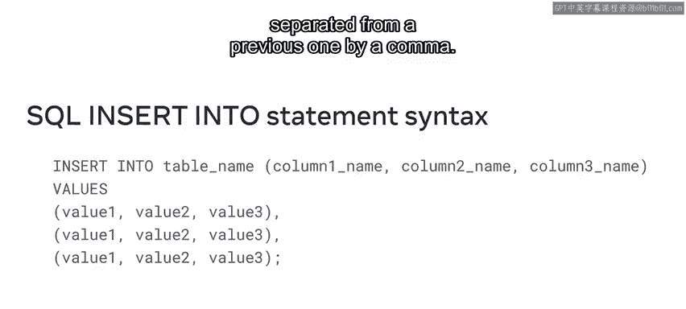
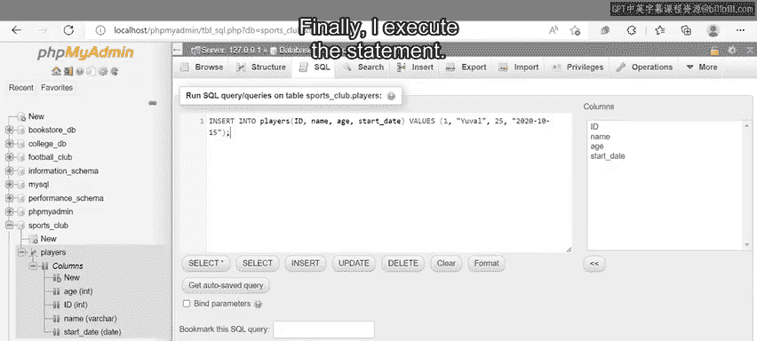
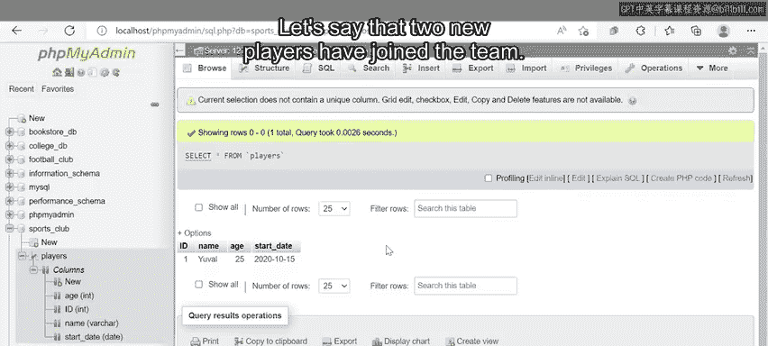
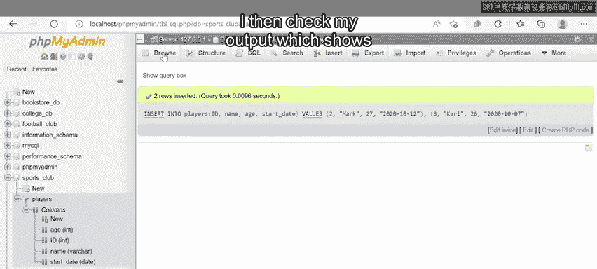
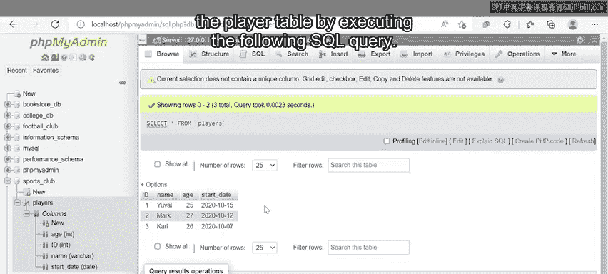
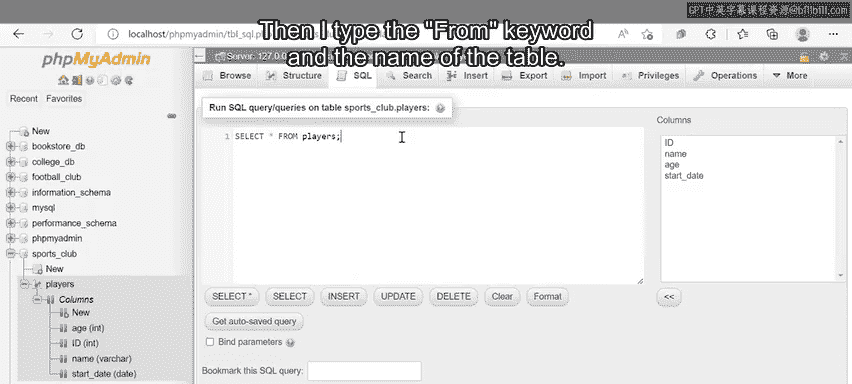
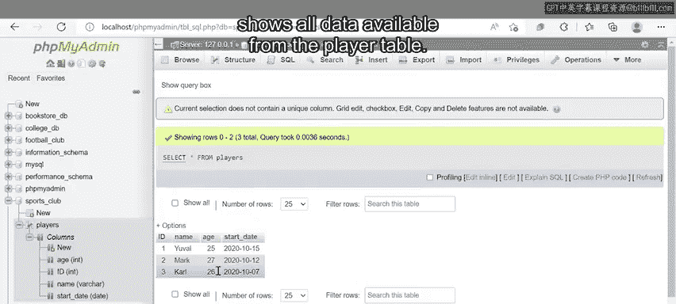

# Meta《数据库工程师（数据库简介／Git／MySQL）｜Meta Database Engineer》中英字幕 - P20：19_INSERT语句.zh_en - GPT中英字幕课程资源 - BV1Vw4m1Z7tb

When working with databases you'll often have to add new rows and columns to existing tables or even create new tables from scratch。

 for example， if you run a college database， you'll have to add new rows for every new student。

With SQL， you can perform these tasks quickly using the insert statement。By the end of this video。

 you'll be able to identify and understand insert SQL syntax and insert data into tables with the use of the insert into clause。

 Let's begin with an expiration of the insert into syntax。To write an insert statement。

 first write and insert into clause。Then specify the table name。

 followed by a list of columnums contained within a pair of parentheses and separated by commas。

Then use the values keyword and write a list of values within a pair of parentheses。

It's important to remember that each value corresponds to a specific column。

 and so should reflect the same data type and order。

You can also add multiple rows into a table at the same time， first。

 write the insert into Cla and table just like before。

Then use the values keyword and add multiple rows of values。

 just make sure that each new row is separated from a previous one by a comma。

Now let's explore some examples of an insert statement。In this example。

 I'll use a table called Players from a Sports club database。

And I want to insert new player data into this table。First， I write the insert into command。

 followed by the name of the table， in this case， its's players。

Then I add the coum names within a pair of parentheses。

These columns must contain the basic information that the club requires about each player。

So I'll name the columns， ID， name， age， and start date。Next。

 I insert the values keyword and then add the values I want to assign to each column within a pair of parentheses。

I start adding the data for a new player named Uil， age 25 with an ID of one。

 and the start date of 2020， 10，15。It's important to use the correct format of year。

 month and day when entering dates in a table。 otherwise an error message will appear。

I can also use the current date function followed by a pair of empty parentheses next to my values。

 just like I've done for the new player at Uil。Then I have scripted all values for Uil。

 note that each value relates to a specific column。😊，Number one corresponds to the player ID column。

 Uval to player name， 25 to player age and the date to start date。

This means that the order in which I type my values within the parentheses is very important。

Otherwise， I might accidentally store these values in the wrong columns。

It's also important to note that all nonnumeric values are placed within quotation marks。

 just like Uil and the date value in this statement。Finally， I execute the statement。

The output now shows one row of data for Uil， just as my code instructed。

But what if I wanted to insert multiple records of data into the table？

Let's say the two new players have joined the team。 Their first player is Mark。

 age 27 with an I of2 and a start date of 2020，1012。

And the second player is Carl， age 26 with an idea of three and a start date of 2020，10，7。

Both Mark and Carl must be inserted into the database。As you learned earlier。

 this is a very straightforward task。First， I write the insert into command。

 then I write the table name，Pers。Next I type the ID， name。

 age and start date columns within a pair of parentheses。

Then I write the values keyword and insert two records of data。

 These data records are contained within two pairs of parentheses separated by a comma。

 one for Mark and another for K。

Finally， I run or execute the statement。 I then check my output。

 which shows that all three players are now on the table。😊。

So far， I've explored how to add data to the table。😊。

But it's also possible to show existing data in the player table by executing the following SQL query。

First， I type the select clause， followed by an asterisk。

This asterisk tells SQL to return all columns within the table。

Then I type the Fr keyword and the name of the table。

I execute the statement and the output shows all data available from the player table。

You can now identify and make sense of the insert syntax。

 as well as insert new data into tables with the insert into clause。Good work。

