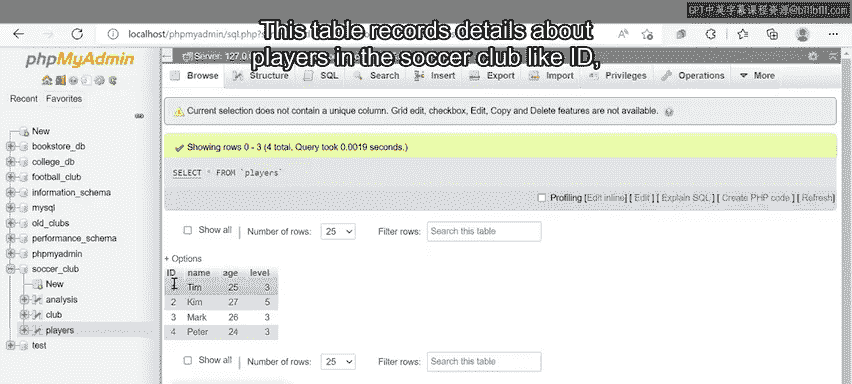
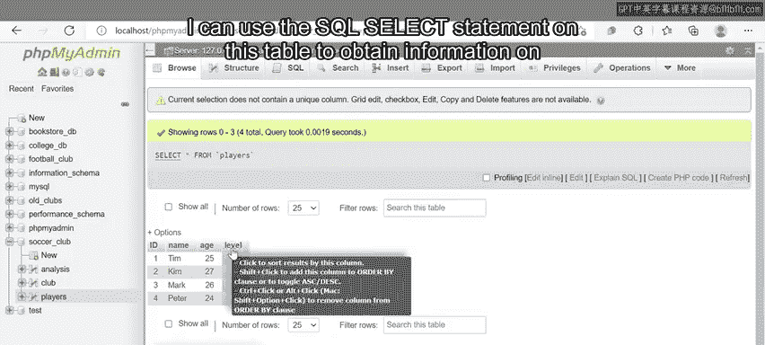
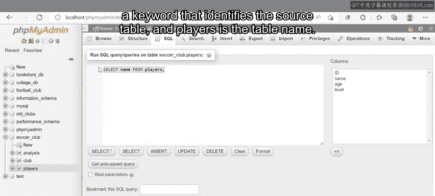
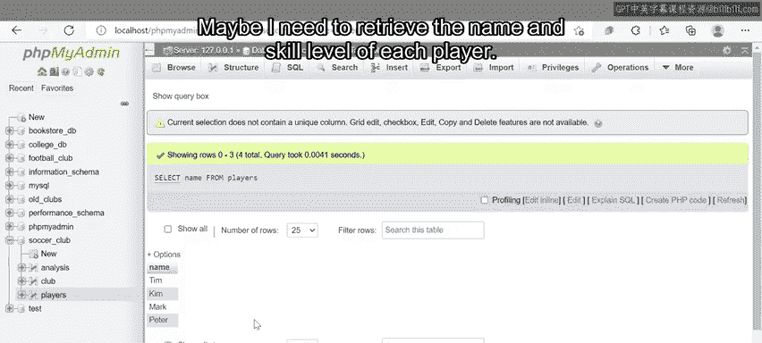
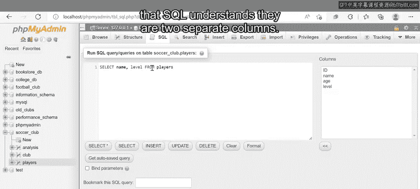
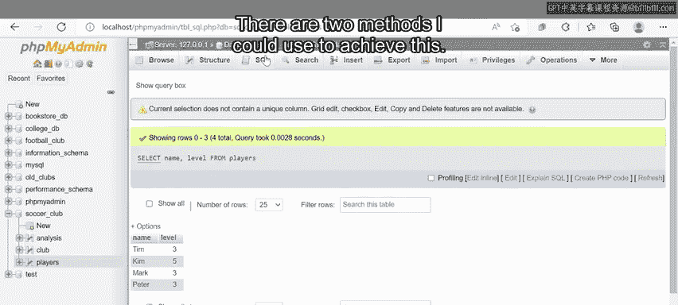
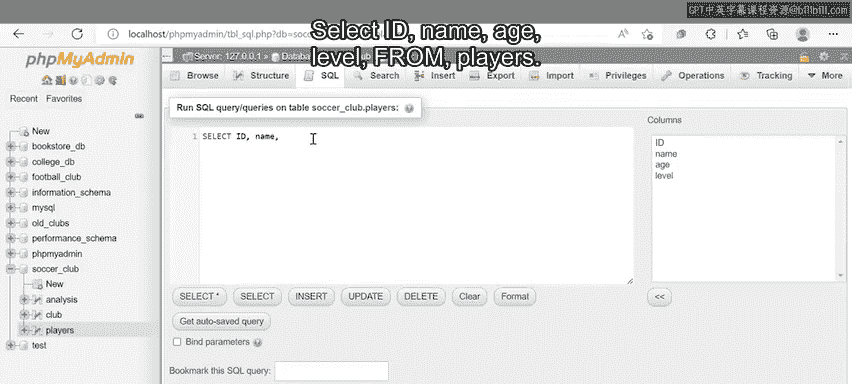
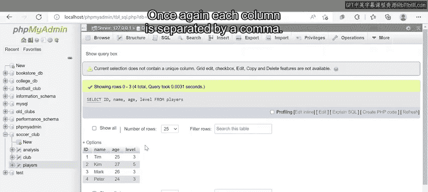
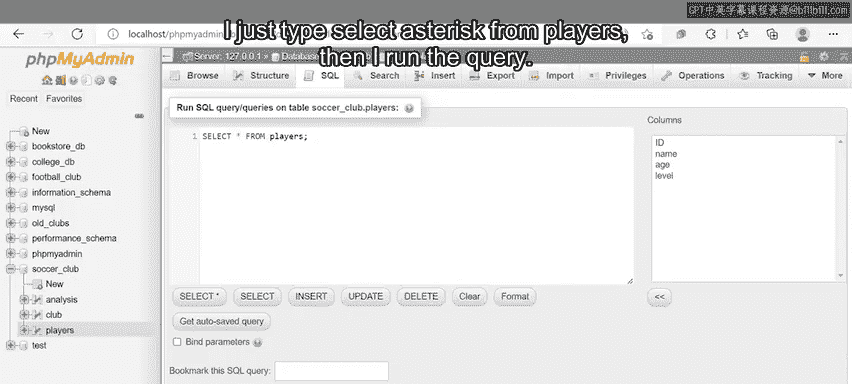
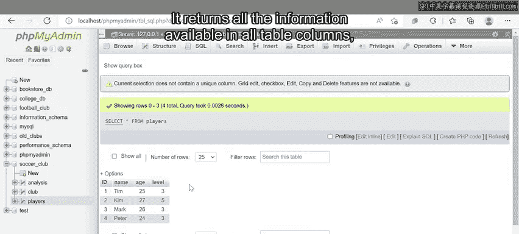

# Meta《数据库工程师（数据库简介／Git／MySQL）｜Meta Database Engineer》中英字幕 - P21：20_SELECT语句.zh_en - GPT中英字幕课程资源 - BV1Vw4m1Z7tb

There will often be times that you'll need to query data from a table in your database， for example。

 you might need to retrieve a list of names from a table or return a set of results from a math calculation。

You can perform these actions using the select statement。And that's what I'll demonstrate now。😊。

So over the next few minutes， you'll learn how to utilize a SQL Select statement to query data from a table in a database and perform other SQL select tasks such as math calculations。

 date and time queries， and concatenation functions。To get started。

 let's explore the syntax of a SQL statement。A basic SQL select statement is written as the select keyword。

 the name of the column that contains a data you need to query， then the Fr keyword， and finally。

 the name of the table you want to query。 For example。

 if I want a query data made the names of players from a soccer club database。

 I could use the following syntax。 the select keyword， the player name column and the Fr keyword。

 and finally， the name of the table， which is player table。And although it's not mandatory。

 a semicolon is often added to mark the end of a SQL statement。

Let's take a closer look at how the statement works。😊，As an example。

 I'll extract information from a table called Players held in a soccer club database。😊。

This table records details about players in the soccer club like ID， name， age， and skill level。

I can use the SQL select statement on this table to obtain information on the club's players。

The expected outcome of this select query is that it will return a result set that displays all player names held in the table。

I can write the statement as select name from Players。The select command is used to retrieve data。

Name is the column that stores the player's name in the database from is a keyword that identifies the source table and players is the table name。

I then run the statement。The query returns a table column that lists the player's names from the player's table。

 with each name on its own row。So in the example you just explored。

 I retrieve data from one column in a table。😊，But what if I wanted to retrieve data from multiple columns？

Maybe I need to retrieve the name and skill level of each player。

I can obtain this information using a SQL select statement written as select name。

 level from players。I add a comma between name and level so that SQL understands they are two separate columns。

I run the query and it returns the data from the name and level columns in the players table。😊。

I could also use a select statement to retrieve all data from all columns in the player table。

There are two methods I could use to achieve this； The first method is to list all column names in a standard select statement as follows。

Select ID， name， age， level from Play。

Once again， each column is separated by a comma。

I then run the query and get all the requested information and table format。

The second method is to use an asterisk as shorthand。So instead of typing out all column names。

 I just type select asterisk from players。

Then I run the query， it returns all the information available in all table columns。

 just like in the first method。

You're now familiar with how to use the select statement in MySQL。

So next time you need to query data in your database。

 you've now got different methods to choose from。😊。

