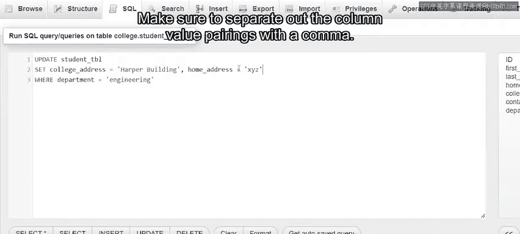
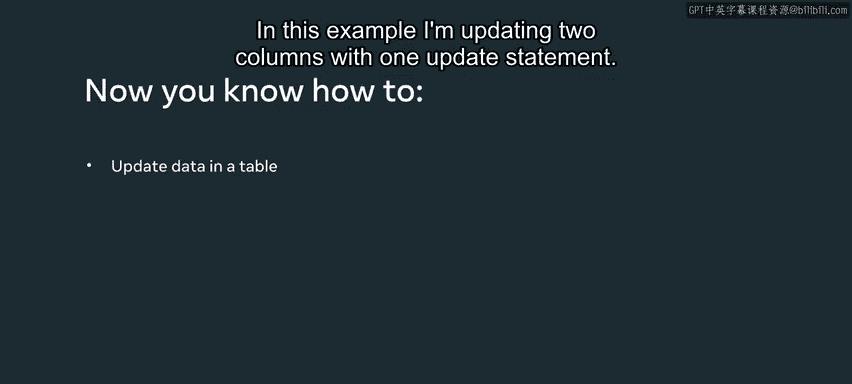

# Meta《数据库工程师（数据库简介／Git／MySQL）｜Meta Database Engineer》中英字幕 - P23：22_更新数据.zh_en - GPT中英字幕课程资源 - BV1Vw4m1Z7tb

I recently created a database table for a college called Student Table。

It contains the following pieces of data on each student in the college。Id。First name， last name。

 home address， college address， contact number， and department。

Let's use the updateate syntax to update the home address and contact number of the student assigned the ID of three in the table。

So I click the SQL tab in PP my admin。Now I use the update clause followed by the name of the table that I want to update。

 which is student table。Then I add the set clause。Followed by the names of the columns to be updated。

Which our home address。And contact number。Next to the name of each column。

 I add an equal to symbol and place the new values to be inserted into the table in single quotation marks。

I also make sure to separate these column value pairings with a comma。Finally。

 I add the where clause。To identify the exact record I want to update。

This record has a student ID column field that was assigned the value of 3， so I write where ID。

Equals 3。Now that I've completed the syntax， I can select go。

I then receive a message confirming that the change has been made。And when I checked the table。

It displays the updated values for the assigned columns alongside student 3。

So that's how you update the information for one student。However。

 the Up syntax can also be used to update the information from multiple students at once。

Let's suppose that the college's engineering department has moved their classes to a new location on campus called the Harper Building。

And I need to update the department's address on the table for all engineering students。

I can perform this task using the update SQL syntax。

The syntax is very similar to the previous example。First。

 I use the update clause followed by the name of the table。

Then I add the set clause and state that I want to update the values within the college address column。

Two Harper Building。So I type this as set college address equals Harper buildinging。Next。

 I type the wear clauses。And state that I want this update to occur within the College Ad column for all students assigned the value of engineering in the department column。

I then clickGo to run the state。Now I just checked that the table has updated the college address of the engineeringing department to HarperBuilding。

I could also use the update statement to update multiple field values in multiple records。

For example， I can return to the original SQL statement。

And add a new column value pairing to the set clause。If I want to update the home address column。

 I add a comma。And write， home address。Equals。The new address information within quotes。

Make sure to separate out the column value pairings with a comma。

In this example， Im updating two columns with one update statement。

