# Meta《数据库工程师（数据库简介／Git／MySQL）｜Meta Database Engineer》中英字幕 - P25：24_模块小结 CRUD操作.zh_en - GPT中英字幕课程资源 - BV1Vw4m1Z7tb

You've reached the end of this module and Ch operations in this module you've discovered how to create。

 read， update and delete data within a database you've also examined different SQL data types like numeric。

 string and default values。It's now time to recap the key topics you learned and skills that you gained。

He began the module with an introduction to SQL data types。

Following the completion of this first lesson， you can now identify and understand the numeric data type so that you can store data as numbers in a database。

 utilize numerical data types in a database， and differentiate between integer and decimal data types so that you can store numerical values of different sizes。

 including positive and negative ones。

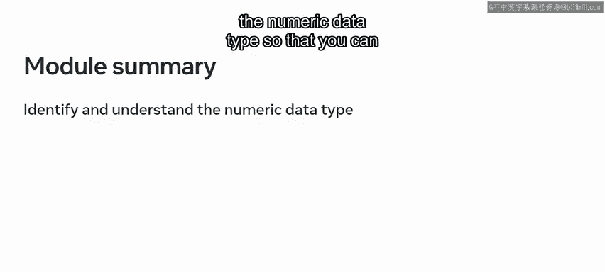

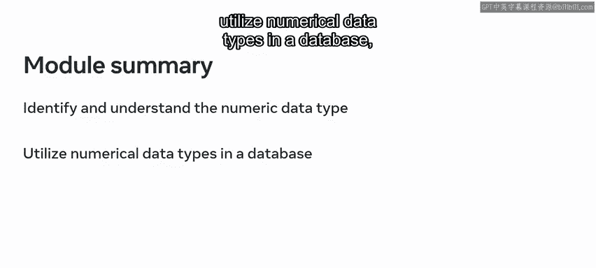

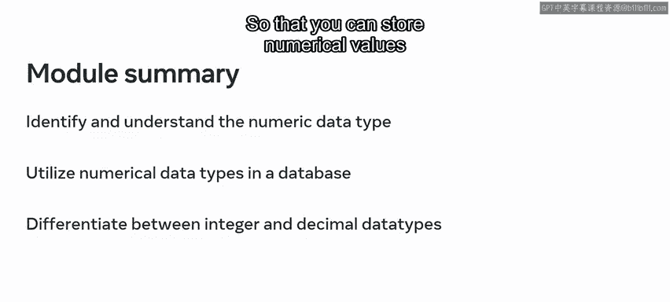

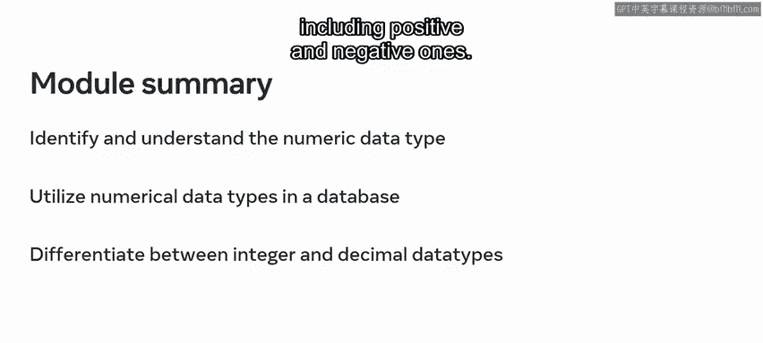

Following your exploration of numerical data types。

 you then moved on to investigate string data types。During your investigation。

 you learned how to identify and understand string data types in a database。

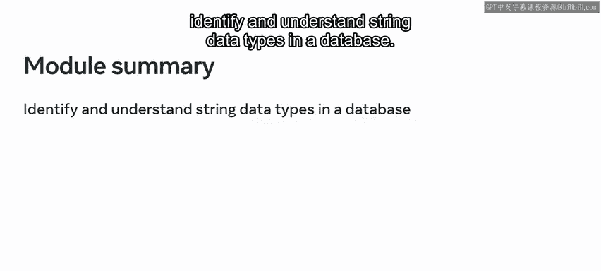

Demonstrate how to use string data types and outline the key differences between ChaAR and VarCAR data types。

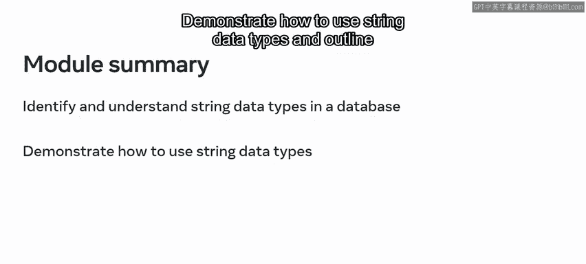

The final concept that you learned about in this lesson was default values。

Now that you've completed the lesson on default values。

 you're able to demonstrate an understanding of the concept of constraints in a database with SQL syntax and identify the default constraint to set default values in a table。

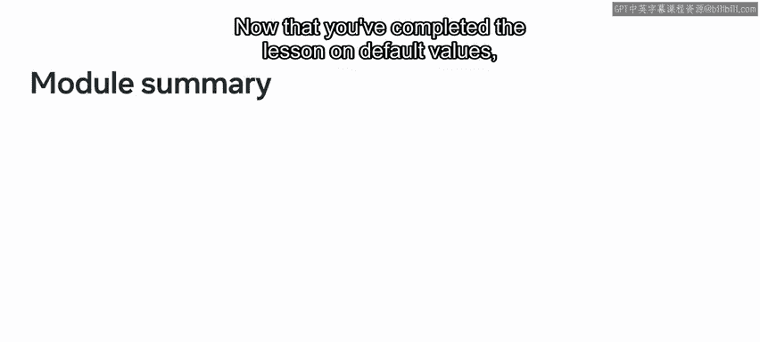

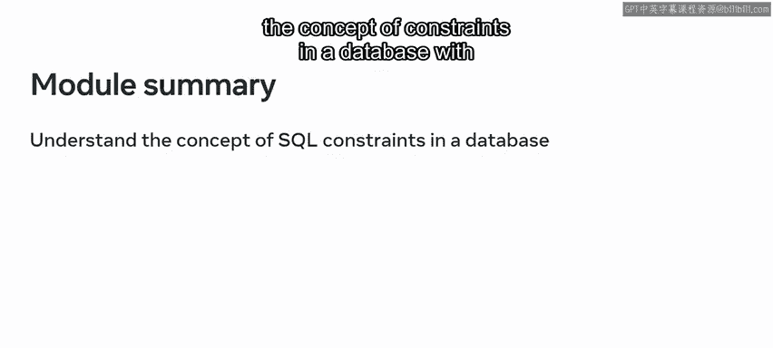

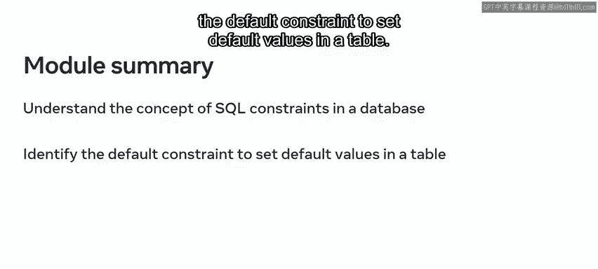

As part of this lesson， you also undertook a series of exercises focused on SQL data types。

Having successfully completed these exercises， you can now demonstrate your ability to work with numeric data types。

 string data types， and default values， and outline how to select the correct data type for your data。

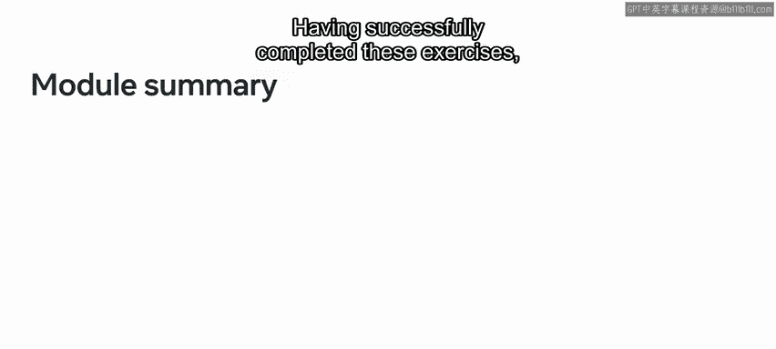

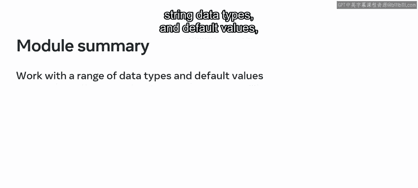

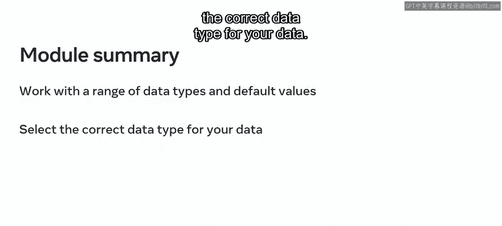

Once you completed your study of SQL data types， you then moved on to explore the topic of creating and reading data in a database。

Now that you've completed this lesson。

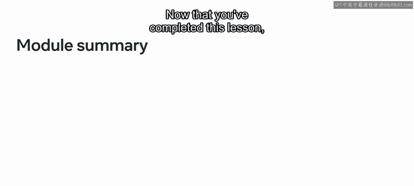

You're able to create a database and create tables， alter database tables， and drop a database。

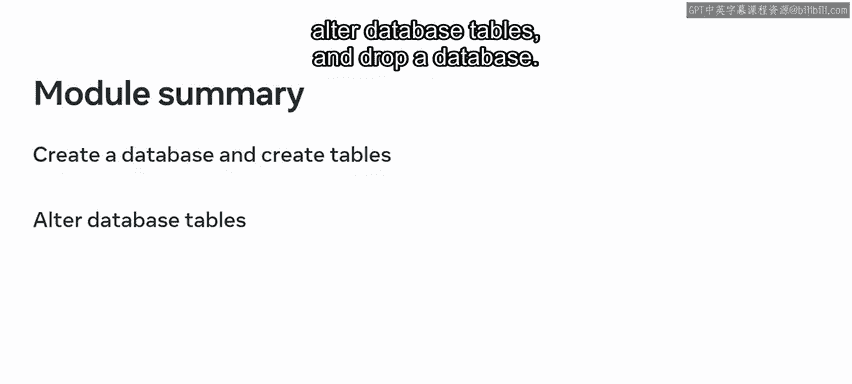

You can also demonstrate how to create a table in a database with SQL syntax。

 Al table structure used a SQL Al table statement， and insert or add data into a table with SQL insert statement。

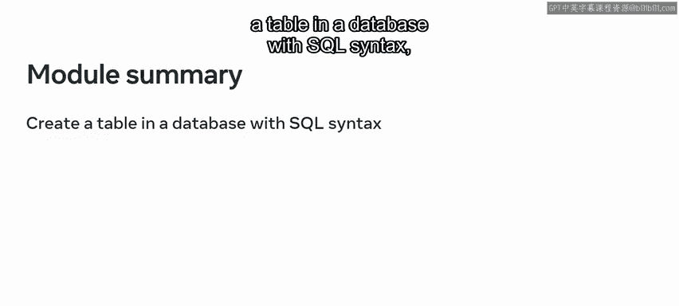

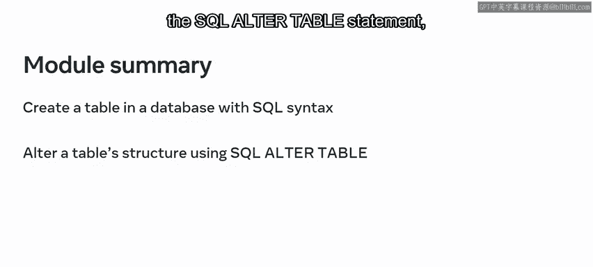

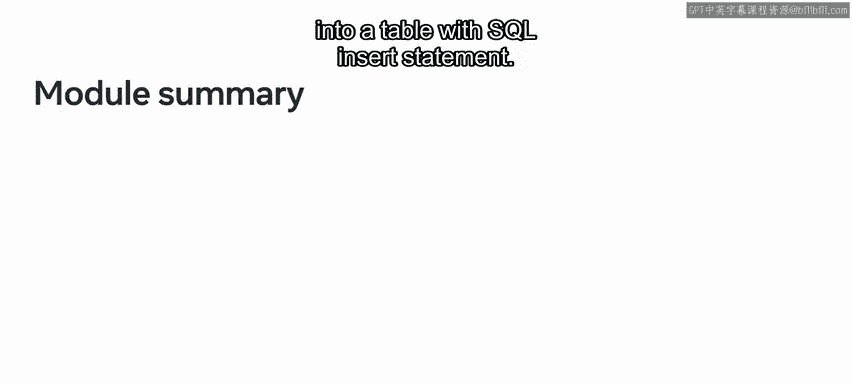

In addition to these new skills， you also learned how to retrieve data from tables with the SQL select statement and insert query data from one or more tables into another target table using the insert into select statement。

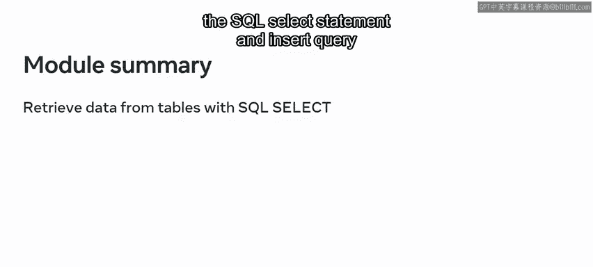

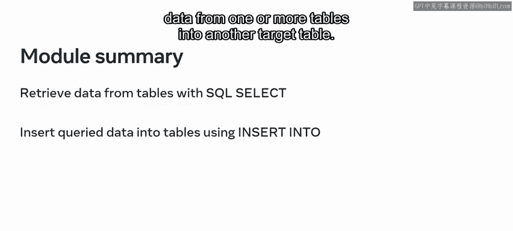

You also had an opportunity to demonstrate these new skills through a series of exercises。

In these exercises， you proved your ability to create a database and a table and then populate the table with data and manage data within your tables using the select and insert into select statements。

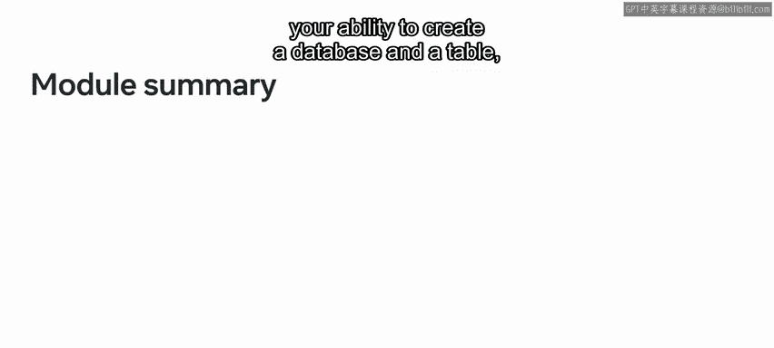

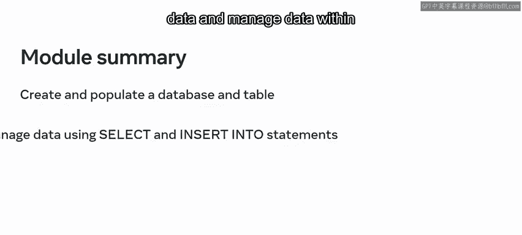

You then move on to the final lesson in which you explored how to update and delete data。

Having completed this lesson， you can now demonstrate knowledge of the SQL update statement and utilize the update statement to update both single and multiple field values of a record Finally。

 you also proved your abilities with these new skills by completing an exercise in which you deleted records from a table。

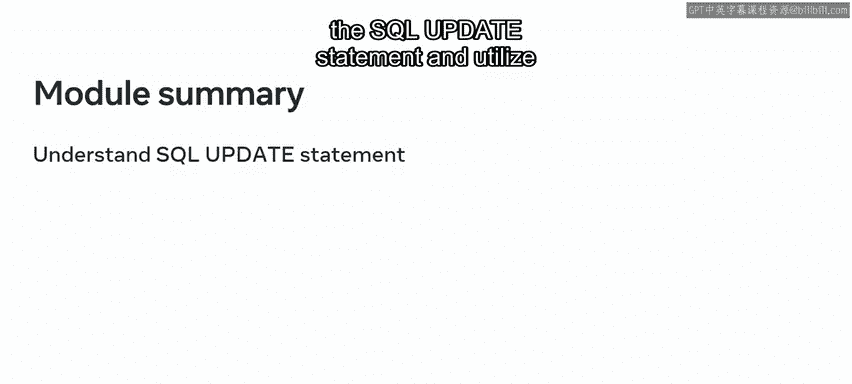

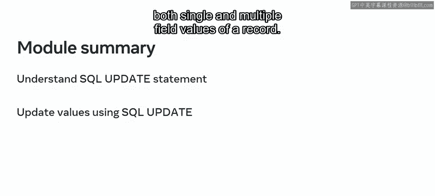

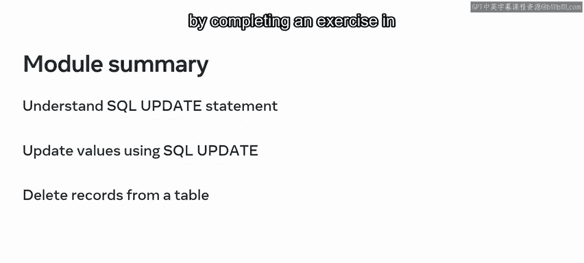

You're now familiar with the C， read， update and delete operations。😊。

You're also skilled in the use of SQL data types。 Great work。

 You're making good progress on your journey towards becoming a database engineer。

