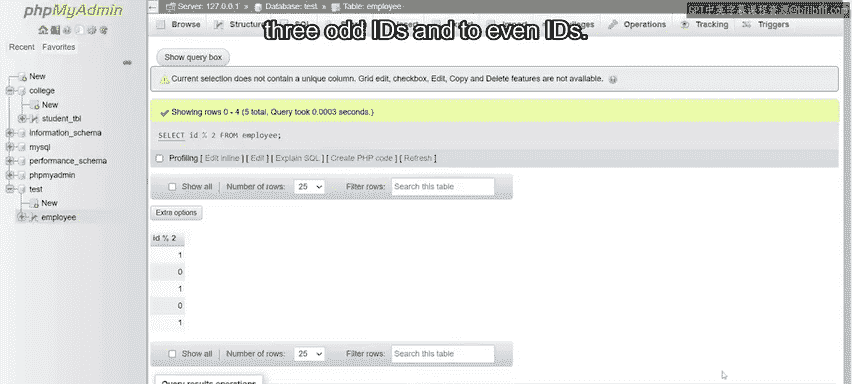
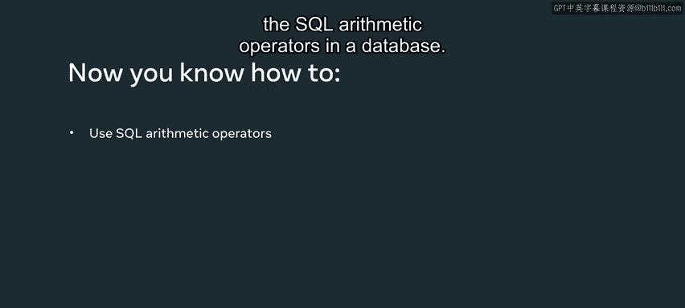

# 数据库工程师：P27：运算符应用 🧮

在本节课中，我们将学习如何在数据库的实际操作中应用SQL算术运算符。我们将通过一个员工数据表的例子，演示如何使用加、减、乘、除和取模运算符来执行各种计算，从而从数据中提取有价值的信息。

上一节我们介绍了SQL算术运算符的基本概念，本节中我们来看看如何将它们应用到真实的数据表上。

## 使用加法运算符

假设雇主想给团队中的每位员工发放500美元的奖金，并希望先查看加上奖金后每位员工的薪水情况。

以下是实现此目标的SQL查询语句：

```sql
SELECT salary + 500 FROM employee;
```

此`SELECT`命令从`employee`表中检索每位员工的薪水值，然后为每个值加上500美元。执行此查询后，结果将显示每位员工增加了500美元后的薪水。

## 使用减法运算符

接下来，假设雇主想从每位员工的薪水中扣除500美元。

以下是相应的SQL查询：

```sql
SELECT salary - 500 FROM employee;
```

这里同样使用`SELECT`命令检索薪水值，但这次使用减号（`-`）从每位员工的薪水中减去500美元。执行查询后，数据库将返回扣除后的薪水结果。

## 使用乘法运算符

现在，考虑一个场景：雇主希望通过将当前年薪翻倍来增加员工薪水。

以下是完成此计算的SQL语句：

```sql
SELECT salary * 2 FROM employee;
```

该语句使用乘号（`*`）将每位员工的薪水值乘以2。执行查询将生成薪水翻倍后的输出结果。

## 使用除法运算符

假设雇主需要确定每位员工的月薪。我们可以将年薪除以12个月来计算。

以下是相应的查询语句：

```sql
SELECT salary / 12 FROM employee;
```

`SELECT`命令检索年薪值，然后除号（`/`）将其除以12。执行后，输出结果即为每位员工的月薪。

## 使用取模运算符

在最后一个例子中，雇主想知道每位员工的ID是偶数还是奇数。我们可以使用取模运算符来完成此任务。

以下是使用的SQL语句：

```sql
SELECT ID % 2 FROM employee;
```

此语句将每位员工的ID除以2，并返回除法运算的余数。余数为0表示ID是偶数（因为所有偶数都能被2整除，没有余数）。根据结果，可以判断出有三个奇数ID和两个偶数ID。



---



本节课中我们一起学习了如何在实际数据库操作中应用SQL的算术运算符。我们通过具体的员工表示例，演示了如何使用`+`、`-`、`*`、`/`和`%`运算符来执行薪资调整、月薪计算以及数据奇偶性判断等任务。掌握这些运算符的应用是进行有效数据查询和计算的基础。