# 数据库工程师：P28：SQL比较运算符 🔍

在本节课中，我们将要学习SQL比较运算符的概念及其在数据库中的实际应用。比较运算符是SQL查询中用于筛选数据的重要工具，通过它们可以精确地检索出满足特定条件的记录。

## 什么是SQL比较运算符？ 🤔

上一节我们介绍了课程目标，本节中我们来看看比较运算符的定义。比较运算符用于比较两个值或表达式，其比较结果可以是**真（True）**或**假（False）**。

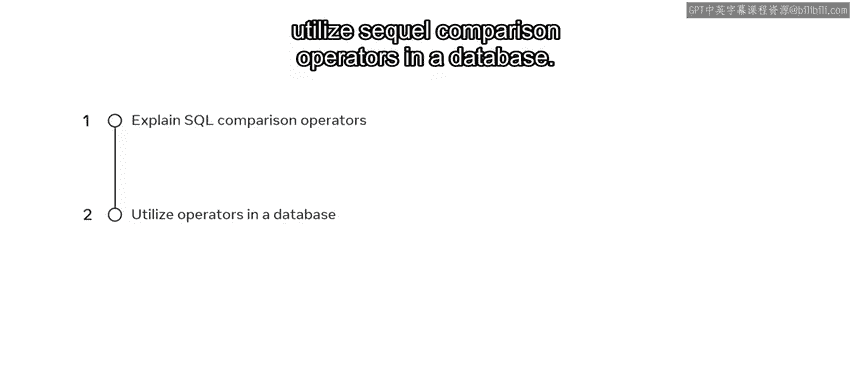

它们主要用于过滤数据，以包含或排除特定的数据集。

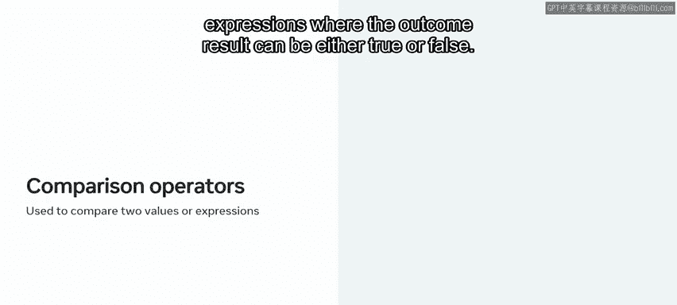

## SQL中的比较运算符 📊

SQL使用常见的数学比较运算符，通过符号来表示。以下是SQL中可用的主要比较运算符：

以下是SQL中常用的比较运算符列表：

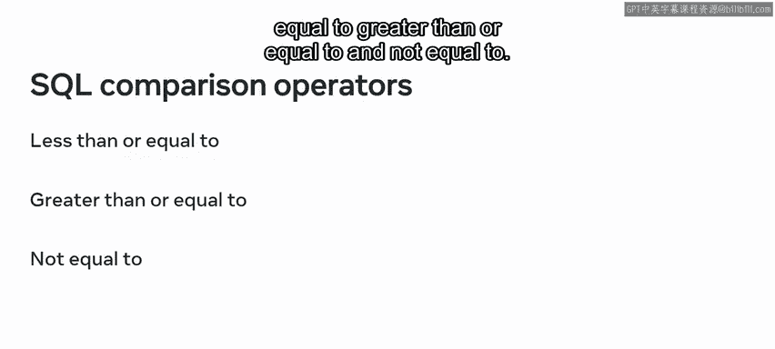

*   **等于**：`=`
*   **小于**：`<`
*   **大于**：`>`
*   **小于或等于**：`<=`
*   **大于或等于**：`>=`
*   **不等于**：`<>` 或 `!=`

## 实践：在数据库中使用比较运算符 💻

现在，让我们通过一个实际的数据库例子来探索如何使用这些比较运算符及其符号。

为了演示SQL比较运算符的用法，我将使用一个公司数据库中的员工表（`employee`）作为例子。该表包含每位员工的ID、姓名和薪资信息。

假设雇主需要从员工表中提取关于员工薪资的相关数据用于不同目的，每种数据提取情况都需要使用不同的比较运算符。

### 示例一：查找薪资等于特定值的员工

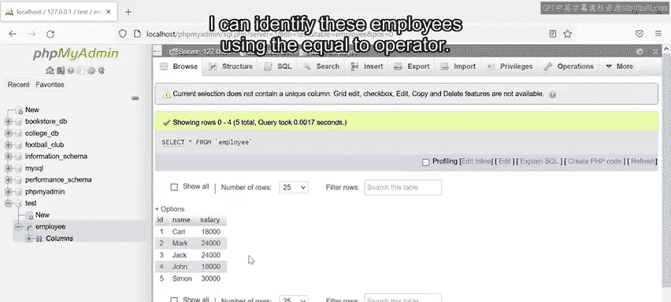

在第一个例子中，雇主希望找出所有年薪等于**$18,000**的员工。我可以使用**等于（=）**运算符来识别这些员工。

首先，在主菜单中点击SQL标签页，然后编写以下SQL语句：

```sql
SELECT * FROM employee WHERE salary = 18000;
```

让我们分解这个SQL语句：`SELECT`命令用于检索数据，星号（`*`）表示选择所有列的数据，`FROM`关键字和表名指定了数据的来源，然后我使用`WHERE`子句来定义条件。

在这个例子中，条件使用**等于**符号来检查表中每条记录的薪资值是否等于$18,000。如果结果为真，则检索该数据。执行查询后，会生成输出结果。

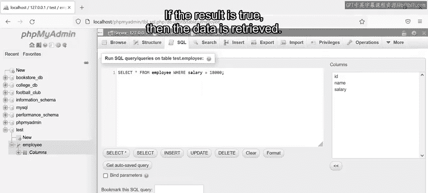

此查询的输出结果是：员工**Carl**和**John**的年薪为$18,000。

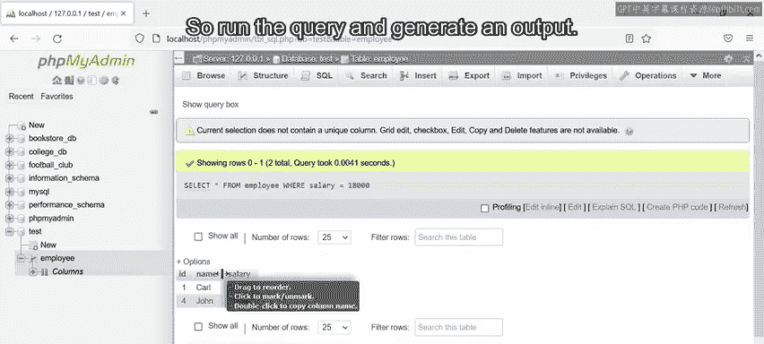

### 示例二：查找薪资低于特定值的员工

我们可以用类似的方式应用其他比较运算符来执行不同的功能。让我们看另一个例子来了解更多。

在下一个例子中，雇主需要知道哪些员工的年薪**低于$24,000**。这个任务需要使用不同的运算符。为了找到这个信息，我可以编写：

```sql
SELECT * FROM employee WHERE salary < 24000;
```

这条SQL语句利用了**小于（<）**符号来检查薪资列中每个字段存储的值是否小于$24,000。

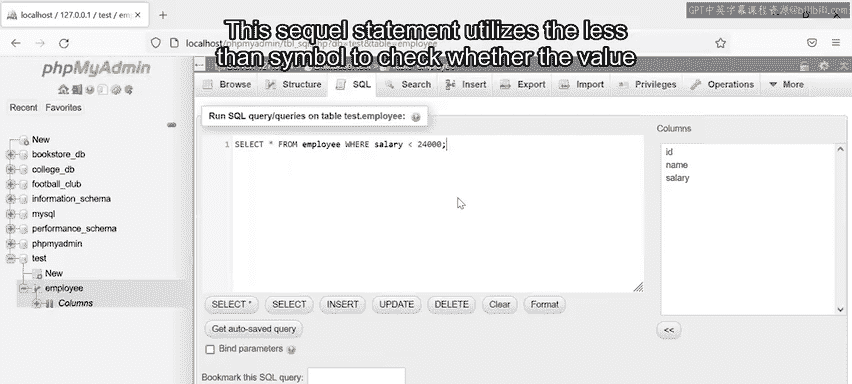

再次点击执行按钮来运行查询并生成输出。

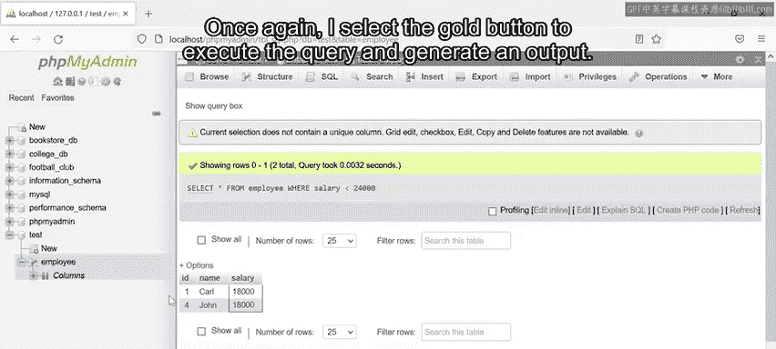

此查询的输出是：员工**Carl**和**John**的薪资低于$24,000。

### 示例三：查找薪资小于或等于特定值的员工

让我们再看一个例子，雇主需要确定哪些员工的年薪**小于或等于$24,000**。在这种情况下，我需要编写以下查询：

```sql
SELECT * FROM employee WHERE salary <= 24000;
```

这条语句与上一个例子唯一改变的地方就是运算符符号。

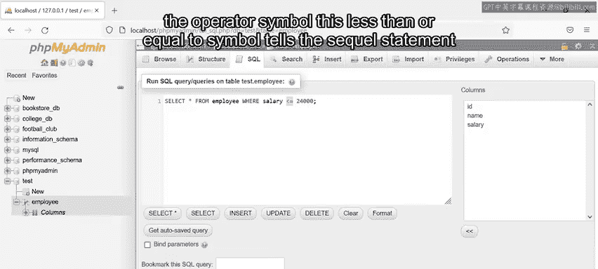

这个**小于或等于（<=）**符号告诉SQL语句去检查薪资列中每个字段存储的值是否小于或等于$24,000。

点击执行按钮来运行查询。输出结果显示，有**四名**员工的年薪小于或等于$24,000。

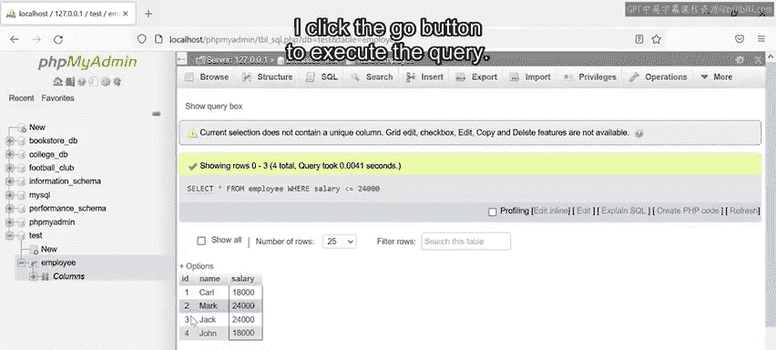

### 示例四：查找薪资大于或等于特定值的员工

如果雇主想知道哪些员工的年薪**大于或等于$24,000**呢？

为了生成这些结果，我可以在SQL语句中使用**大于或等于（>=）**运算符。因此，我编写以下SQL查询：

```sql
SELECT * FROM employee WHERE salary >= 24000;
```

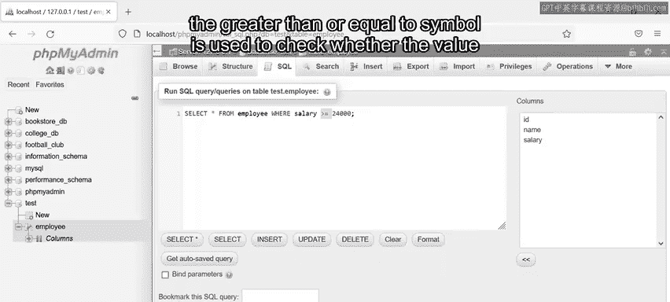

这次，使用**大于或等于**符号来检查薪资列中每个字段存储的值是否大于或等于$24,000。点击执行来运行查询，输出显示有**三名**员工的年薪达到或超过$24,000。

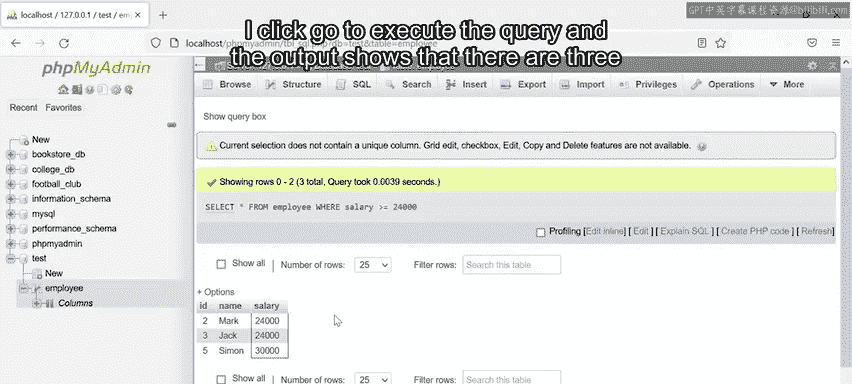

### 示例五：查找薪资不等于特定值的员工

SQL中最后一个可用的比较运算符是**不等于**运算符。

在最后一个例子中，雇主想知道哪些员工的年薪**不等于$24,000**。我可以使用以下SQL代码来确定：

```sql
SELECT * FROM employee WHERE salary <> 24000;
```

与之前的运算符一样，SQL语句利用该运算符来检查薪资列中每个字段存储的值。在这种情况下，它检查的是**不等于**$24,000的值。

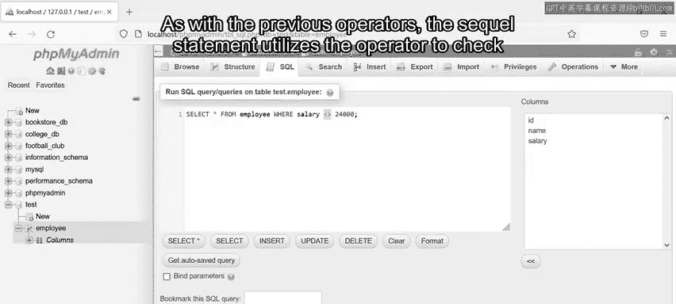

此查询的输出结果显示，有**三名**员工的薪资不等于$24,000。

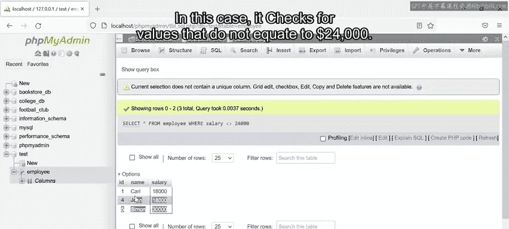

## 总结 📝

本节课中我们一起学习了SQL比较运算符。你现在应该能够描述比较运算符的概念，并在SQL数据库中运用它们。具体来说，我们掌握了如何使用`=`、`<`、`>`、`<=`、`>=`和`<>`这些运算符，通过`WHERE`子句来过滤和检索满足特定条件的数据记录。恭喜你掌握了这项重要的数据库技能！