# Meta《数据库工程师（数据库简介／Git／MySQL）｜Meta Database Engineer》中英字幕 - P2：1_数据库介绍.zh_en - GPT中英字幕课程资源 - BV1Vw4m1Z7tb

Hello and welcome to this course in Data engineering。

Almost everyone has used the database and more likely information about us is probably present in many databases all over the world。

 but who understands what a database is and how important database engineering is to global industry。

 government， and organizations。A very straightforward description of a database is that it is a form of electronic storage in which data is held。

 of course that explanation does not even come close to explaining the impact of database technology。

😊。

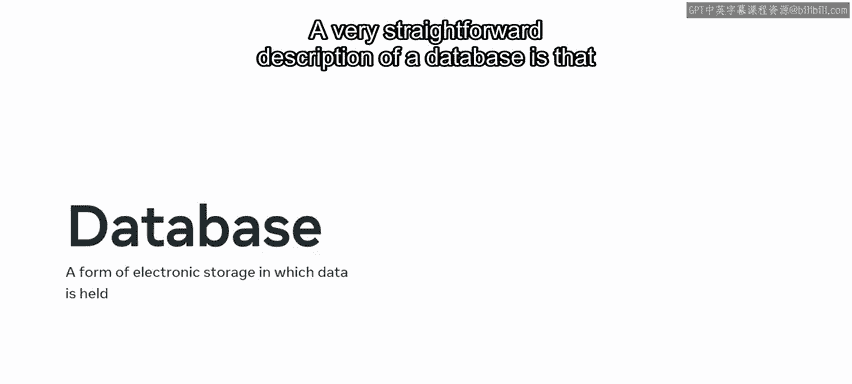

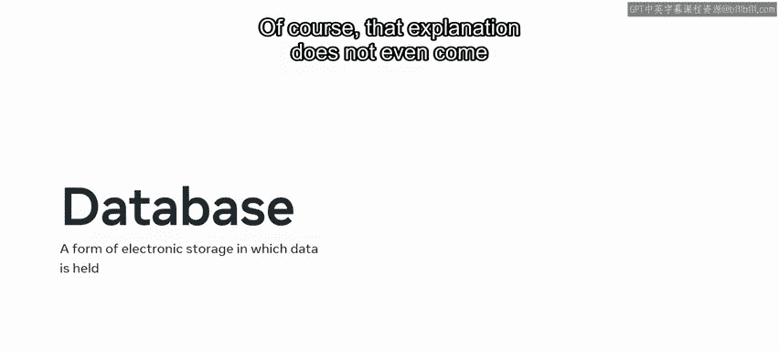

To give an idea of databases in a real world context。

 let's briefly describe some typical use cases For example。

 your bank uses a database to store data for customers， bank accounts and transactions。😊。

A hospital store is patient data， staff data， laboratory data， and more。

 and an online store retains your profile information along with your shopping history and accounting transactions。

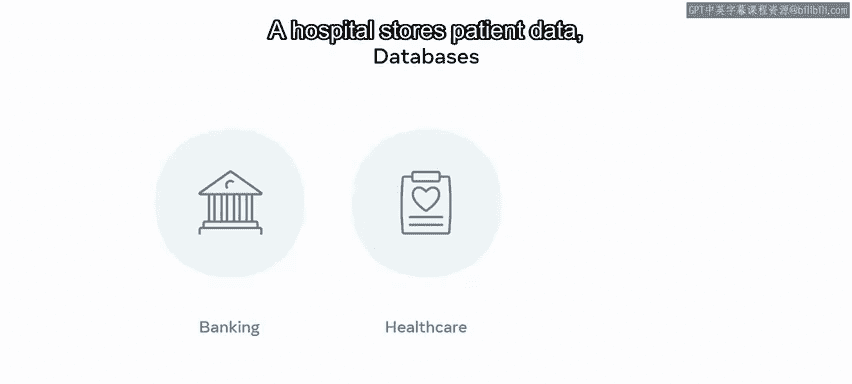

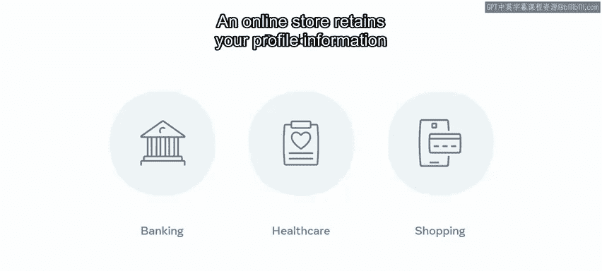

Many of these services have access to a diverse range of data。

 they collect and store other items such as your location， how long you spend on their platform。

 and friends you connected with alongside many more facts。

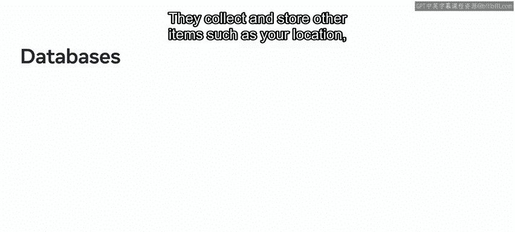

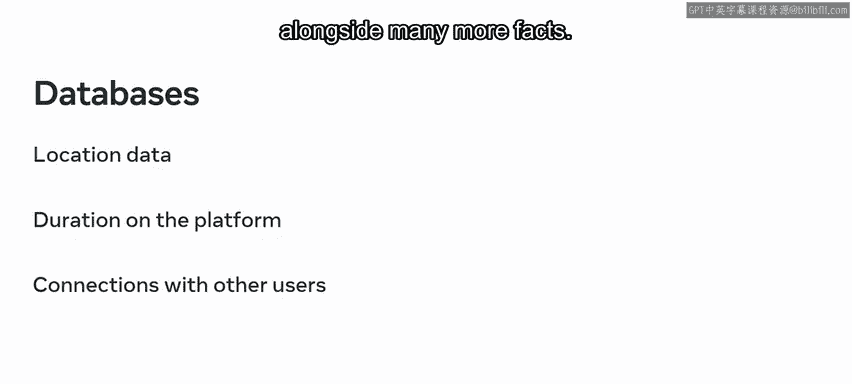

Such online services and social media platforms generate enormous amounts of data due to their large user base and constant user activity。

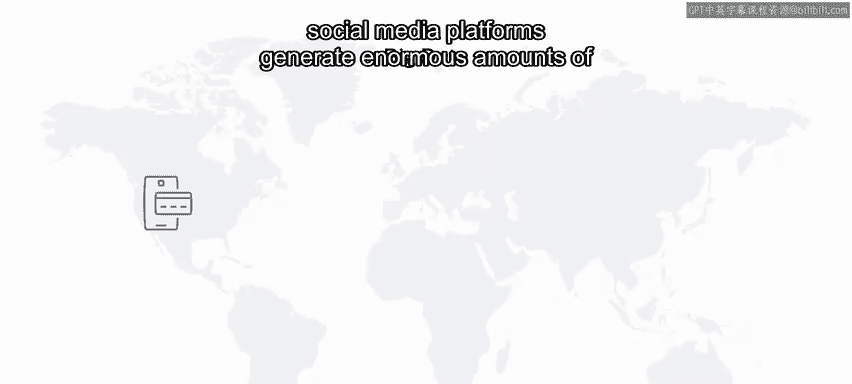

And with the Internet of Things or IoT， many extra devices are now connected to the internet。

These continual streams of data have led to a revolution in database technology to accommodate the volume。

 variety， and complexity of what has become known as big data。

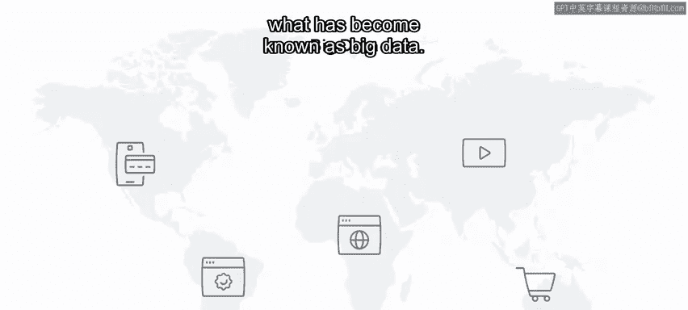

Whatever the source of the data， a database will typically carry out the following actions。

 all of which a database engineer must be familiar with store the data。

 form connections or relationships between segmented areas of the data filter the data to show relevant records。

 search data to return matching records and have functions to allow the data to be updated。

 changed and deleted as required don't worry if you don't fully understand all these terms For now you're just receiving a brief introduction to databases and data。

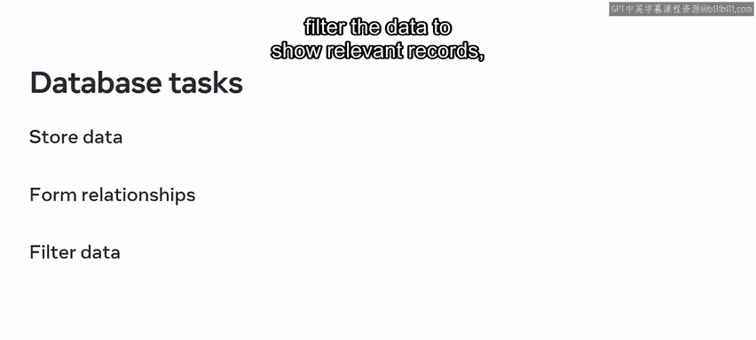

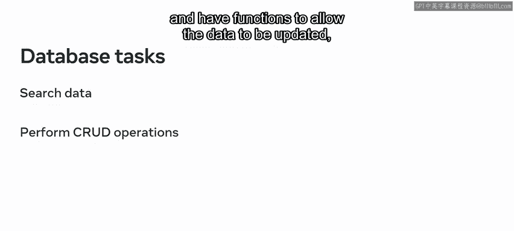

During the course， youll explore these concepts in more detail。

 alongside the many other tasks that form the duties of a database engineer。

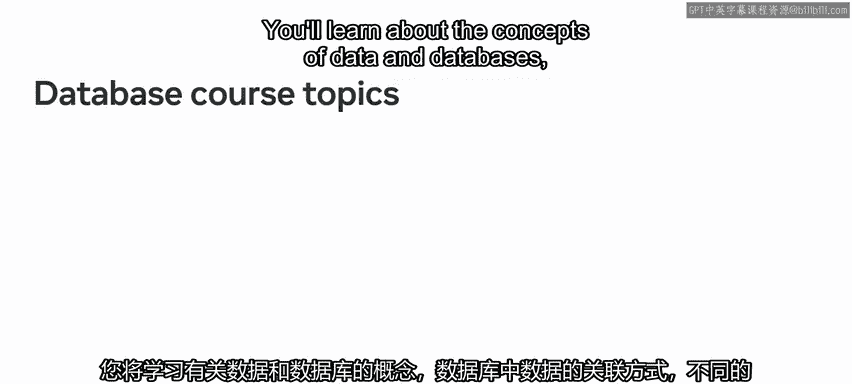

You learn about the concepts of data and databases， how data is related in a database。

 and different database structures and their uses。😊。

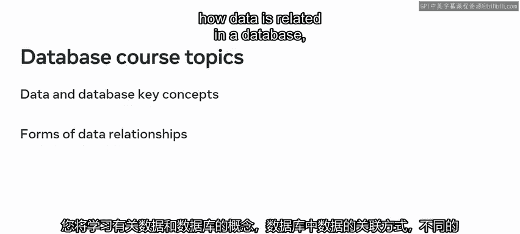

How to perform， create， read， update， and delete operations。

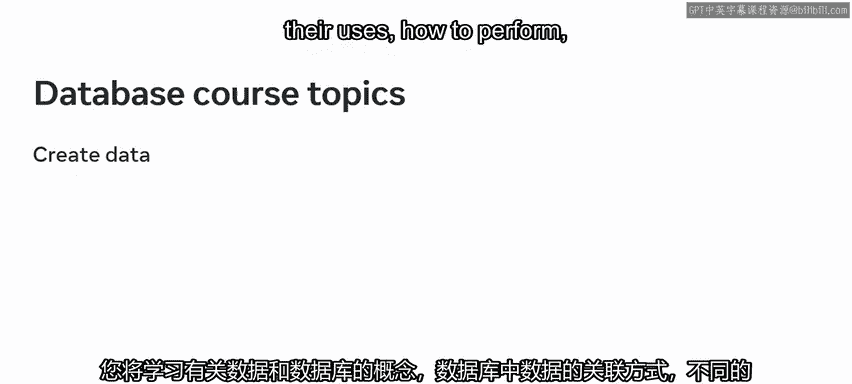

How to use SQL operators to sort and filter data， what database normalization is。

 and how to normalize a database。

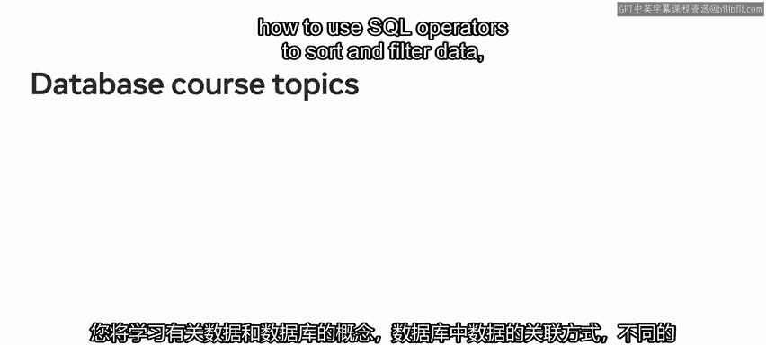

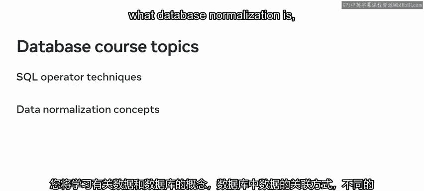

You'll get to build a fully operational database。And you'll also install and set up software called Zamp on your computer to help progress your local and remote database learning。

You're not expected to be a database engineer just now。

There are many videos in your course that will gradually guide you toward that goal。Watch， pause。

 rewind， and rewatch the videos until you are confident in your skills。

Then consolidate your knowledge by consulting the course ratings。

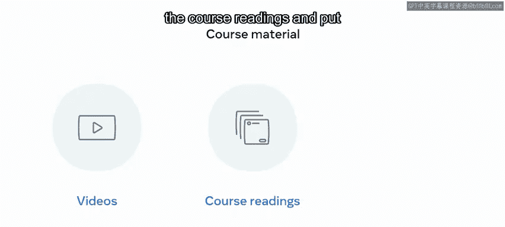

And put your skills into practice during the course exercises。Along the way。

 you'll encounter several knowledge quizzes where you can self check your progress。

 and you're not alone in considering a career as a database engineer。

Which is why you'll also work with course discussion prompts that enable you to connect with your classmates。

It's a great way to share knowledge， discuss difficulties， and make new friends。

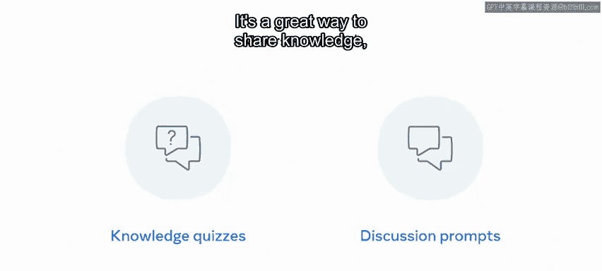

To be successful in this course， it is helpful to commit to a regular and disciplined approach to learning。

You need to be serious about your study， and if possible。

 map out a study scheduled with dates and times that you can devote to attending the course。

It's an online self paced course， but it does help to think of your study in terms of regular attendance at a learning institute。

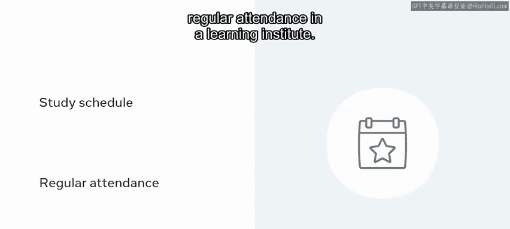

In summary， this course provides you with a complete introduction to databases and is part of a program of courses that lead you toward a career in database engineering。

