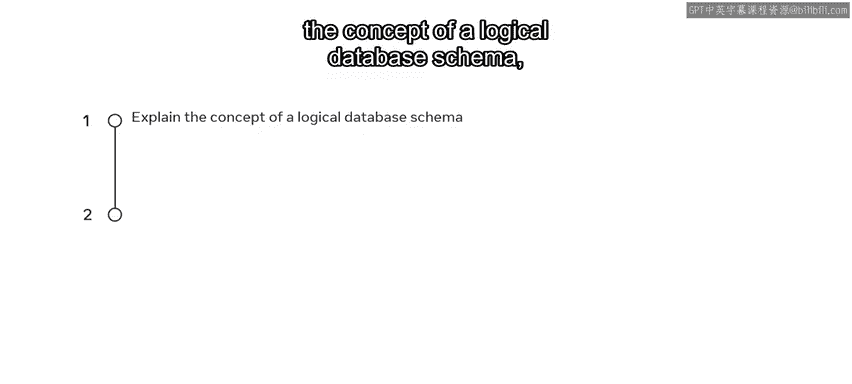
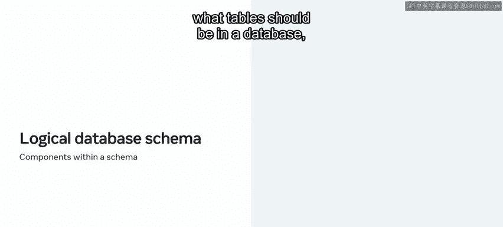
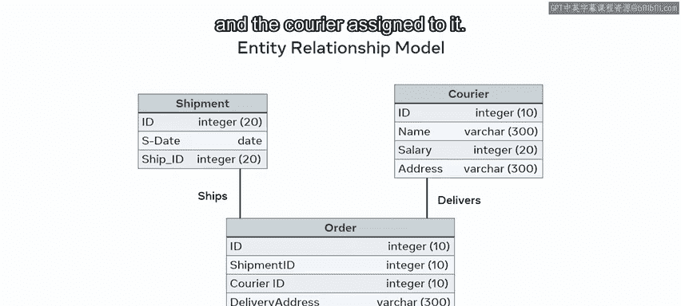
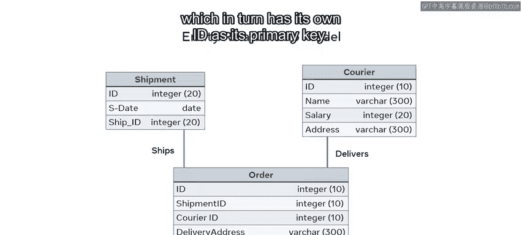
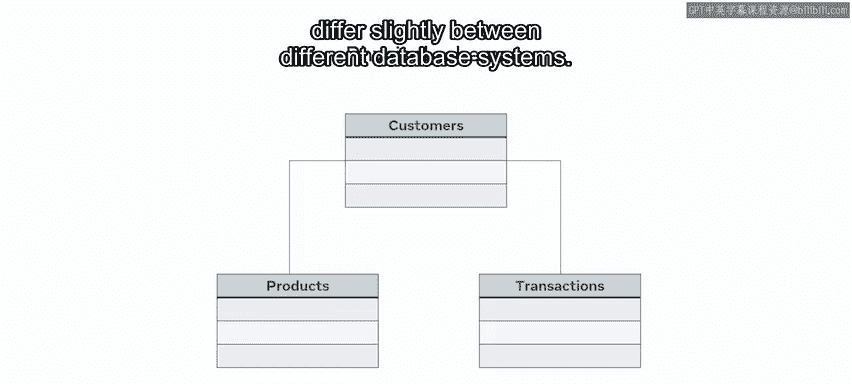

数据库工程师：P35：数据库模式类型 📊

在本节课中，我们将学习数据库模式的不同类型，理解逻辑模式与物理模式的区别，并了解它们如何共同构成数据库应用的基础。

创建数据库时，需要能够区分不同类型的数据库模式。换句话说，需要回答“哪种数据库最适合我的项目”这个问题。接下来，我们将探讨几种不同的数据库模式类型。通过本视频的学习，你将能够解释逻辑数据库模式的概念，并概述物理数据库模式的概念。

---

### 探索逻辑数据库模式 🧠

首先，我们来探索逻辑数据库模式。逻辑数据库模式是指数据在表格层面的组织方式。换句话说，它展示了数据库中应该有哪些表格，并解释了不同表格的属性是如何关联在一起的。

创建逻辑数据库模式意味着描绘数据各组成部分之间的关系。这也被称为实体关系建模。

它具体说明了实体类型之间的关系。让我们以一个简单的ER模型为例，它展示了一个订单应用程序的逻辑模式。该模型演示了订单、运送该订单的货运单以及分配给该订单的快递员之间的关系。

在每个表格中，ID属性是各自实体的主键。它为实体中的每个条目、行或记录提供了唯一标识符。在订单实体中，`to_shi_id`和`courier_id`被称为外键，但实际上，它们也分别是货运单和快递员实体的主键。这就在这些实体与订单表之间建立了关系，而订单表又有自己的ID作为其主键。

---

### 理解物理数据库模式 💾

上一节我们介绍了逻辑模式如何描述数据关系，本节中我们来看看物理模式。物理模式是指数据在磁盘上的存储方式。换句话说，这涉及到使用代码创建数据库的实际结构。

在MySQL和其他关系型数据库中，开发者使用SQL来创建数据库、表格以及其他数据库对象。

例如，你可以通过编写SQL语句来为在线商店数据库创建物理模式，这些语句用于创建客户、产品和交易等表格。然而，不同数据库系统之间的物理模式创建可能略有不同。

---

### 总结 📝

本节课中，我们一起学习了数据库模式的核心概念。数据库模式在数据库创建过程中至关重要，它们构成了应用程序的基础。

你现在应该能够描述逻辑数据库模式如何指代数据和表格的组织方式，并且知道使用ER模型来指定实体之间的关系。同时，你现在也应该知道，可以通过编写SQL语句创建物理模式来控制数据在磁盘上的物理存储方式。