# Meta《数据库工程师（数据库简介／Git／MySQL）｜Meta Database Engineer》中英字幕 - P36：35_表关系.zh_en - GPT中英字幕课程资源 - BV1Vw4m1Z7tb

At this stage of the course you spend some time exploring the relational model for databases。

 however， it's crucial that you have a proper understanding of how the relational model influences the design and structure of a database。

And how it helps to build relationships between tables。

Once you understand how your database is structured。

 then you can determine how best to extract information from it。Over the next few minutes。

 you'll learn how to outline the basics of the relational model。

 identify the different relationships between tables， and explain the basics of an EO diagram。

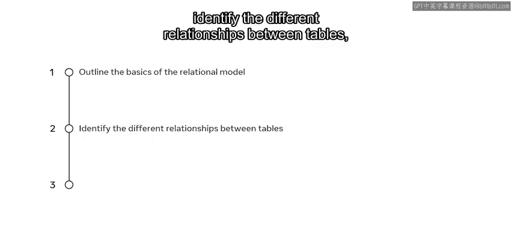

To understand how the relational model influences our databases。

 let's take the examples of two tables from a college database。

The first table shows a list of students， along with a assigned student and course identification numbers。

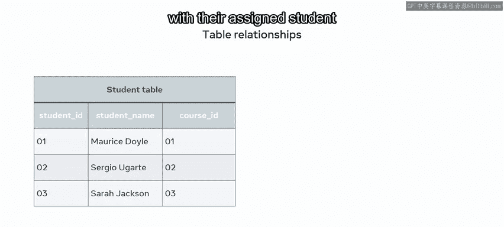

And the second table list courses that students can study。

 along with the ID for each course and its department。

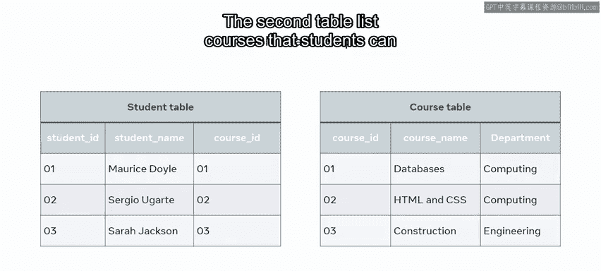

So the big question in this example is which student is studying what course？

And is each student studying one or multiple courses？

These are basic examples of why it's important to structure and connect tables correctly。

There are three types of relationships between any two tables in a relational database， one to many。

1 to one， and many to many。

Let's begin with an exploration of the one to many relationship。In a one to many relationship。

 a record of data in a row of one table is linked to multiple records in different rows of another。

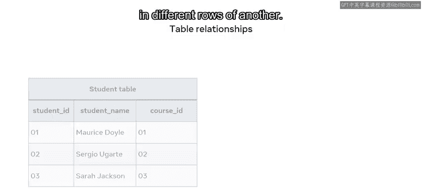

In the student table， a student with the idea of one is enrolled in two courses on the course table。

So a one to many relationship can be drawn between these tables。

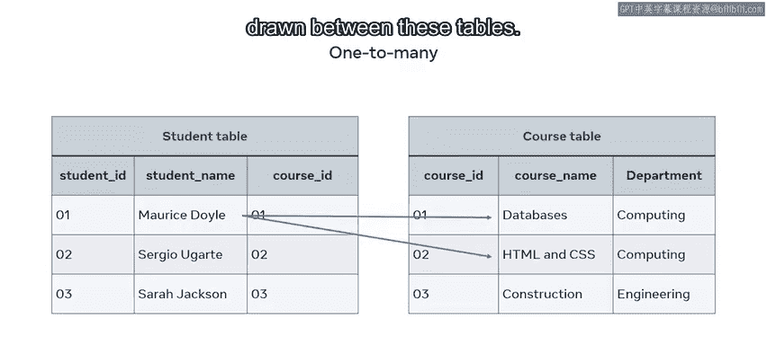

This relationship can also be illustrated in a basic entity relationship diagram or ERD。

 a student is enrolled in many courses using shapes and symbols。

The diagram depicts the two entities student and course in rectangle shapes withinrolled to describe the relationship in a diamond shape。

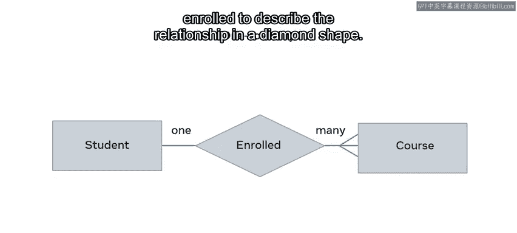

And many is depicted using the Crow's Fo notation symbol。

The relationship can also be illustrated using a more complex E or diagram that depicts keys。

Course ID in the student table is a foreign key or FK。

And this references the primary key or PK course ID column that exists in the course table。

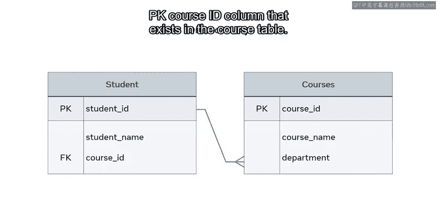

Next， let's take a look at one to one relationships。In one to one relationships。

 one single record of one table is associated with one single record of another table。

To demonstrate this relationship， I use two new tables。

 one that outlinetlines key information about the staff in each college department。

The other is the department location table that records key data by the location of each department on campus。

In this instance， each department head is in one department building on the college campus。

So each staff member from the department's staff table is associated with one record from the department table。

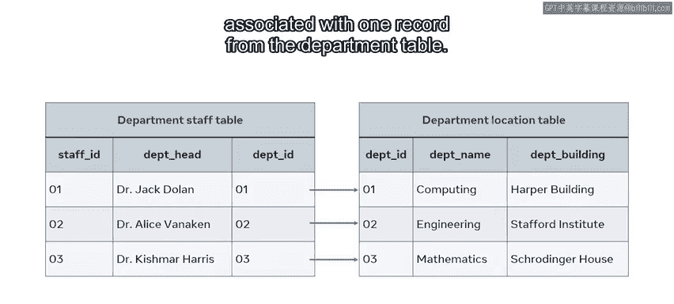

These relationships can also be depicted in an E or diagram as one department head leads one department。

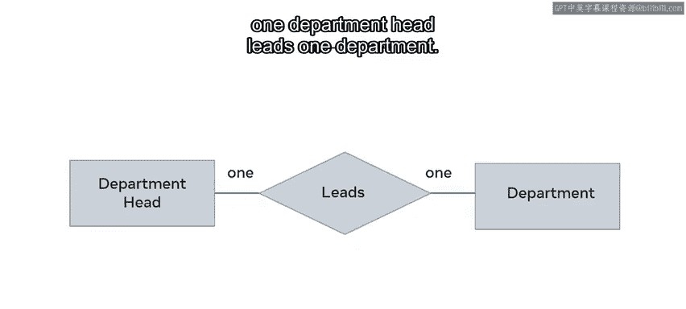

And finally， there's also many to many relationships。

This type of relationship associates one record of one table with multiple records of another table。

And the same relationship also works in the other direction。In this example。

 the student Ma Doyle is undertaking two research projects and each project is supervised by a different staff member。

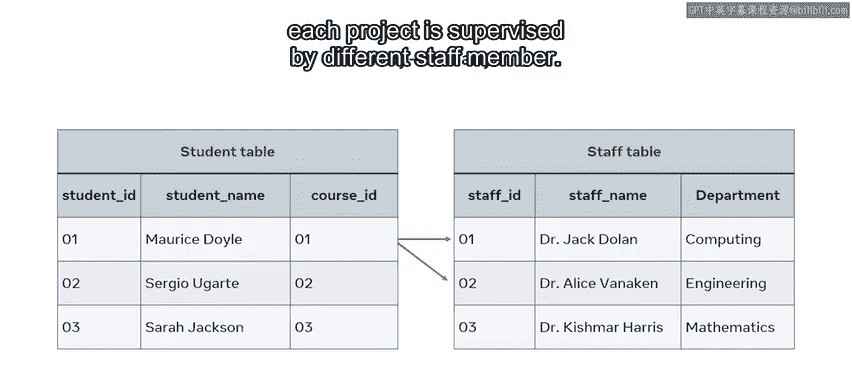

And likewise， one staff member can supervise or collaborate with multiple students on their research projects。

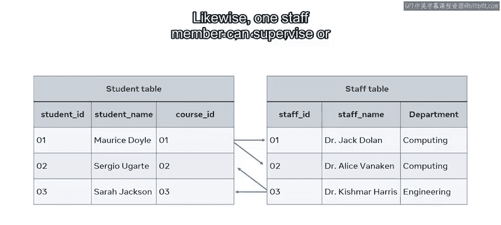

These relationships can also be depicted in an ER diagram as many students are supervised by many staff。

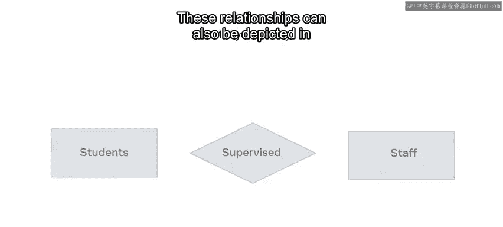

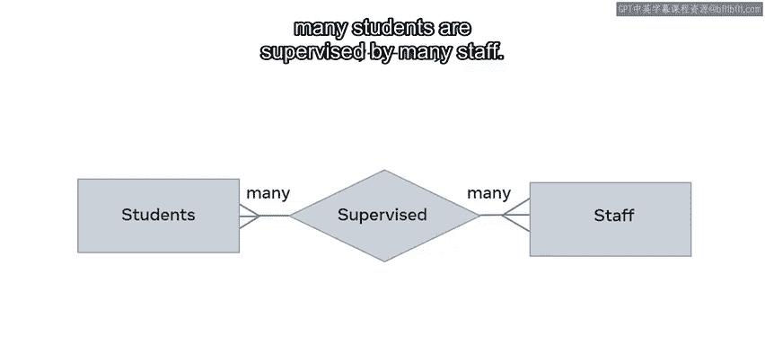

You should now be able to outline the different relationships that exist between tables in a relational database model。

Good work。