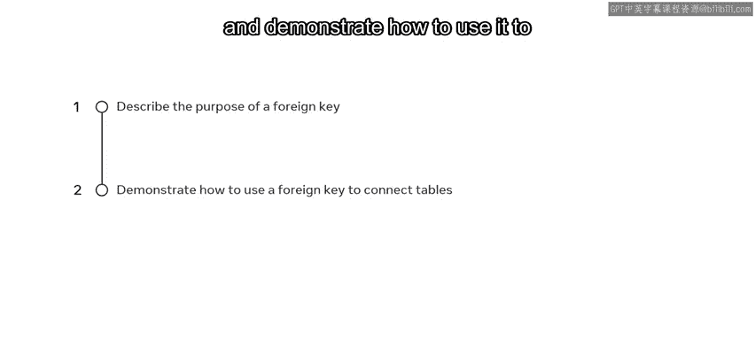
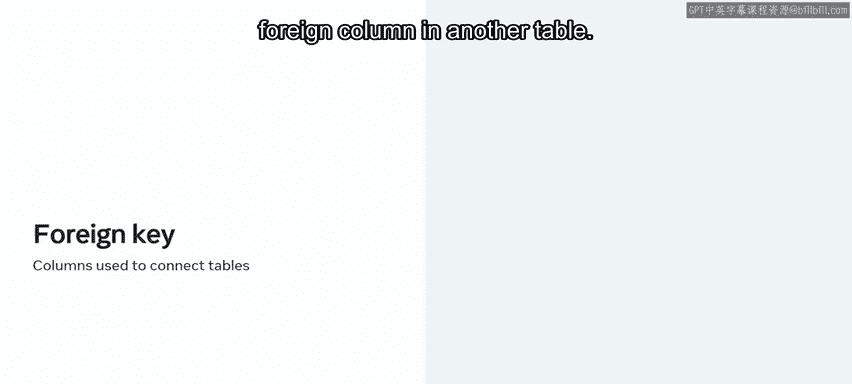
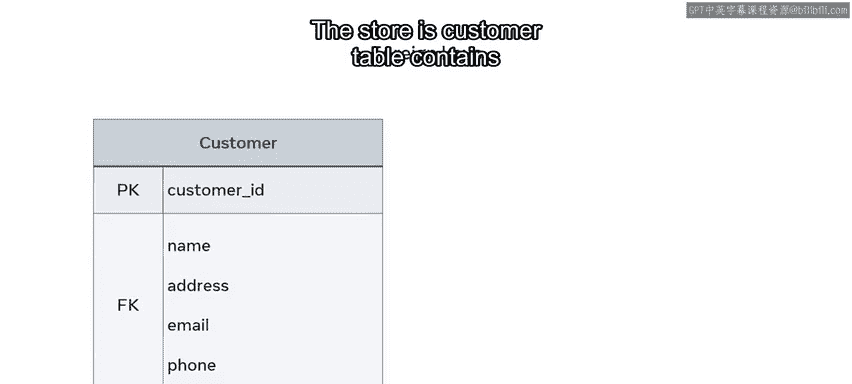
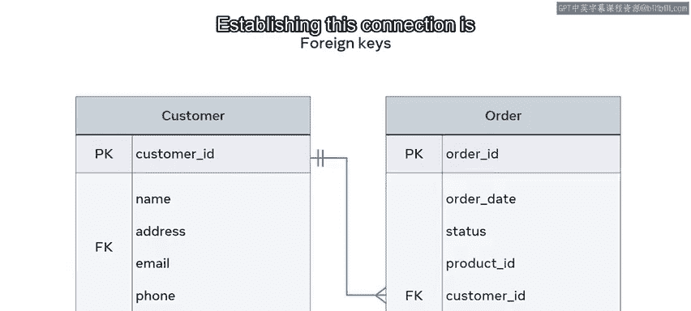
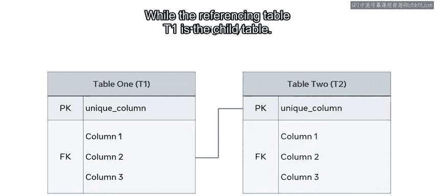
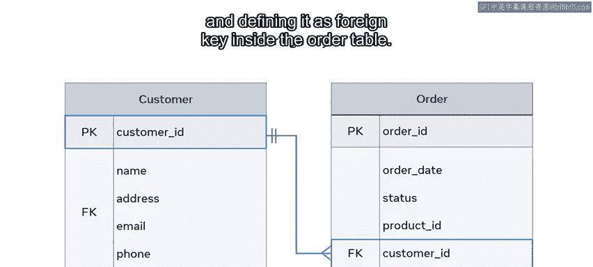
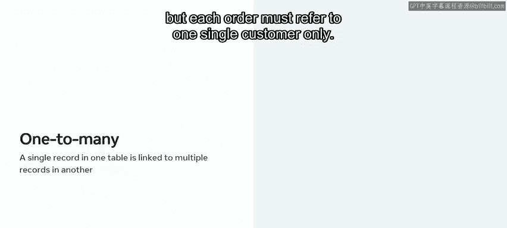
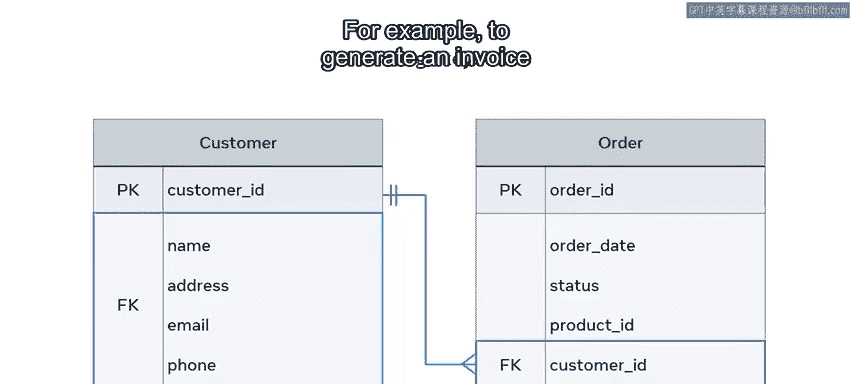
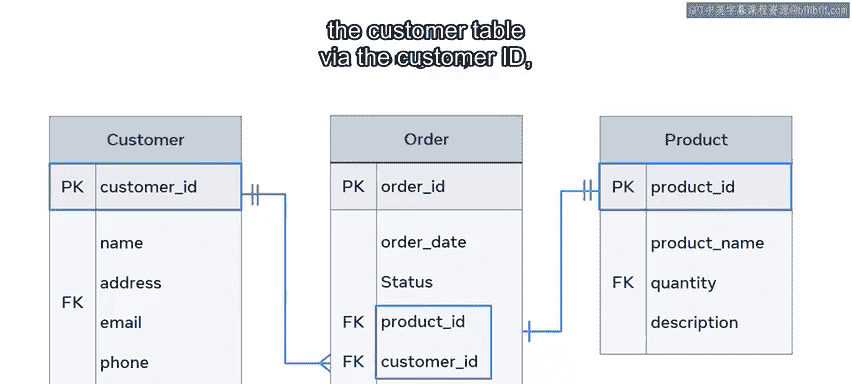
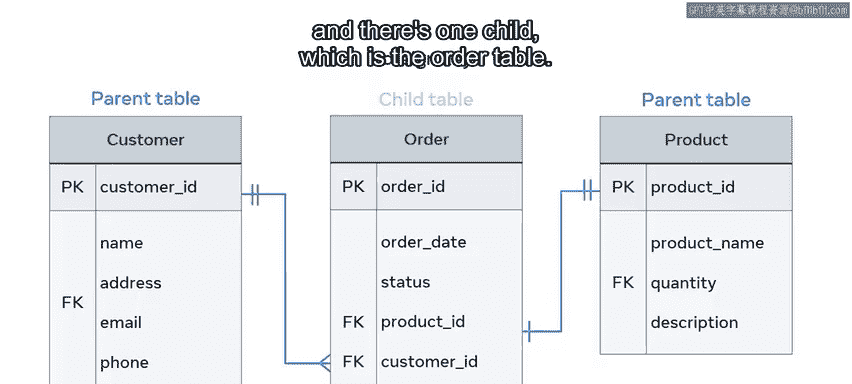

# Meta《数据库工程师（数据库简介／Git／MySQL）｜Meta Database Engineer》中英字幕 - P38：37_外键.zh_en - GPT中英字幕课程资源 - BV1Vw4m1Z7tb

Imagine a scenario where a bookstore has a database that contains two tables。

Customer T to track customer information and an order table to track customers orders。

But how can they determine which customer made which order？

The solution is to add a customer ID column into the order table column as a foreign key。

Over the next few minutes， you'll learn how to describe the purpose of a foreign key and demonstrate how to use it to connect different tables in a relational database。

 so what exactly is a foreign key？

A foreign key is one or more columns used to connect two tables in order to create cross referencing between them by foreign developers mean external。

 so the foreign key in one table will refer to an external or foreign column in another table。

Let's find out more about how a foreign key works by exploring the tables from the database of an online store。

The store's customer table contains information about the customer's name and address。

While their order table contains information about each customer's order date and status。

The issue is how to connect these tables to make sure that each order is associated with the right customer。

Establishing this connection is important so that you can process and deliver orders to the right customers。

 update order details， or cancel orders if required。

A foreign key is a great method of establishing a relationship between these tables so that these other tasks can be carried out。

😊，But before you learn about how to use a foreign key。

 let's take a few moments to explore the concept in a bit more detail。😊。

To find out more about how far keys work， let's take the example of the relationship between two generic entity tables。

These tables are called table 1 or T1 and table2 or T2。

The purpose of connecting these tables is to relate records of data that exist in both tables with each other。

The foreign key in T1 should point a related column in T2 In this case。

 the foreign key column values in T1 must correspond to existing values in the reference column in T2。

And the reference column in T2 must contain unique values in each row of data。

This will most likely be the primary co in T2。In addition。

 the reference table T2 is known as the parentent table。

 while the referencing table T1 is the child table。

Don't worry if all this seems a bit complicated， Let's simplify things by exploring an entity relationship diagram using the customer and order tables from earlier。

In this diagram， the order table relates to the customer table by including the customer ID attribute and defining it asF key inside the order table。

The relationship between these two tables is one to many。

You might have encountered this type of relationship in an earlier video。

One to many means that each customer may have many orders。

 but each order must refer to one single customer only。

This means there must be a customer record available in the customer table before any order can be made。

😊，But it is not necessary to have an order once a new customer is created。Therefore。

 the customer table represents a parent table and the order table represents a child table。

This means that the parent can exist and the child may not exist。

But the opposite scenario cannot occur。In this example。

 the customer ID value existing in the order table can be used to fetch the records of a specific customer to determine who placed the order。

 for example， to generate an invoice or to deliver an order to customer address。

It is also possible for a table to have more than one foreign key。

Each will be used to connect the referencing or child table with other referenced or parent tables。

In this case， you love multiple parents to the same child。

Let's add a new table product table into the previous diagram to explain this in more detail。

The order table now has two foreign keys。One foreign key links it with the customer table via the customer ID。

 and the other links it with the product table via the product ID。

The relationship between these tables is one to one。

Each order must be related to a specific product record。

 and each product might be related to an order record， but doesn't have to be。

For example， you can receive a new product in your inventory。

 but no customer has placed an order on it yet。If an order has not been placed in this product。

 then it's not related to any order yet。So this then raises the question。

 who is the parent and who is the child？The customer， the order， or the product。

The answer is that there are now two parents， the customer and the product tables。

 and there's one child which is the order table。

You should now understand the purpose of a foreign key。

And youd also be able to demonstrate how it can be used to connect tables in a relational database。

Well done。