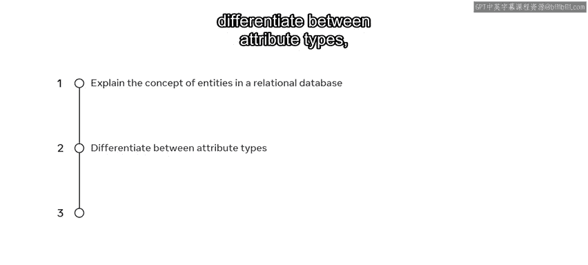

# 数据库设计基础：1.3：查找实体 🔍

在本节课中，我们将要学习关系型数据库设计中的一个核心概念：实体。我们将了解实体的定义，并学习如何区分不同类型的属性。掌握这些知识是构建有效、实用数据库的第一步。

---



## 什么是实体？

上一节我们介绍了数据库设计的基本目标，本节中我们来看看构成数据库的基本元素——实体。


实体可以被描述为一个具有属性来定义其特性的对象。在数据库中，实体可以是任何代表单个对象的事物，例如一个地点或一个人。

在关系型数据库系统中，项目中的每个重要对象都可以被视为一个实体，例如一位客户或一个个体。在诸如MySQL这样的数据库管理系统中，一个实体以表的形式存在，由行和列组成。

让我们通过一个电子商务商店的数据库例子来更深入地探讨这个概念。假设有一个存放配送记录的表。

*   **表名**代表实体名称，例如 `deliveries`（配送）。
*   **每一列**代表与该实体相关的属性。

该系统存储与客户（实体）相关的属性，例如 `ID`（标识符）、`name`（姓名）和 `delivery_status`（配送状态）。这些属性保存着关于表实体的相关数据。因此，在这个电商系统中，客户实体的每个实例都包含一条关于每位客户的数据记录。


**代码示例：一个“客户”实体表**
```sql
CREATE TABLE customers (
    customer_id INT PRIMARY KEY, -- 关键属性
    first_name VARCHAR(50),      -- 简单属性
    last_name VARCHAR(50),       -- 简单属性
    email VARCHAR(100)           -- 单值属性
);
```

---


## 属性的类型

理解了实体的基本构成后，我们来看看定义实体的细节——属性。属性并非千篇一律，它们有不同的类型。

在关系型数据库系统中，存在多种类型的属性，包括：简单属性、复合属性、单值属性、多值属性、派生属性和关键属性。

以下是这些属性的详细说明，我们以一个学生表为例：

*   **简单属性**：指无法进一步分类的属性。在学生记录的例子中，`grade`（成绩）的值就无法再细分。
*   **复合属性**：指可以拆分为不同组成部分的属性。例如，每位学生的 `name`（姓名）值可以拆分为 `first_name`（名）和 `last_name`（姓）这样的子属性。
*   **单值属性**：指一个字段只能存储一个值的属性。在学生表示例中，`date_of_birth`（出生日期）列每位学生只能包含一个值，因此可定义为单值属性。
*   **多值属性**：指一个字段可以存储多个值的属性。例如，`student_email`（学生邮箱）列可以为每位学生保存多个邮箱地址（如学校邮箱和个人邮箱）。**但请注意，在关系型数据库中应避免这种设计实践**，通常需要通过规范化拆分成新的表。
*   **派生属性**：指其值可以从另一个属性推导出来的属性。在学生表中，每位学生的 `age`（年龄）可以从他们各自的 `date_of_birth`（出生日期）派生出来。
*   **关键属性**：这是一个包含唯一值的字段，用于标识唯一的实体记录。一个很好的例子是 `student_id`（学号）列中的值。每个ID都是一个唯一值，可用于获取特定学生的数据。

**公式与代码示例：属性类型**
*   **派生属性公式**：`年龄 = 当前年份 - 出生年份`
*   **关键属性代码**：在SQL中通常使用 `PRIMARY KEY` 约束来定义。
    ```sql
    ALTER TABLE students ADD PRIMARY KEY (student_id);
    ```

---

## 设计的实用性考量

认识了各种实体和属性后，我们需要思考一个关键问题：如何取舍？

请记住，考虑那些在你的项目中不会被使用的实体或属性是没有意义的。你只需要在数据库系统中捕获那些能帮助系统用户完成特定任务和活动的数据。设计应始终以实际需求为导向。


---

## 总结

本节课中我们一起学习了关系型数据库中的核心概念。我们首先定义了**实体**是拥有属性的独立对象，并以表的形式存在。接着，我们详细区分了六种**属性类型**：简单属性、复合属性、单值属性、多值属性、派生属性和关键属性，并通过学生表示例加深理解。最后，我们强调了数据库设计应注重实用性，只包含必要的数据以支持用户任务。掌握这些基础知识是进行有效数据库设计的关键一步。