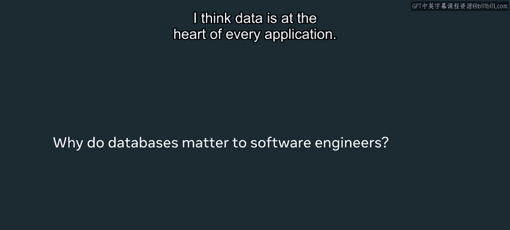
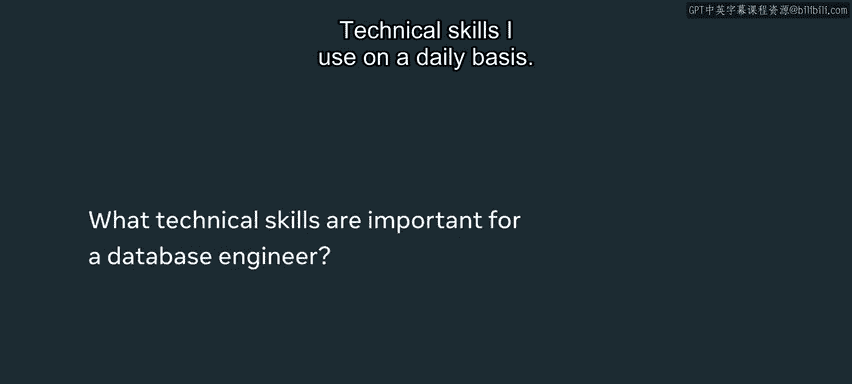
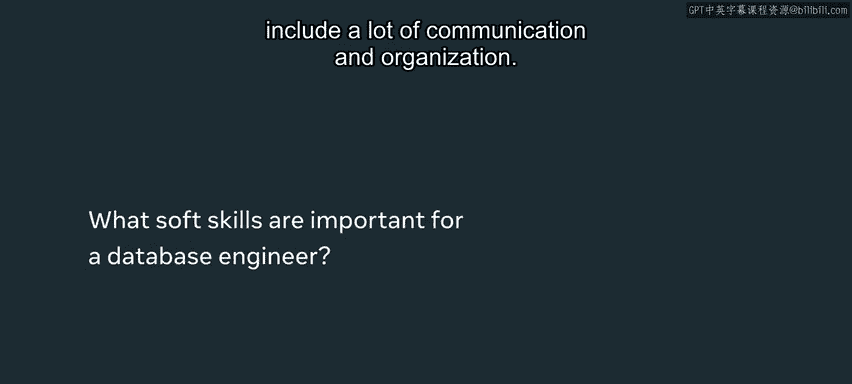
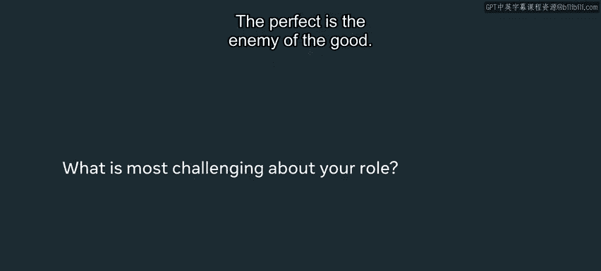
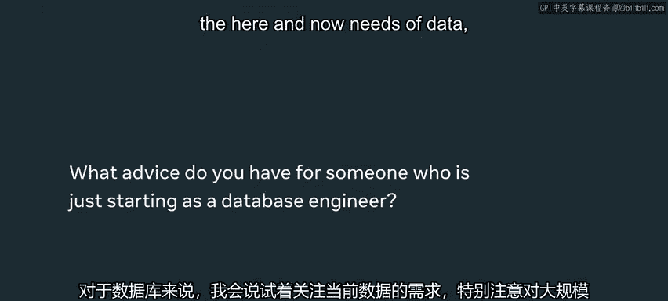
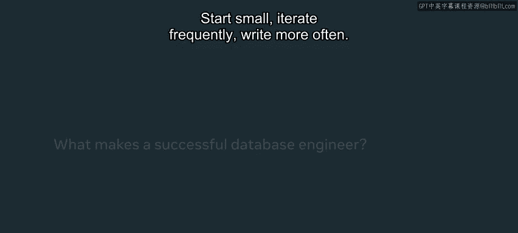
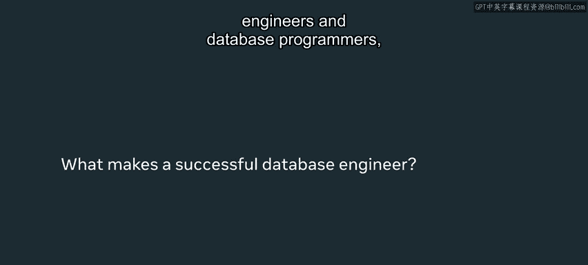
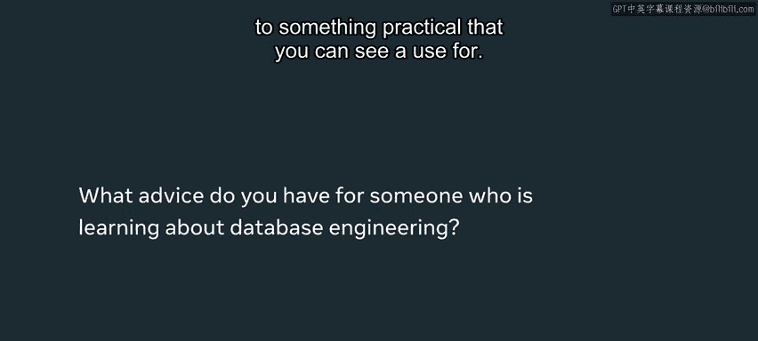

# 数据库工程师课程：P3：数据库工程师的一天 🗓️

在本节课中，我们将跟随Meta的软件工程师Daniel Bloomfield Rammagen，了解数据库工程师的日常工作、核心技能与思维方式。我们将看到技术如何服务于解决实际问题，并学习如何成为一名高效的数据库工程师。

## 核心理念：技术服务于人 💡

上一节我们介绍了数据库的基本概念，本节中我们来看看数据库工程师的核心工作哲学。

我十分认同一个理念：我们最终是通过技术来解决人类的问题。作为一名软件工程师，我的角色不仅仅是开发技术解决方案，这些方案必须能产生实际的人类价值。

我是Daniel Bloomfield Rammagen，是Meta的一名软件工程师。我于2017年加入公司，在华盛顿特区办公室工作。

## 无处不在的数据库 📖

数据库并非遥不可及的概念，它存在于我们生活的方方面面。

我立刻想到了我母亲的食谱书，那是一个活页笔记本。她把所有食谱都记在这个活页本里，每一页都有编号，并且在笔记本的开头做了一个索引，以便轻松找到想要的食谱。这，就是一个数据库。可以说，我母亲就是一位数据库工程师（或许不是工程师），但她确实依赖并创建了自己的数据库。

我喜欢这个有趣的例子，因为它展示了**一旦你以结构化的方式存储数据，使其易于检索，所能实现的各种可能性**。它可以是食谱书，也可以是我刚刚在Facebook上分享的照片，让世界各地的朋友都能迅速看到。这一切的核心，都由大量的基础设施和数据库驱动。

## 数据层的重要性与影响力 ⚙️

理解了数据库的普遍性后，我们来看看它在应用开发中的核心地位。

我认为数据是每个应用的核心。因此，学会创建一个有效的数据层，能够为用户提供快速、准确的响应和结果，是至关重要的。特别是作为一名数据库工程师，你参与的是构建应用程序中如此关键的一环，你对后续的一切都有着巨大的影响力。

这包括用户界面、客户端、API等，所有这些都会受到影响。数据层如何被建模、存储，以及有效检索数据的特性，如何让技术栈的其他部分更容易地使用这些信息，你都拥有巨大的影响力。我希望你能认识到，你对应用程序的开发有着非常重要的影响。

## 数据库工程师的日常技能 🛠️

那么，数据库工程师具体需要哪些技能呢？以下是日常工作中用到的关键技能。

**技术技能：**
*   **编程：** 我每天都会编码。这不仅指使用标准的Web编程语言进行开发。
*   **数据库操作：** 我也在数据库领域工作，创建那些**提取、转换、加载（ETL）** 大量数据的管道，这些数据最终会进入我们开发的应用程序。

**软技能：**
*   **沟通与组织：** 我日常使用的软技能当然包括大量的沟通和组织能力。刚从学校毕业时，你可能会对编码和你学到的技术技能感到非常兴奋，这些显然非常重要。

## 超越代码：沟通的价值 📝

技术技能是基础，但仅有技术是不够的。上一节我们提到了软技能，本节我们来深入探讨其中最重要的部分：沟通。

我曾以为代码就是一切，我来这里就是为了编程。我期望人们能理解我的代码输出。

但我后来认识到这是不够的。我看到过一些技术能力很强的人，他们之所以能取得更大的成功，仅仅是因为他们能够向内部团队，以及可能使用这些工具特性的其他人，清楚地解释他们在做什么。

**“完美是优秀的敌人。”**

特别是在数据库开发中，很容易过度复杂化解决方案，尤其是在进行数据建模和数据存储时。你会想要覆盖数据的每一种可能变化、每一个不同的用例和边缘情况，这可能导致你创建出非常复杂、难以维护且性能不佳的数据模式。

你需要对你的工作进行迭代。对于数据库，我会说，**尽量关注数据当前和近期的需求**。

要特别警惕那些对海量数据可扩展性的臆想需求，这可能会再次导致你的解决方案过度复杂化。而事实上，你可能只需要一个规模小得多的方案，至少可以用于启动项目，并更好地理解功能和数据的真实需求。所以，**从小处着手，频繁迭代**。

## 实践建议：多写与联系实际 ✍️

了解了核心技能和沟通的重要性后，这里有一些具体的行动建议可以帮助你成长。

**多写：**
我知道，通常当你想到工程师和数据库程序员时，你认为你的工作成果就是程序、代码和SQL查询。是的，确实如此。

但仅此而已，我认为是不够的。所以要用写作来补充。你要写什么？当然有伴随代码的文档。我在Meta有一位好同事，每当我我说我完成了某件事时，他会看着我说：“你是真的完成了吗？”我第一次听到时回答：“是的，我完成了。”然后他会接着问：“你的文档准备好了吗？你的代码提交到正确的地方了吗？Wiki页面更新了吗？你为此写过文章吗？”他强调了一个重要性：**代码只完成了80%，另外20%是所需的额外沟通**。

所以我会说，**多写**。不要害怕写得不完美，先写点什么，发布点什么。无论是分享你正在做的工作状态，还是仅仅增强你正在编写的文档，养成多写的习惯。

**联系实际：**
尝试将你学到的东西与一些实际的、你能看到用途的事物联系起来。无论是学习数据库时，想到你母亲或父亲活页笔记本里的食谱书，还是你小时候收集的棒球卡或漫画书。

尝试思考如何将你学到的技术知识应用到这些现实生活的问题中。它们可以是小问题，比如在合适的时间找到食谱；当然也可以是更大、或许更有趣的问题，比如人与人之间的技术和数字通信问题。

## 总结 📚

本节课中，我们一起学习了数据库工程师的日常工作视角。我们认识到，数据库工程师的核心使命是**通过技术解决人类问题**，而不仅仅是编写代码。数据层是应用的心脏，数据库工程师对其有着深远的影响。日常技能不仅包括编程和数据库操作（如ETL管道），更包括**沟通、组织和写作**等软技能。记住“完美是优秀的敌人”，在数据库开发中应避免过度设计，**从小处着手，频繁迭代**。最后，通过**多写作**和**将学习与实际应用场景联系**起来，可以更有效地提升自己，为构建有影响力的应用打下坚实基础。