# Meta《数据库工程师（数据库简介／Git／MySQL）｜Meta Database Engineer》中英字幕 - P44：43_模块小结 数据库设计.zh_en - GPT中英字幕课程资源 - BV1Vw4m1Z7tb

Well done， you've reached the end of this module and database design。

 It's now time to recap the key points and skills。You began this module with a lesson on designing a database schema and learned that a correctly designed database is the basis for all subsequent data storage and analysis。

It's crucial to know the principles of good database design because a poorly designed database makes it hired。

 if not impossible， to produce accurate information。Having completed this module。

 you should now be able to define the term database schema。

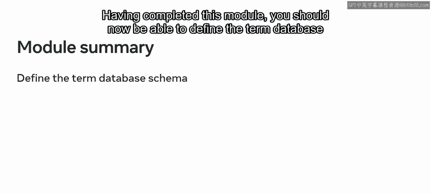

Describe the schema of different database systems。

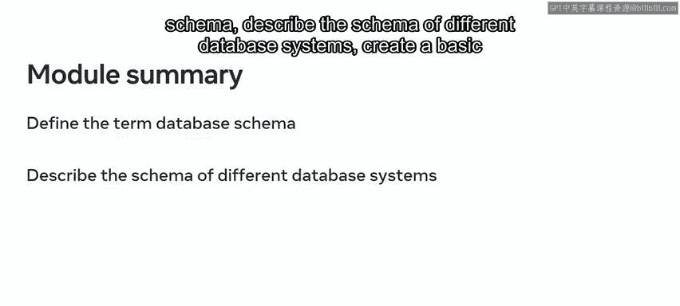

Create a basic database schema using SQL and list the two main types of database schema。

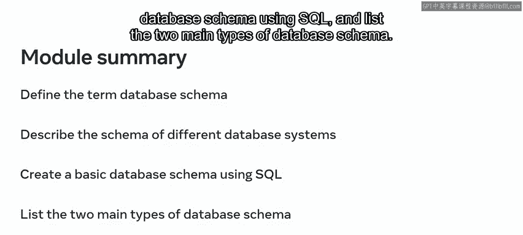

You then move on to explore relational database design。

In this lesson you learned how to design a relational database。Having completed this lesson。

 you should now be able to describe the relational model list different types of relations。

 evaluate an entity relationship diagram or E or D。

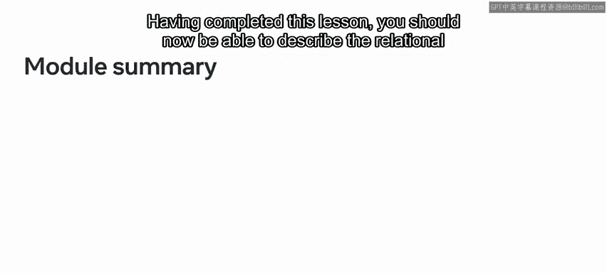

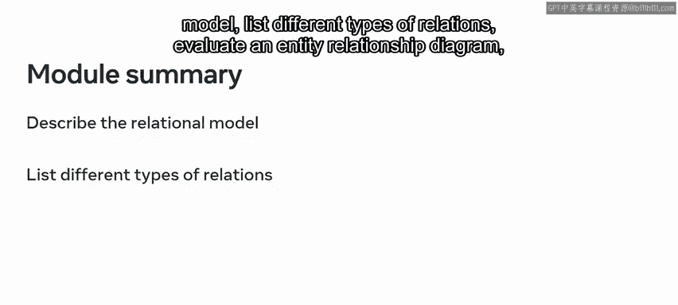

And explain the purpose of primary key in a database table。

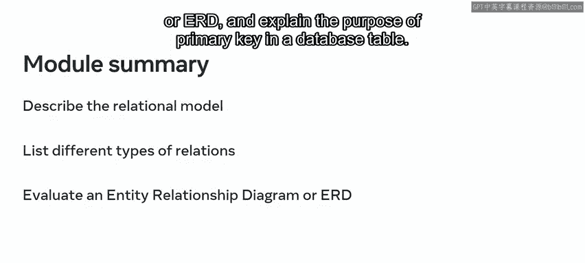

And you should now also be able to demonstrate how to select a single primary key and a composite primary key。

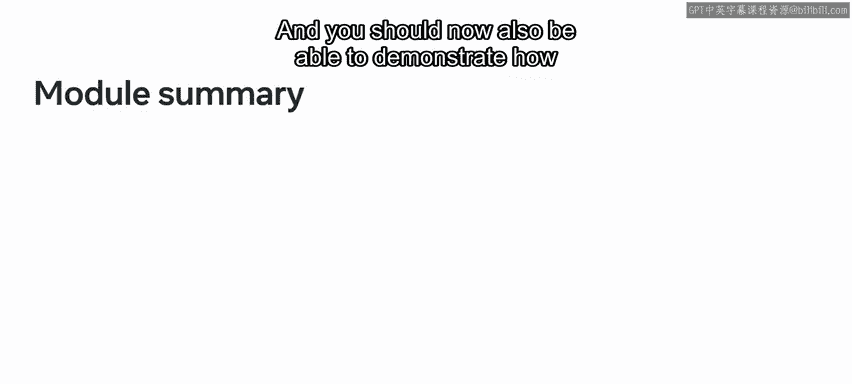

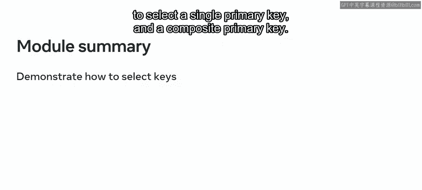

Described the purpose of a foreign key。Connect tables using a foreign key and summarize the meaning of entities in a relational database。

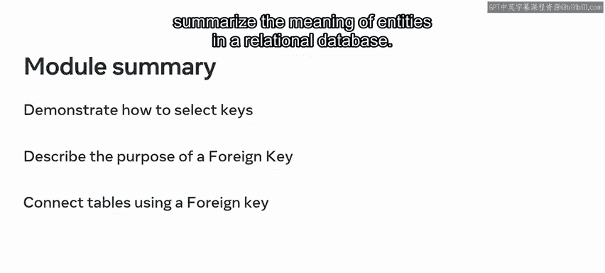

Furthermore， you should now be able to list different types of attributes。

 identify entities and their attributes， and create links between entities。

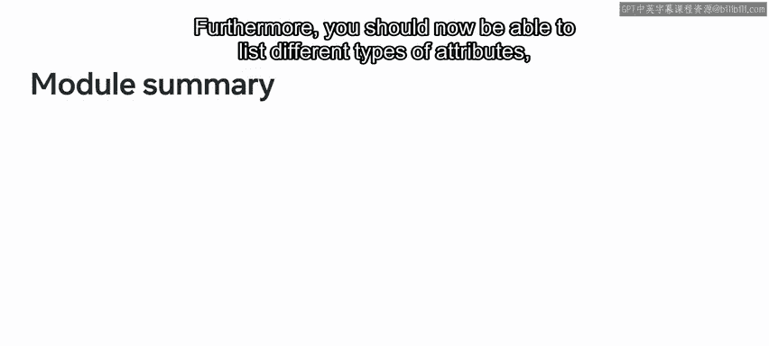

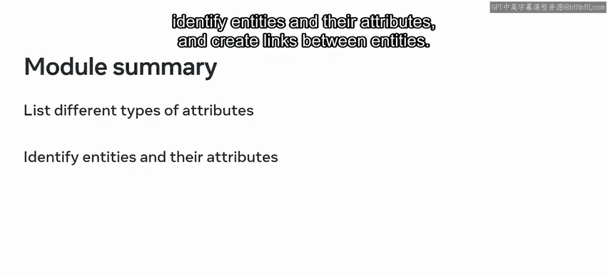

The last lesson covered database normalization。Normalization is the process of converting a large table into multiple tables to reduce data redundancy。

You should now be able to explain database normalization， recognize insert。

 update and deletion anomalies， and explain the atomity concept and describe the repeating groups of data problem。

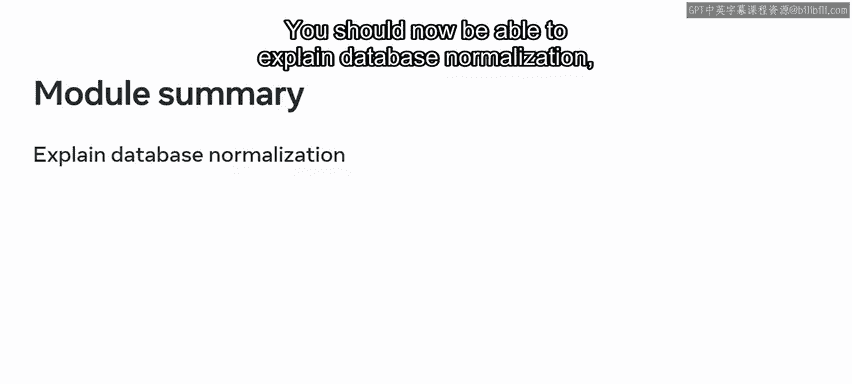

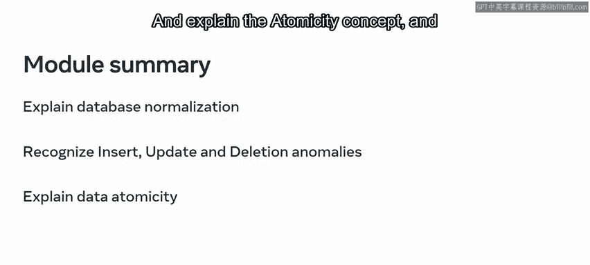

And you should now know how to design a database in first， second， and third normal form。

 and explain the concept of functional， partial， and transitive dependency。

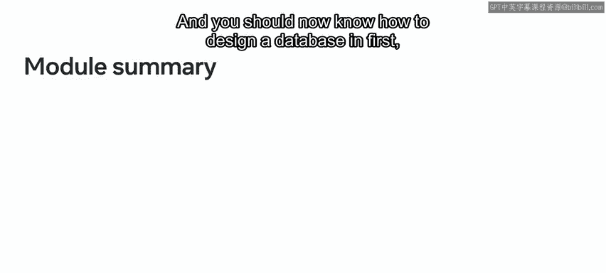

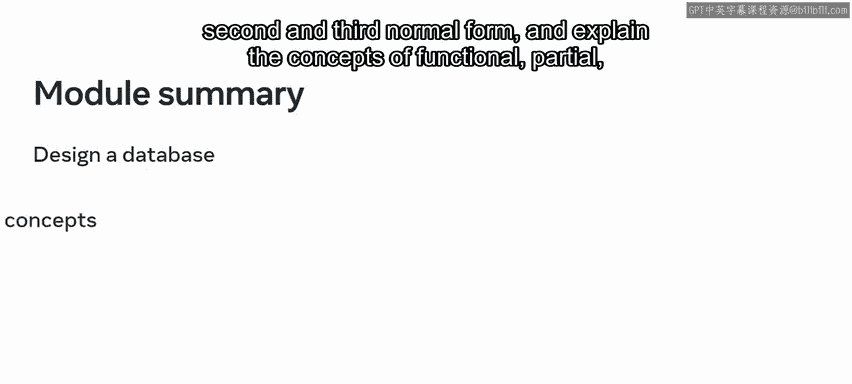

You should then be familiar with the essential skills and concepts of database design。

And you should also be able to create the structure of a normalized relational database。Well done。

That's great progress towards your learning goals。