# Meta《数据库工程师（数据库简介／Git／MySQL）｜Meta Database Engineer》中英字幕 - P45：44_数据库介绍课程回顾.zh_en - GPT中英字幕课程资源 - BV1Vw4m1Z7tb

In this course， you covered an introduction to database engineering。

Let's take a few moments to briefly recap what you learned。In the opening module。

 you introductions to the course and explored possible career roles that you might want to follow as a database engineer。

You also reviewed some tips around how to take this course successfully and discussed what it is that you hope to learn。

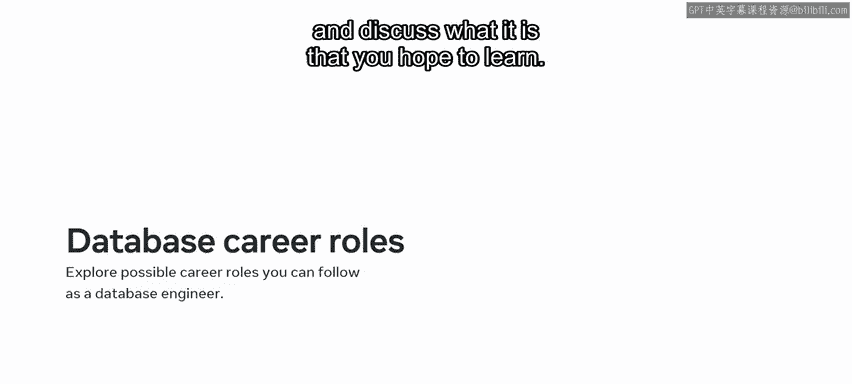

You then covered an introduction to SQL or standard query language。

 the coding syntax used to interact with databases。

 and finally you explore the basic structure of databases and learn about the different types of keys they use。

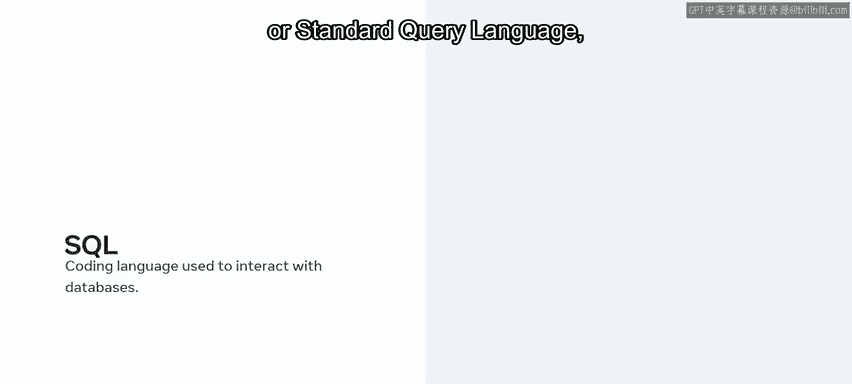

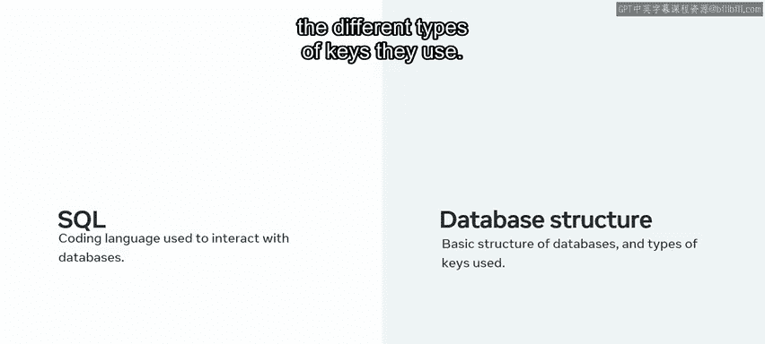

You began module2 with an exploration of SQL data types and learned how to differentiate between numeric data。

 string data， and default values。

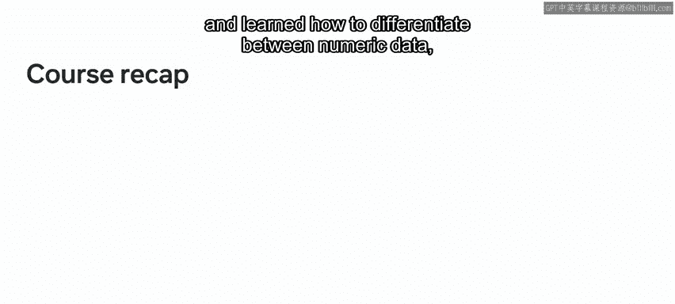

You also completed several exercises in which you learned how to utilize these different data types in your database projects。

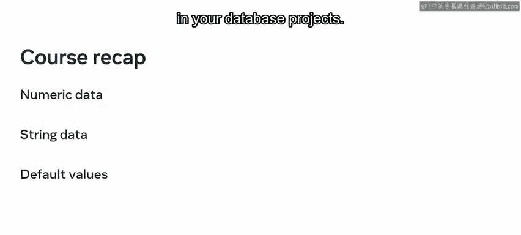

You then moved on to exploreCd， or create， read， update， and delete operations。

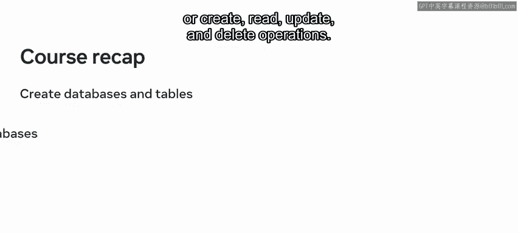

You learn how to create databases and tables and populate them with data。

You explored how to update and delete data， and you demonstrated your ability with crowd operations by completing exercises in creating and managing data。

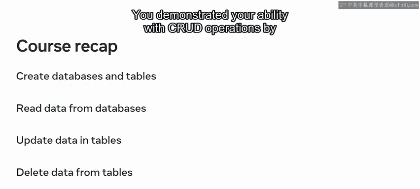

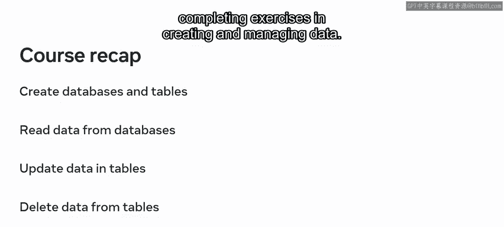

In the third module， your reviewed SQL operators learned how to sort and filter data。

You began the module with a lesson on SQL operators in which you explored the syntax and process steps to deploy SQL arithmetic and comparison operators within a database。

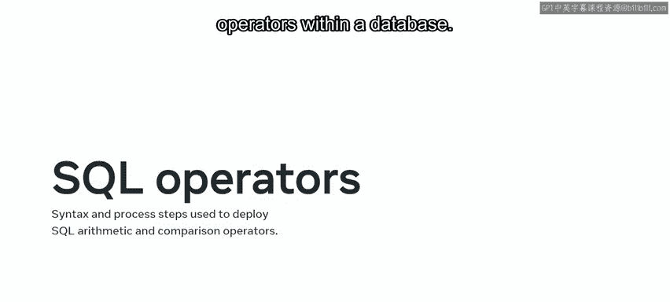

Next， you covered how to sort and filter data using clauses。

The clauses that you learned about include the order by clauses， the wear clauses。

 and the select distinct clauses。You also covered an overview of how each clause is used to sort and filter data in a database。

And you went through demonstrations of these clauses and had an opportunity to try them for yourself。

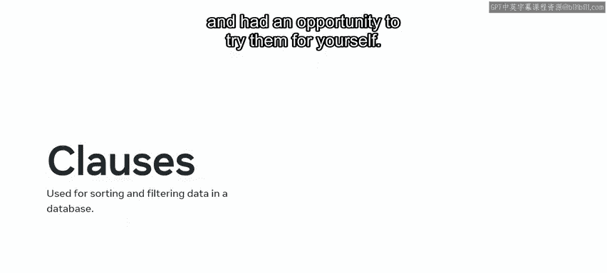

In module4， you learned about database design。In the first lesson。

 you had an overview of how to design a database schema。

 you explored basic database design concepts like schema and learned about different types of schemas。

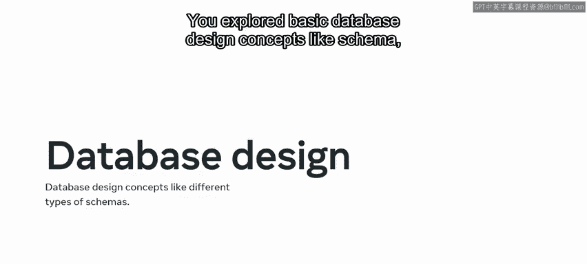

The next lesson focused on relational database design。

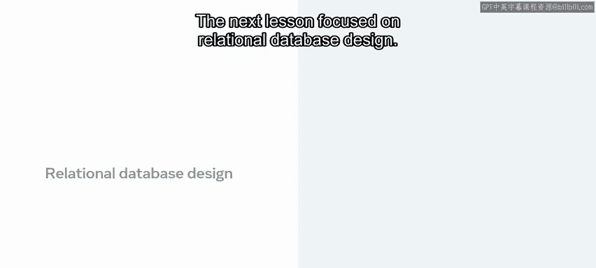

In this lesson， you investigated how to establish relationships between tables in a database using keys。

You also learned about the different types of keys that are used in relational database design。

 such as primary， secondary， candidate， and foreign keys。

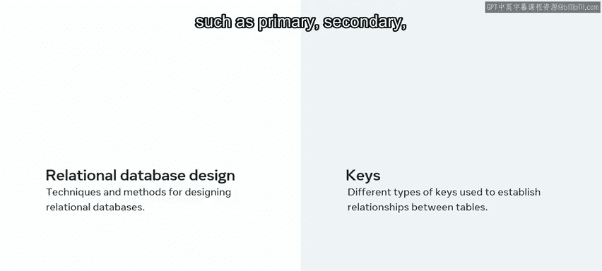

Finally， you covered a lesson on database normalization。In this lesson。

 you investigated the key concepts around database normalization。

 You then learned about the concept of normal form and about the first。

 second and third normal forms。

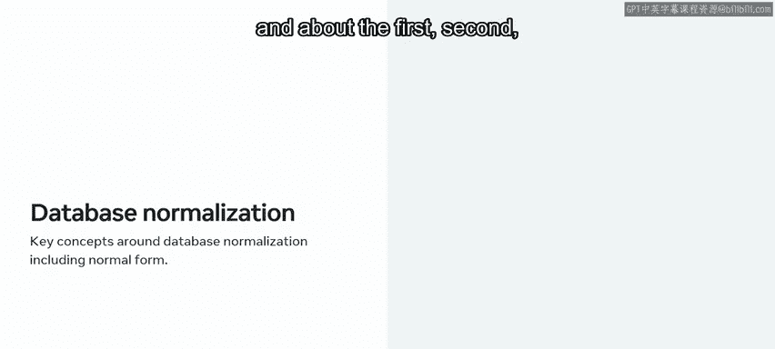

Well done in completing this recap。Now it's time to try out what you've learned in the grade assessment。

Good luck。