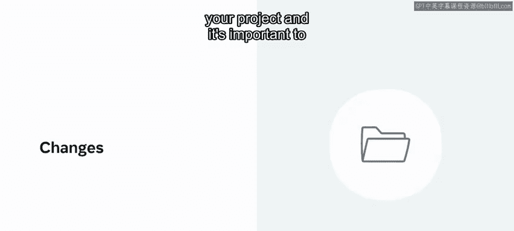
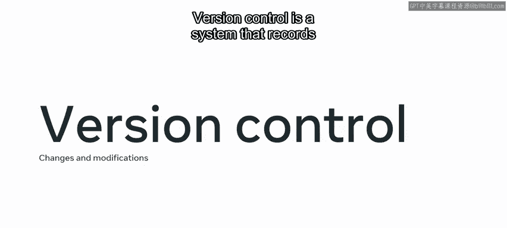
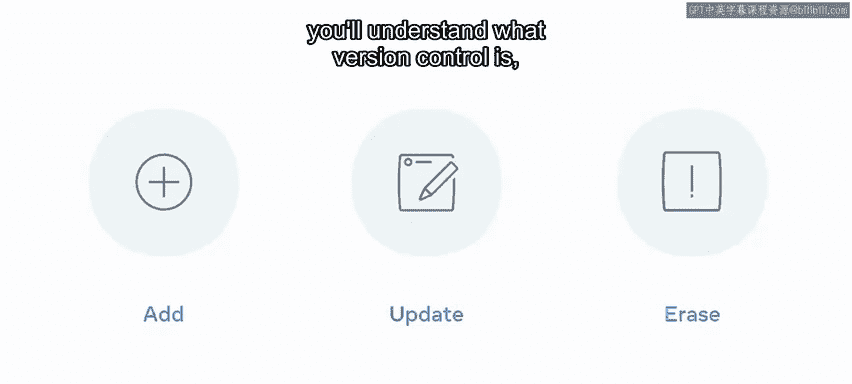
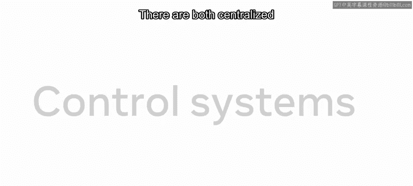
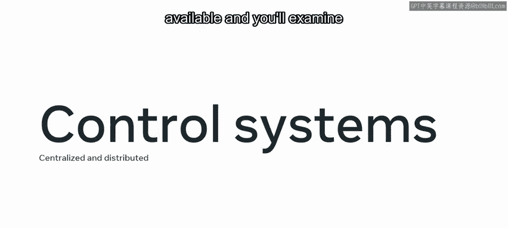
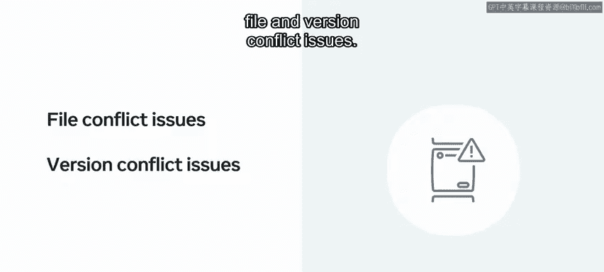
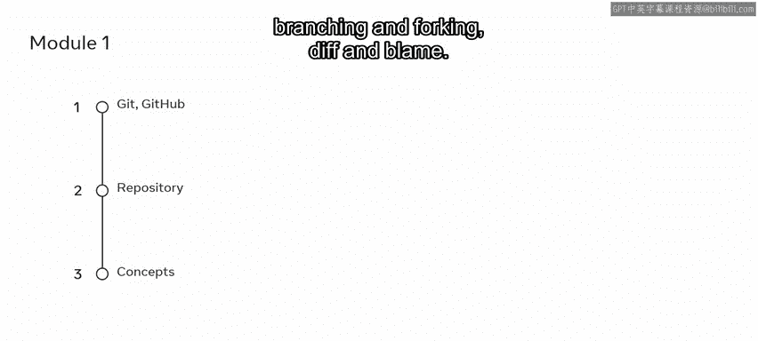
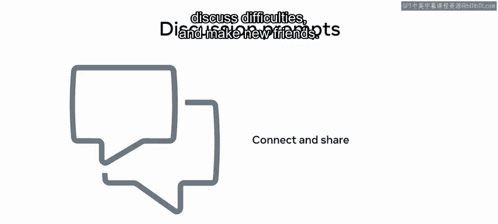
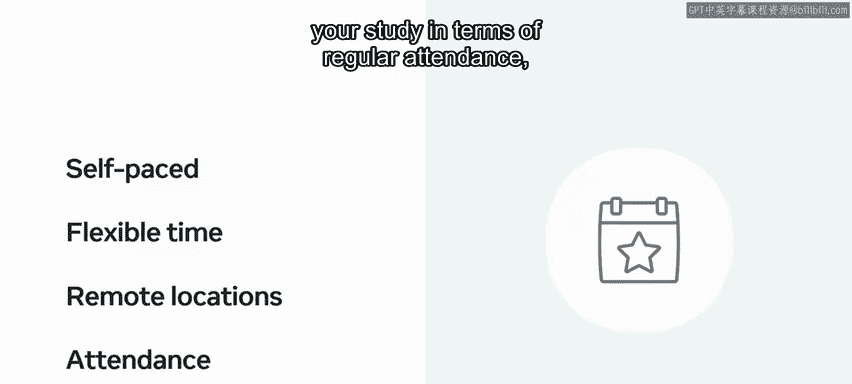
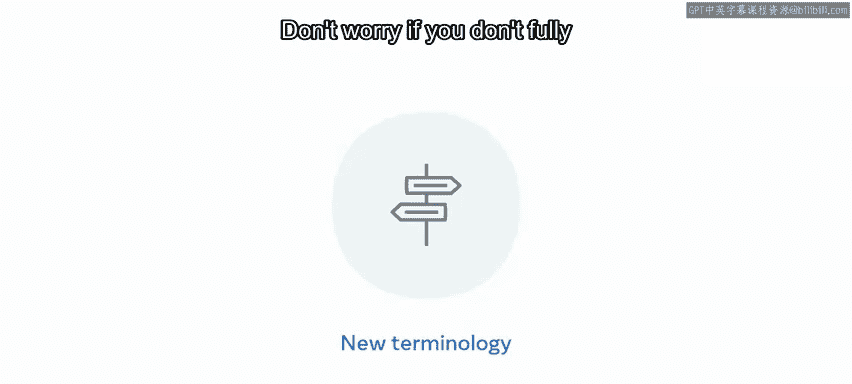

# 数据库工程师：P47：课程介绍 📚

在本节课中，我们将要学习版本控制的基础概念及其在软件开发中的重要性。课程将介绍版本控制系统如何工作，以及如何使用像 Git 和 GitHub 这样的工具来管理项目文件的变化。我们还会探讨命令行操作，特别是 Unix 命令，并了解如何通过课程资源有效地学习。

你是否曾经在设备上意外删除了某些内容，并希望能够撤销这个错误。

虽然人类尚无法进行时间旅行，但从事项目工作的程序员可以做到类似的事情。

他们使用一个称为版本控制的系统来实现这一点。作为一名程序员，你将在项目中处理许多文件，跟踪所做的更改非常重要。版本控制系统会记录所有文件的更改和修改，以便进行追踪，这对你的日常开发活动至关重要。

在本课程中，你将熟悉版本控制及其与开发的关系。学习结束时，你将理解什么是版本控制、它如何工作以及如何使用它。既有集中式也有分布式的控制系统，你将审视不同类型的工作流程。冲突解决是版本控制的一个重要方面，因为它帮助用户管理文件和版本冲突问题。

你将探索使用 Git 和 GitHub 等版本控制技术进行版本跟踪的流行方法，并学习如何在 GitHub 中创建和克隆仓库。此外，你将熟悉 Git 的概念，例如 `add`、`commit`、`push` 和 `pull`、分支与分叉、`diff` 和 `blame`。

除了专注于版本控制，本课程还探讨了命令行的使用，重点在于 Unix 命令。课程中有许多视频将逐步引导你实现目标。观看、暂停、回放和重看视频，直到你对自己的技能充满信心。然后，你可以通过查阅课程读物来巩固知识，并在课程练习中将技能付诸实践。在学习过程中，你会遇到几个知识测验，可以自我检查进度。

考虑从事网络开发职业的人不止你一个，课程讨论提示使你能够与同学联系。这是一个分享知识、讨论困难和结交新朋友的好方法。为了帮助你在课程中取得成功，承诺采用规律且自律的学习方法是一个好主意。

你需要尽可能认真地对待学习，如果可能的话，制定一个学习计划，标明你可以投入课程的日期和时间。当然，这是一个在线自定进度的课程，你可以在适合你生活方式的时间、地点进行学习。然而，将你的学习视为定期出勤，就像在实体教育机构可能必须做的那样，可能会有所帮助。

你可能在本视频中遇到了新的技术词汇和术语。如果你现在不完全理解所有这些术语，请不要担心，学习过程中将涵盖所有你需要的内容。总之，本课程为你提供了版本控制的完整介绍，并且是引导你走向软件开发职业生涯的一系列课程的一部分。

本节课中我们一起学习了版本控制的基本概念、其重要性以及 Git 和 GitHub 等工具的基础操作。我们还了解了如何通过课程视频、练习和社区互动来有效地学习。掌握这些知识是成为一名高效开发者的重要第一步。