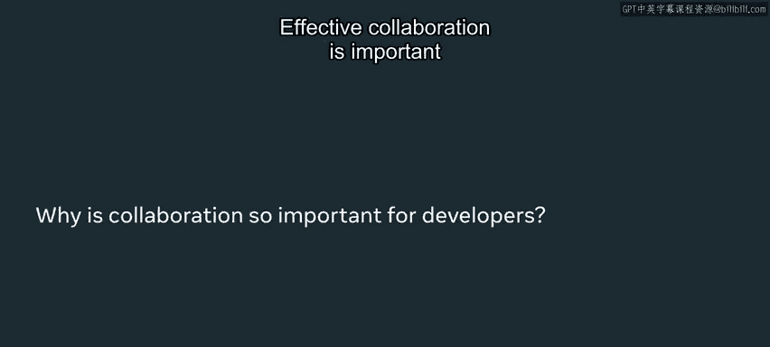
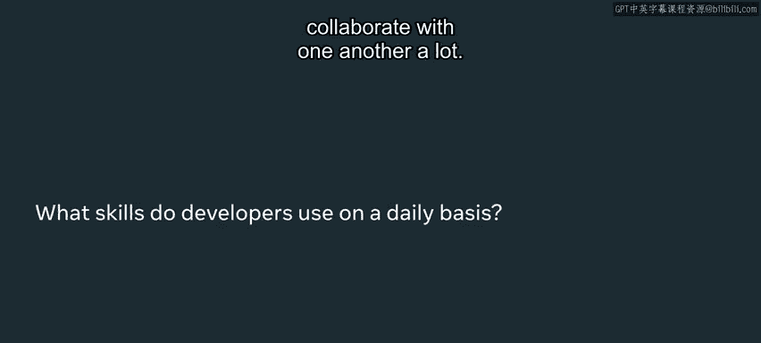
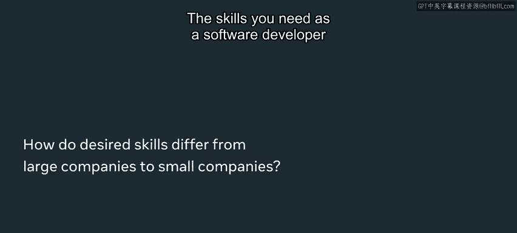
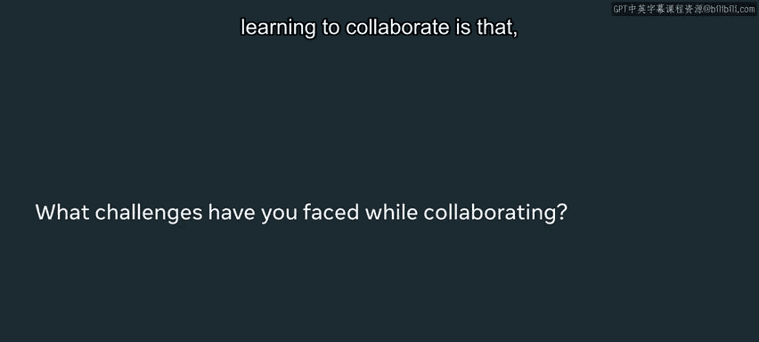
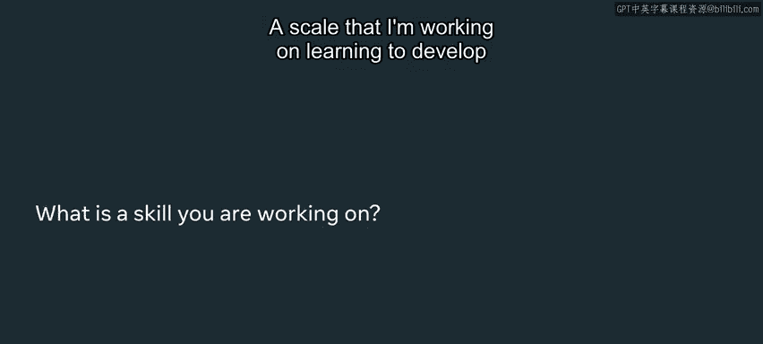
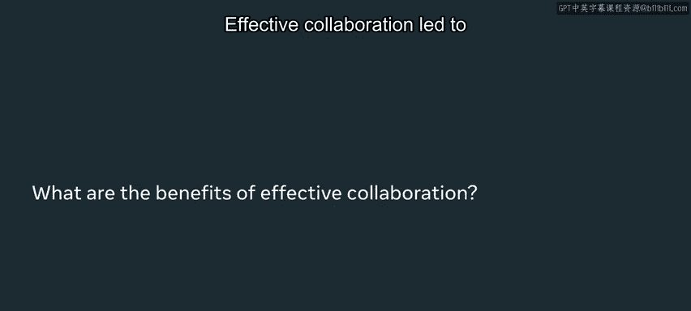

# 数据库工程师：P48：开发人员如何在现实中进行协作 💬

在本节课中，我们将学习软件开发中至关重要的协作技能。我们将探讨有效沟通、优先级管理、时间估算以及如何适应不同团队环境，这些是确保项目成功和团队高效运作的核心。

## 概述

沟通是与他人协作时最重要的技能。它能确保在构建产品时大家目标一致，并让团队成员能相互跟进时间线，对产品需求的理解保持一致。

## 协作的重要性与对象

上一节我们了解了沟通的核心地位，本节中我们来看看协作的具体场景。有效的协作对于在大型项目中与拥有不同技能的人协同工作至关重要。

以下是工程师需要协作的主要对象：
*   **与其他工程师协作**：在共同构建功能时，我们必须并行工作，为用户设计最佳功能。
*   **与非工程师角色协作**：例如，在构建 Instagram Live 功能时，我们需要：
    *   与产品经理合作，确定应该构建什么。
    *   与用户研究员合作，确定应关注哪些领域以打造最佳产品。
    *   与设计师合作，确定产品的外观和感觉。
    *   作为工程师，共同确定在既定时间线内实际可以构建的内容。

## 关键协作技能

了解了协作对象后，我们来看看作为开发者需要掌握哪些具体技能。沟通是与其他开发者合作最重要的技能之一，此外还有几项关键能力。

1.  **提供恰当背景信息**：学习如何为其他开发者提供他们工作所需的适量背景信息。
2.  **无情地确定工作优先级**：作为软件工程师，总有无数可以改进产品的事情。学会区分哪些事情对解除他人或自己的阻碍最为重要，这是一项关键技能。这可以用一个简单的公式表示：`优先级 = 影响力 / 所需努力`。
3.  **准确估算时间**：对于软件开发者来说，准确估算产品开发时间非常重要。刚开始时可能有些棘手，但学会预估项目时长并能解释其中的权衡取舍至关重要。

## 不同公司环境的协作差异

掌握了核心技能后，需要注意的是，这些技能的应用会因公司环境而异。软件开发者所需的技能因公司不同而略有差异。

*   **大公司（如 Meta）**：工程师更加专业化。需要学会为他人提供恰好适量的背景信息，因为与你合作的人可能对你所做的工作了解有限。
*   **初创公司**：人们通常对你正在做的工作有更多了解，但他们可能不是该领域的专家。因此，你可能需要做更多解释，但提供的背景信息可以相对少一些。

## 协作中的挑战与个人发展

适应不同环境会带来挑战，同时也推动个人成长。我在学习协作时遇到的一些挑战是，必须学会根据不同人的工作偏好来调整我的工作方式。

*   有些同事是视觉型学习者，因此我学会了在交谈时使用白板。
*   有些同事喜欢先思考再发言，因此我学会了在交谈时更有耐心地倾听他们。

一项我正在学习、以推动自身职业发展的技能是移动开发。我是一名后端工程师，每天与移动工程师合作。为了更好地为他们构建产品，了解他们的工作方式和代码库结构对我们共同构建更好的产品很有帮助。

为了学习移动开发，我参加了 Meta 为有兴趣学习移动开发的后端工程师提供的 Android 训练营课程。完成课程后，我团队中的 Android 工程师给了我一些小任务和项目来主导，以便我能更多地了解他们的工作方式。

## 有效协作的工具与益处

个人技能的提升需要好的工具来支撑。实践有效的版本控制能带来更好的协作，因为它能帮助你理解某些更改的原因（例如查看提交记录 `git commit -m "描述"`），也有助于你在处理不同功能或项目时理清上下文关联。

有效的协作在我最近的一个项目中带来了更好的结果。我是一名后端工程师，负责主导团队一个关键项目的后端部分。我不得不意外休假，但由于我在 Git 中为代码更改保留了清晰的提交记录，并为团队准备了大量文档，他们能够轻松接手我的工作，最终项目得以按计划推进。

## 总结与鼓励

回顾本节课，我们一起学习了软件开发中现实协作的多个方面。你应该继续学习如何与他人协作，因为与越多的人合作，你就能获得关于所构建产品的不同视角，从而打造出更好的产品。

这是有回报的，因为与你合作的人越多，你能学习的人就越多。最终，你构建的产品会更好，因为它将融入更多不同的意见和视角。