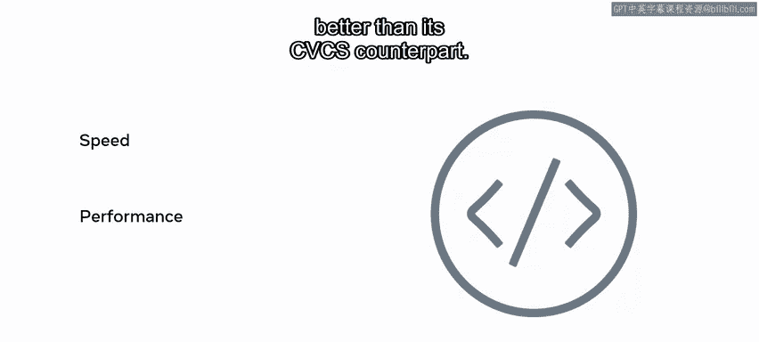

# Meta《数据库工程师（数据库简介／Git／MySQL）｜Meta Database Engineer》中英字幕 - P51：4_版本控制系统和工具.zh_en - GPT中英字幕课程资源 - BV1Vw4m1Z7tb

As a developer working in a team， you are continually writing。

 changing or updating existing source code。 It may happen that while you are working on a new feature。

 another developer in the team is busy fixing an unrelated bug。

 With multiple developers all working in the same code base。

 keeping track of all of those additional updates can be problematicLuckily。

 version control addresses these kinds of problems。 In this video。

 you will discover the different types of version control systems。

 Learn how they operate and learn about their similarities and differences。

There are many different version control systems available， for example， subversion per force。

 AWS code commit， Mercurial， and Git to name a few。

Version control systems can be split into two types or categories。

 centralized version control systems and distributed version control systems。

 both types are quite similar， but they also have some key differences which set them apart from each other let's start with centralized version control systems。

Centralized version control systems or CVCS for short contain a server and a client the server contains the main repository that houses the full history of versions of the codeb developers working on projects using a centralized system need to pull down the code from the server to their local machine This gives the user their own working copy of the code base。

The server holds the full history of changes， the client has the latest code。

 but every operation needs to have a connection to the server itself。

In a centralized version control system， the server is the central copy of the project。

After making changes to the code， the developer needs to push the changes to the central server so that other developers can see them。

This essentially means that viewing the history of changes requires that you are connected to the server in order to retrieve and view them。

Now let's discover how distributed version control systems work Dis version control systems or DVCS for short are similar to the centralized model you still need to pullcode down from the server to view the latest changes。

The key difference is that every user is essentially a server and not a client this means that every time you pull down code from the distributed model。

 you have the entire history of changes on your local system。

Now that you know a little about CVCS and DVCS， let's explore some of the advantages and disadvantages of each the advantage of CVCS is that they're considered easier to learn than their distributed counterparts。

They also give more access controls to users The disadvantage is that they can be slower given that you need to establish a connection to the server to perform any actions with DVCS。

 you don't need to be connected to the server to add your changes or view of files history。

It works as if you are actually connected to the server directly， but on your own local machine。

You only ever need to connect to the server to pull down the latest changes or to push your own changes。

 it essentially allows users to work in an offline state。

Speed and performance are also better than its CVCS counterpart。

DVCS is a key factor in improving developer operations and the software development lifecycle you will learn more about DVCS later in this course and there you have it you can now differentiate between a centralized and a distributed version control system。

You also learned how they operate and what their benefits are as an aspiring developer。

 I'm sure you can appreciate the importance of version control systems well done。

