# Meta《数据库工程师（数据库简介／Git／MySQL）｜Meta Database Engineer》中英字幕 - P53：6_模块小结 软件协作.zh_en - GPT中英字幕课程资源 - BV1Vw4m1Z7tb

Well done， you reach the end of this introductory module on software collaboration。

 It's now time to review what you've learned during these lessons。😊。

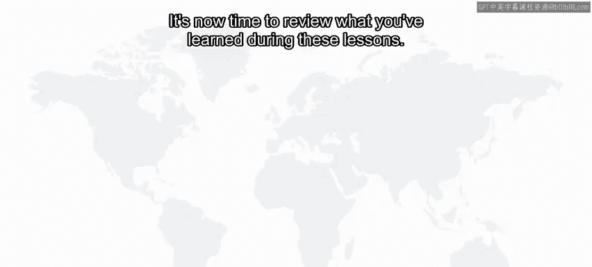

This module started with a case study about how software engineers collaborate across the globe without wrecking on another's code。

 You then began to explore the answer to the question， what is version control。

 You learned to describe how modern software teams collaborate and work on the same codeb。

 list different version control systems， Ex different version control methodologies and explored software development workflows。

 You learned about the history of version control and that it has been in use before the internet was widely adopted。

 You explored conflict resolution and discovered the important role of version control in the software development process。

 You learned about some of the common tools and strategies developers use to implement version control such as workflow。

 continuous integration， continuous delivery and continuous deployment。😊。

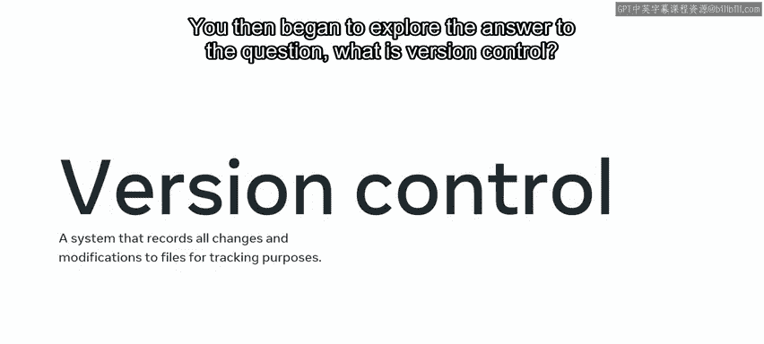

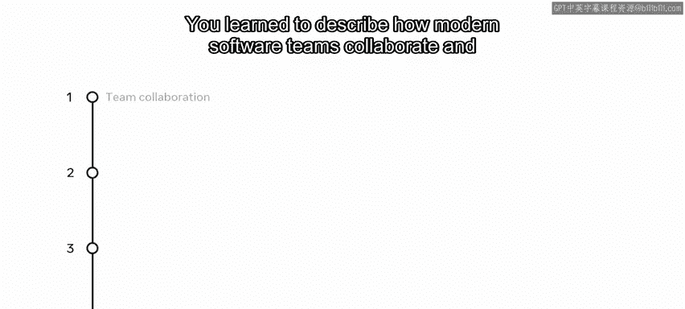

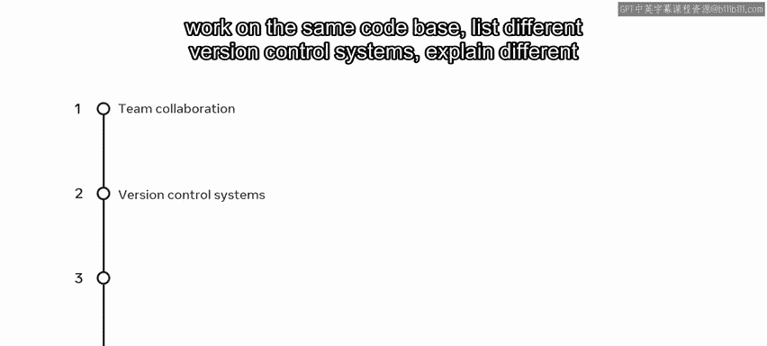

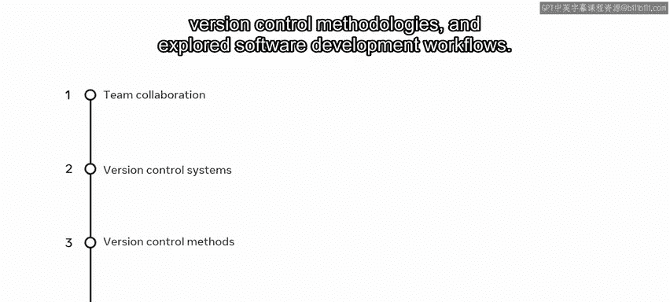

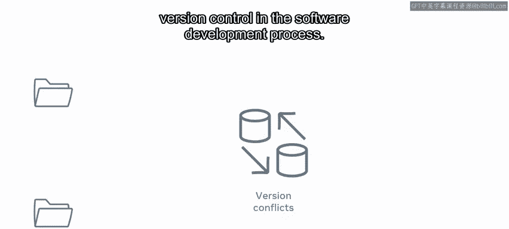

The differences between staging and production were explored。

 And you learned that the staging environment should mimic your production environment。

 You also learned the many areas that benefit from creating a staging environment。

 including new features， testing， migrations and configuration changes。

 You learned that any issues should be caught and fixed in the staging environment before going live in production。

 You have also explored down time， vulnerabilities and reputation regarding production。

 You should now be familiar with version control。 Well done。

 Youre making good progress on your learning journey。😊。

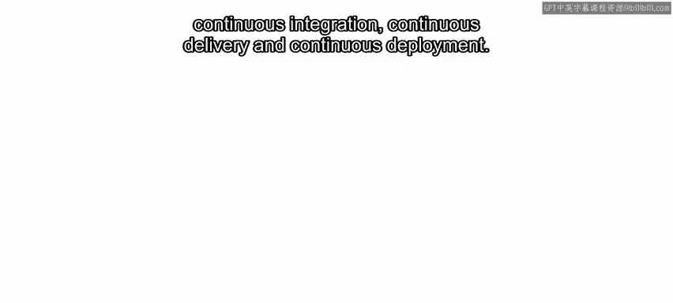

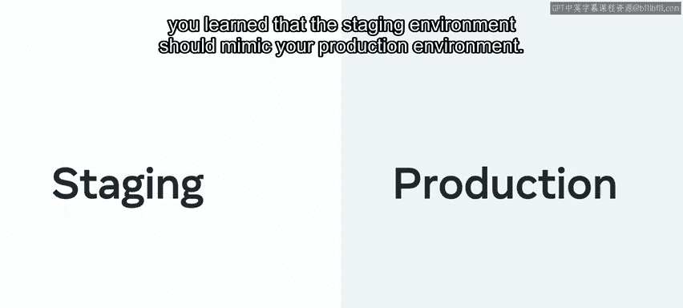

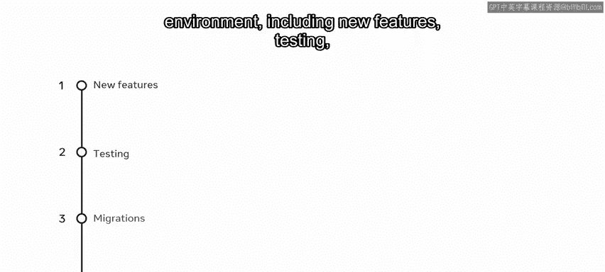

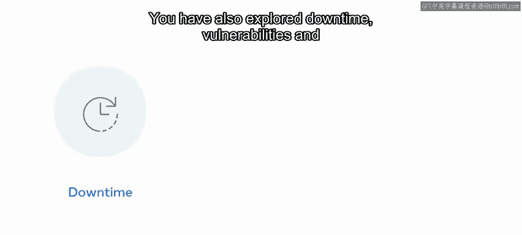

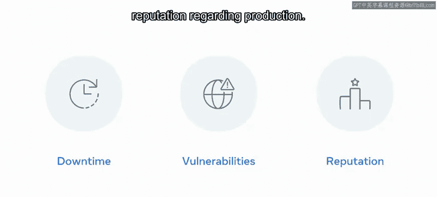