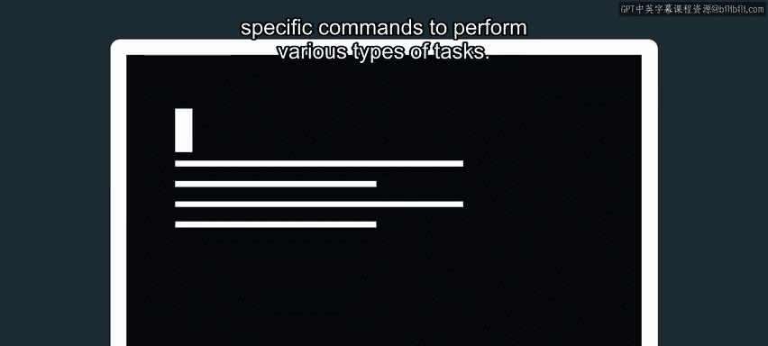
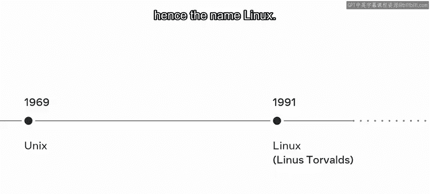
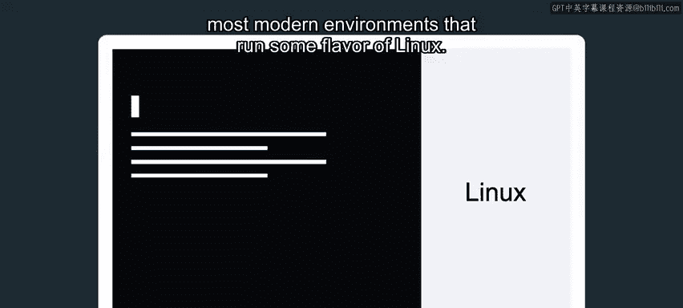
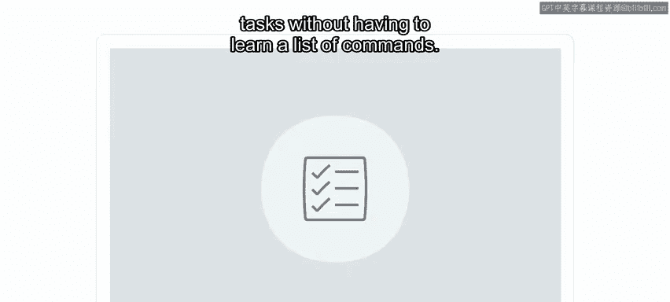
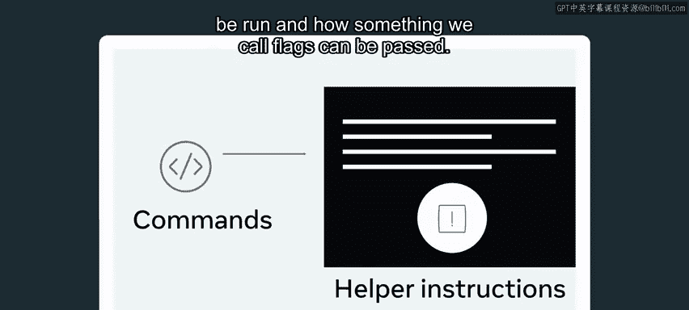
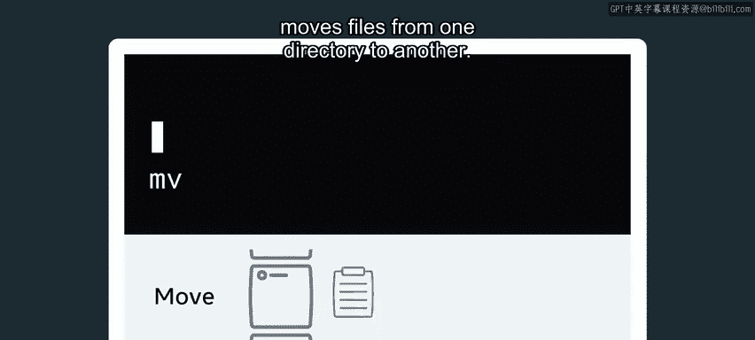

# 数据库工程师：1.8：什么是Unix命令 🖥️

在本节课中，我们将要学习Unix命令的基础知识。你将了解什么是Unix命令，它们与图形用户界面的关系，以及为什么掌握这些命令对软件开发人员至关重要。

## 概述

我们每天使用手机和电脑进行各种活动，例如发送消息、在线购物和观看视频。我们通过点击屏幕、滚动和滑动来与设备交互。这种交互是通过**图形用户界面**实现的，它位于底层命令之上，负责告诉设备该做什么。

然而，开发者需要知道如何使用特定的命令来执行各种任务。例如，在桌面上创建一个新文件夹，你可以右键单击并选择“新建文件夹”。而在命令行中，你需要使用特定的命令 `mkdir` 来达到相同的结果。掌握Unix命令是当今软件开发世界中的一项重要技能。

## Unix与Linux的历史渊源

你可能会想，既然本视频的主题是Unix命令，为什么我要讨论Linux？要回答这个问题，让我们先探索一些历史。

**Unix** 先于Linux出现，由Ken Thompson、Dennis Ritchie和AT&T实验室的团队于1969年开发。**Linux** 出现得晚得多，最初是Linus Torvalds作为业余爱好开发的，因此得名Linux。

你在本视频中将要探索的命令起源于Unix平台。如今，你可以在大多数运行某种Linux变体的现代环境中使用它们。

## 命令行与图形界面

起初，使用命令行可能看起来有点令人生畏，但你很快就会了解到，Unix命令只不过是诸如打开文件目录或重命名文件等常规操作之下的一层。

例如，**Windows** 之所以成为主导的桌面操作系统，主要归功于其易于使用的图形用户界面。它允许非技术用户无需学习一系列命令即可执行任务。但作为一名有抱负的开发者，你将学习使用Unix命令来执行任务。

## 命令帮助与标志

在深入探讨一些最常见的命令之前，重要的是要注意每个命令都有一组帮助指令。这些帮助程序提供了关于如何运行命令以及如何传递我们称之为“标志”的详细说明。

其中一个帮助程序是 `man` 命令。`man` 是“manual”的缩写，当针对某个命令调用时，它会显示该命令的详细使用手册。

例如，命令 `man ls` 将显示`ls`列表命令的详细使用手册。

你还可以将所谓的**标志**与Unix命令结合使用。标志用于修改命令的行为，可以将它们视为可以改变或扩展给定命令功能的选项。

接下来，你将了解一些最常用的Unix命令，在下一个视频中，你将看到其中一些命令的实际应用。

## 常用Unix命令简介

以下是几个最基础且常用的Unix命令及其简要说明。

*   **`cd`**：`cd` 或“更改目录”命令用于在文件系统的不同目录之间移动。你可以在本课末尾的补充阅读中了解更多关于使用相对路径和绝对路径的信息。
*   **`ls`**：`ls` 用于显示当前工作目录的内容。`ls` 命令可以接受许多不同类型的标志，这些标志会改变返回的响应内容。例如，`ls -l` 以列表顺序列出文件，并显示读写权限、所有者和所属组。而 `ls -a` 则会列出所有文件和目录，包括隐藏文件。
*   **`pwd`**：`pwd` 或“打印工作目录”命令显示当前工作目录的完整路径。
*   **`cp`**：`cp` 或“复制”命令，将文件或文件夹从一个位置复制到另一个位置。
*   **`mv`**：`mv` 或“移动”命令，将文件从一个目录移动到另一个目录。

## 总结

本节课中，我们一起学习了Unix命令的基础概念。我们了解了Unix命令是位于图形用户界面之下的底层指令，是开发者与计算机系统高效交互的重要工具。我们还回顾了Unix与Linux的历史联系，并介绍了一些最常用的命令，如 `cd`、`ls`、`pwd`、`cp` 和 `mv`。

下次你使用设备时，不妨思考一下，在图形用户界面之下，是哪些命令在运行以完成你正在执行的任务。掌握这些命令将为你打开通往更高效、更强大的软件开发世界的大门。