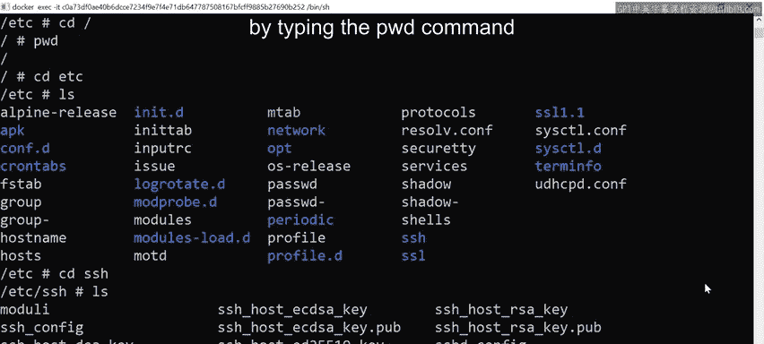
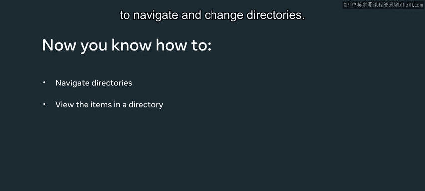

# 数据库工程师：1.1：命令行目录操作指南 🗂️

在本节课中，我们将学习如何在命令行界面中查看当前所在位置、列出目录内容以及在不同目录之间进行切换。这些是使用命令行管理文件和目录的基础技能。

## 查看当前目录

首先，我们需要知道当前位于哪个目录。为此，我们使用 `pwd` 命令。

`pwd` 是 “print working directory”（打印工作目录）的缩写。在命令行中输入 `pwd` 并按下回车键，系统会返回一个路径。例如，返回一个正斜杠 `/`，这表示您当前位于**根目录**。根目录是操作系统中的顶级目录。

## 列出目录内容


上一节我们介绍了如何确认当前位置，本节中我们来看看如何查看当前目录下包含哪些文件和子目录。

要检查根目录的内容，我们运行另一个名为 `ls` 的命令，它是 “list”（列表）的缩写。输入 `ls` 并按下回车键，您会看到根目录下不同目录名称的列表。

为了获取每个目录更详细的信息，我们可以使用一个叫做 **标志（flag）** 的选项。标志用于设置您运行命令的选项。我们可以将 `ls` 命令与一个名为 `-l` 的标志一起使用，这表示结果应以列表格式打印。

以下是使用 `ls -l` 命令的示例：
```bash
ls -l
```
按下回车后，结果将以列表结构返回。

## 理解列表输出

现在，让我们聚焦于列表中的一些项目。首先，您需要了解链接文件、目录和标准文件之间的区别。

*   **链接文件**：总是由字母 `l` 表示，并且会出现在输出行的最开头。例如，`lrwxrwxrwx ... tp -> tmp` 表示 `tp` 是指向实际目录 `tmp` 的链接。
*   **目录**：由字母 `d` 表示。例如，`drwxr-xr-x ... bin` 表示 `bin` 是一个标准目录。您可以使用 `cd` 命令进入该目录并检查其内容。
*   **标准文件**：例如文本文件或配置文件，由连字符 `-` 表示。例如，`-rw-r--r-- ... resolve.conf`。

理解这些不同的符号和命名约定对于查找特定文件非常重要。列表中还会显示文件的所有者和所属组信息。

## 更改目录

了解了如何查看内容后，接下来我们学习如何在目录之间移动。

要更改当前目录，请使用 `cd` 命令。例如，要切换到 `etc` 目录，请输入 `cd etc` 并按下回车。然后输入 `ls` 来检查该目录的内容。您会发现 `etc` 目录下的内容与根目录完全不同。

要确认您确实在 `etc` 目录中，可以再次运行 `pwd` 命令，它会确认您当前位于 `/etc`。

## 返回上级目录

当您需要从当前目录返回时，有两种方法。

1.  **使用相对路径**：输入 `cd ..`。两个点 `..` 表示上一级父目录。按下回车后，您就回到了父目录。您可以运行 `pwd` 来确认。
2.  **使用绝对路径**：输入 `cd /`。正斜杠 `/` 代表根目录。按下回车后，您将直接回到根目录。

要进入多级子目录，过程是相同的。例如，从根目录进入 `etc` 下的 `ssh` 目录：
```bash
cd etc
cd ssh
```
然后使用 `ls` 检查 `ssh` 目录的内容。

要从 `ssh` 目录逐步返回，可以连续使用 `cd ..`。第一次 `cd ..` 会让您回到 `etc` 目录，再次使用 `cd ..` 则会返回到根目录。最后，您可以通过 `pwd` 命令确认自己回到了根目录。

## 总结

本节课中，我们一起学习了命令行中目录操作的核心命令：
*   使用 **`pwd`** 命令查看当前工作目录。
*   使用 **`ls`** 命令列出目录内容，并通过 **`ls -l`** 获取详细列表格式。
*   使用 **`cd`** 命令更改目录，并通过 **`cd ..`** 返回上级目录或 **`cd /`** 直接返回根目录。
*   理解了列表输出中 `d`（目录）、`-`（文件）和 `l`（链接）等符号的含义。





您现在已经掌握了如何在命令行中导航和更改目录的基本方法。