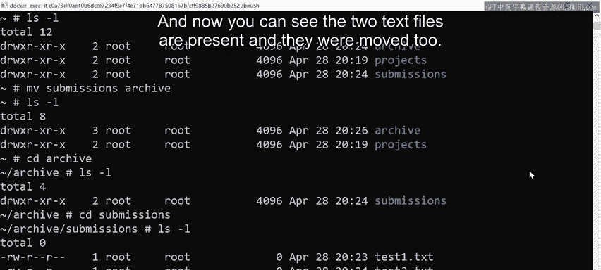
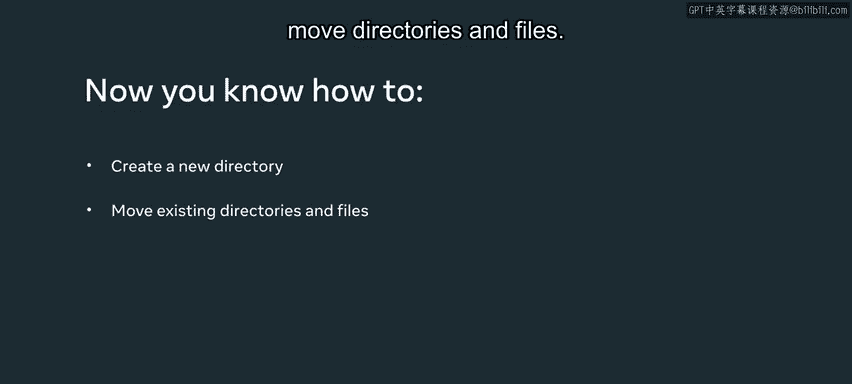

# 数据库工程师：P58：创建和移动目录和文件 📁

在本节课中，我们将学习如何在命令行界面中创建目录和文件，以及如何移动它们。这些是文件系统管理的基础操作，对于后续的数据库环境搭建和文件管理至关重要。

## 概述

我们将从检查当前工作目录开始，然后逐步学习创建新目录、进入目录、创建文件，最后学习如何将整个目录移动到另一个位置。每个步骤都会使用具体的命令进行演示。

## 检查当前目录

首先，我们需要确认自己当前位于文件系统的哪个位置。这可以通过 `pwd` 命令来实现。

运行 `pwd` 命令后，终端会显示当前所在的目录路径。例如，输出 `/` 表示位于根目录。

## 查看目录内容

在确认位置后，我们可以查看当前目录下有哪些文件和子目录。

使用 `ls -l` 命令可以列出当前目录的详细内容。例如，你可能会看到一个名为 `projects` 的目录。

## 创建新目录

接下来，我们将创建一个新的目录。创建目录使用 `mkdir` 命令。

以下是创建目录的步骤：
1.  输入命令 `mkdir submissions`。
2.  按下回车键执行命令。
3.  再次使用 `ls -l` 命令，确认名为 `submissions` 的新目录已经创建成功。

## 进入目录

创建目录后，我们可以进入这个新目录进行操作。

使用 `cd submissions` 命令可以进入名为 `submissions` 的目录。进入后，使用 `ls` 命令查看，会发现该目录目前是空的。

## 创建文件

在一个空目录中，我们可以创建新的文件。创建空文件可以使用 `touch` 命令。

以下是创建文件的步骤：
1.  输入命令 `touch test1.txt` 创建第一个文件。
2.  输入命令 `touch test2.txt` 创建第二个文件。
3.  使用 `ls -l` 命令，可以看到两个文本文件已成功创建并列出。

## 返回上级目录

完成文件创建后，我们可能需要返回到之前的目录层级。

使用 `cd ..` 命令可以返回上一级目录。在本例中，执行后会回到根目录。再次运行 `ls -l`，可以看到 `projects` 和 `submissions` 两个目录。

## 创建另一个目录并移动

现在，我们将在根目录下创建另一个目录，并练习移动操作。

首先，使用 `mkdir archive` 命令创建一个名为 `archive` 的新目录。使用 `ls -l` 确认 `archive`、`projects`、`submissions` 三个目录均已存在。

为了界面清晰，可以使用 `clear` 命令清空终端屏幕，然后再次用 `ls -l` 查看。

假设我们需要将 `submissions` 目录移动到 `archive` 目录内，这需要使用 `mv`（move）命令。

移动目录的命令格式是：`mv [要移动的目录] [目标目录]`。

因此，我们输入命令 `mv submissions archive/` 并执行。执行后，使用 `ls -l` 检查，会发现根目录下的 `submissions` 目录消失了。

## 验证移动结果

为了确认移动是否成功，我们需要进入目标目录进行查看。

使用 `cd archive` 进入 `archive` 目录，然后运行 `ls -l`。这时可以看到 `submissions` 目录已经存在于 `archive` 之中。

之前我们在 `submissions` 目录内创建的文件也随目录一同移动了。使用 `cd submissions` 进入该目录，再运行 `ls -l`，即可看到 `test1.txt` 和 `test2.txt` 两个文件完好无损。

## 总结

本节课中，我们一起学习了命令行下的基础文件操作。我们掌握了使用 `pwd` 查看当前路径，使用 `ls` 列出目录内容，使用 `mkdir` 创建目录，使用 `touch` 创建文件，以及使用 `mv` 移动目录。这些命令是管理数据库相关文件和目录结构的基础，请务必熟练掌握。