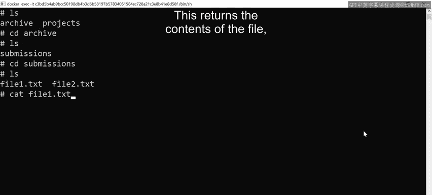
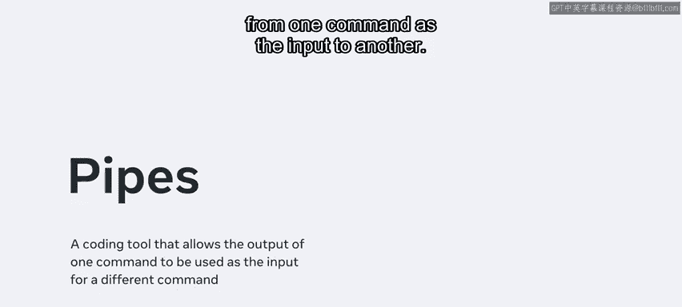

# Meta《数据库工程师（数据库简介／Git／MySQL）｜Meta Database Engineer》中英字幕 - P59：12_管道.zh_en - GPT中英字幕课程资源 - BV1Vw4m1Z7tb

Okay， so I have launched my terminal and I'm running the LS command。

 it informs me that I have two folders archive and projects Next I can change directory into archive using the CD command and search inside using LS This reveals a submissions folder I can then type the CD submissions command to enter into the Subs folder and check what's inside。

The LS command reveals two files， file 1。Xt， and file 2 do TXT。

 each of these files have some content in them。I can check the content of a file by running another command called CA I run the command CA file 1。

txt This returns the contents of the file， which is some simple text。

Another command is the word count command， which is abbreviated as WC To use this command。

 I can just call it against the file by typing wC file 1。txtw。

The W flag tells the WC command to return the word count。

The output informs me that there are 181 words in the file。 Let's run another example with pipes。

 Pipes allow you to pass the output from one command as the input to another I can perform an LS command on the current directory Note that this output's two file names。

 Let's type the LS command again， then I pass in my pipe using the vertical line character Then I use the WC command with the dashed W flag Notice that it returns a result of two because there's two files in the system。

 So what if I want to find the word count of a file using pipes。

I just changed the LS command to cat file 1。txt pipepewcw。

This returns a word count of 181 for file 1。 TXD Did you know that you can also combine this command against the directory or multiple files。

 for example， I can use the command to get a combined word count for file 1 and file2 to get this data I just input the command CA file 1。

 TXD and then also pass in file 2。TXD。Then I use a pipe followed by a WC dashW。

This returns a total word count of 362 for the two files。

