# Meta《数据库工程师（数据库简介／Git／MySQL）｜Meta Database Engineer》中英字幕 - P5：4_数据之间的关系.zh_en - GPT中英字幕课程资源 - BV1Vw4m1Z7tb

Picture yourself in the following scenario。You're managing the database of a large online store。

Your database must be able to retrieve the customer's details from one table and then find the order recorded against another table。

So how does the database establish a relationship between these pieces of data？

Over the next few minutes， you explore this process， and by the end of this video。

 you'll be able to explain why data in a database should be related and identify an instance of related data in a database。

😊，Data stored in a database cannot exist in isolation。

It must have a relationship with other data so that it can be processed into meaningful information。

So how do you make sure that all the data in your database is related？😊。

Let's explore how data is related by using the online store as our example。

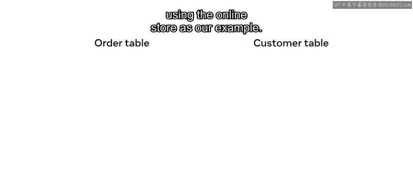

In the database of your online store， you could have an order table and a customer table。😊。

To locate the details of a customer's order， you will check the order number against the customer ID In other words。

 the database establishes a link between the data and the tables。😊。

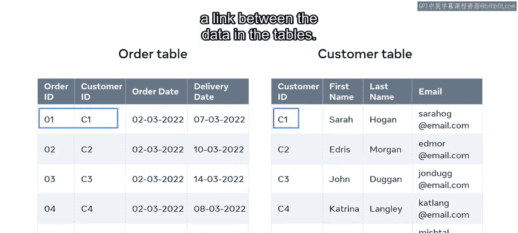

Let's look at the customer table in more detail。😊，In this table， the columns are customer ID。

 first name， last name， and email。

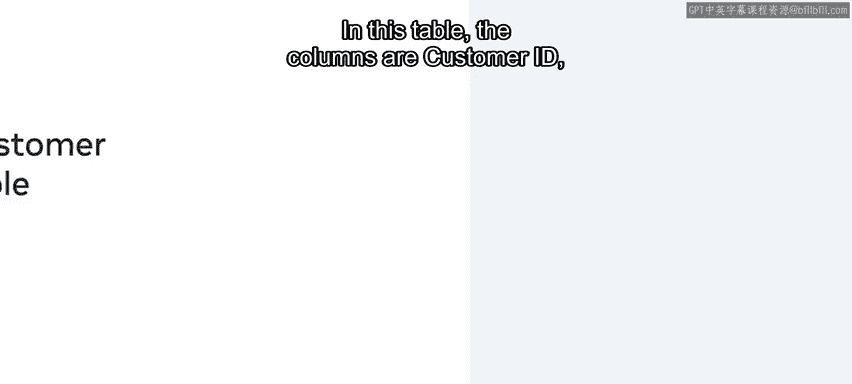

In relational database terms， these are fields。Then there are several rows which contain data for each of these fields。

In relational databases， they are known as records of the table。

All these fields and rows work together to store information on the customer。

 also known as the entity。Every R record in the customer table is an instance of the customer entity。

 for example， Sarah Hogan， who is a customer ID of C1。😊，Is one customer instance at Katrina Langley。

 who is a customer ID of C4， is another customer instance。

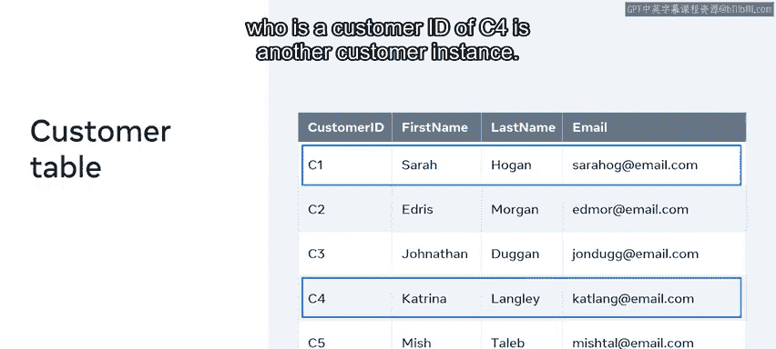

What's most important is that each of these customer instances or records must be uniquely identifiable。

But what if two or more customers share similar info， like the same first name or last name？

To avoid this confusion within the database， you can use a field that contains only unique values like the customer ID。

😊。

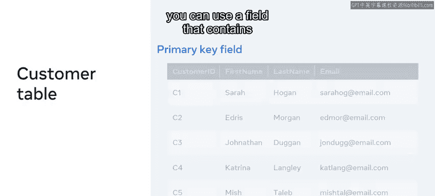

This is called a primary key field。It contains unique values that cannot be replicated elsewhere in the table。

So even if two customers share the same name， they'll still have separate customer IDs。

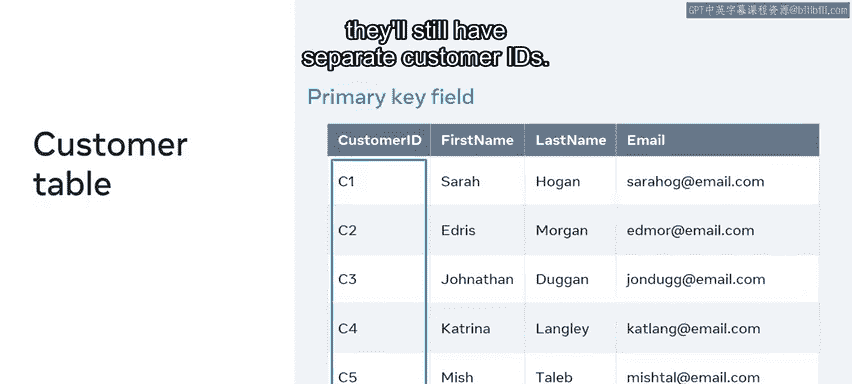

This means that your database can determine which customer is the required one。

Let's look at the order table next。😊，Just like the customer table。

 the order table also has fields and records。😊。

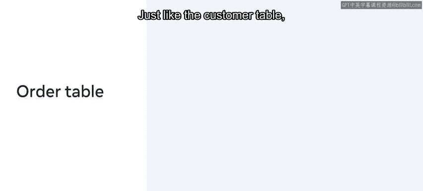

And in this table， the primary key field is the order ID。

But there's also a field named customer ID with the exact same data as the customer data。😊。

So what is the purpose of the customer ID in this table？

The customer ID is there to help identify who it is that place the order。

 so by adding the customer ID field to the order table。

 a relationship is established between the customer table and the order table。😊。

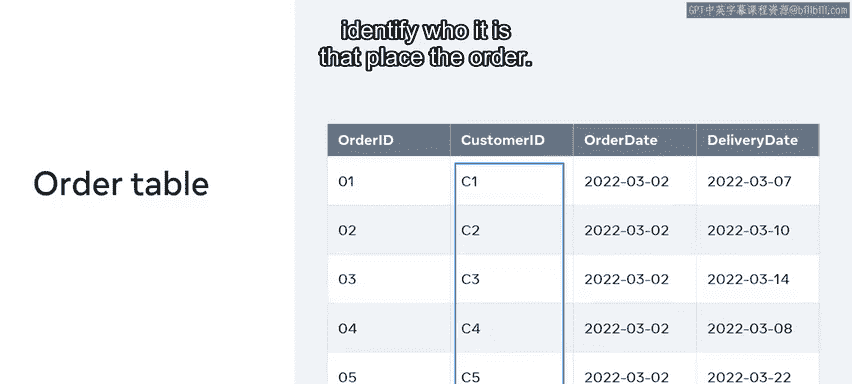

And because of this relationship， you can pull data in a meaningful way from both tables。

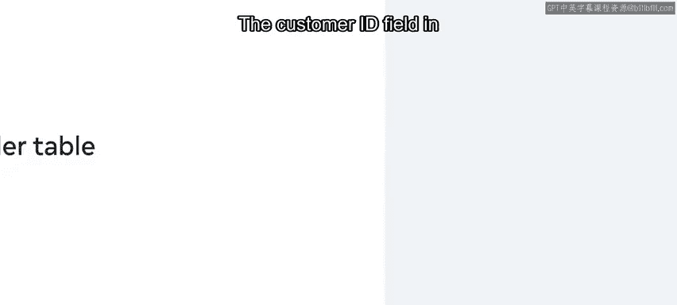

The customer ID field in the order table is known as the Forign key field。

A foreign key is a field in one table that connects to the primary key field in the original table。

 which in this case is the customer table。😊。

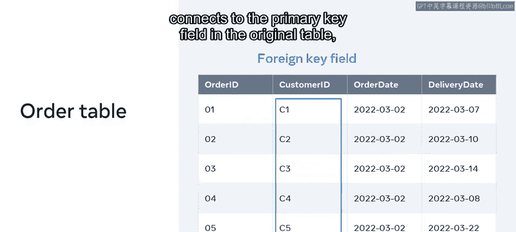

So the customer ID is the primary key of the customer table。

 but it becomes the foreign key in the order table。This way。

 the relationship is established and the data and these two tables are related。

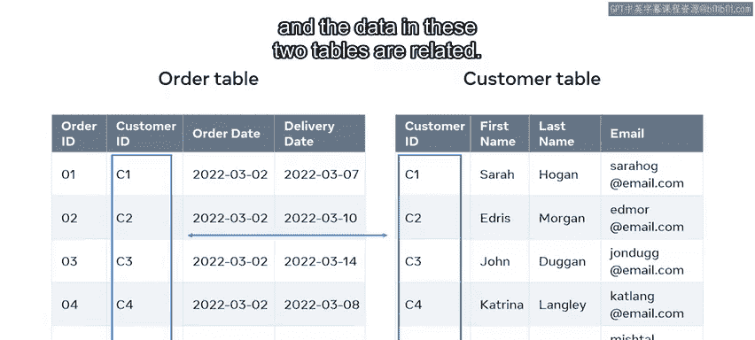

You should now be able to explain the relationships between data and a database and identify instances of related data。

 great work。😊。