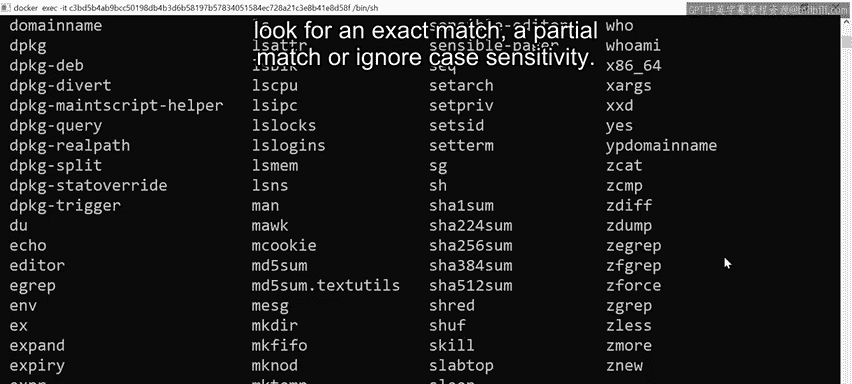

# 数据库工程师课程：P61：grep命令详解 🔍


在本节课中，我们将学习一个在文件和目录中搜索文本的强大工具——`grep`命令。我们将了解它的基本用法、常用选项以及如何通过管道与其他命令结合使用，以精确地查找所需信息。

## 什么是grep？

`grep` 代表 **G**lobal **R**egular **E**xpression **P**rint（全局正则表达式打印）。它是一个用于在文件和文件夹中，以及文件内容中进行搜索的命令行工具。


## 基本搜索操作

上一节我们介绍了`grep`的基本概念，本节中我们来看看它的具体使用方法。

首先，我们有一个名为 `names.txt` 的文件，它包含一系列未按字母顺序排列的名字。

```
ls
cat names.txt
```

为了查找以特定模式开头的名字，我们可以使用`grep`进行标准搜索。例如，查找所有以“Sam”开头的名字：

```
grep Sam names.txt
```

这个命令会返回所有以“Sam”开头的名字列表。需要注意的是，`grep`默认是**区分大小写**的。这意味着，如果我们使用小写的“sam”进行搜索，会得到完全不同的结果集，因为它无法匹配大写的“S”。

## 使用标志（Flags）改变搜索行为

为了克服大小写敏感的限制，我们可以向`grep`传递不同的标志（flags）来获得不同的结果。

以下是几个常用的`grep`标志及其作用：

*   **`-i` (忽略大小写)**：此标志使搜索不区分大小写。
    ```
    grep -i sam names.txt
    ```
    执行此命令将返回所有包含“sam”（无论大小写）的名字，包括“Sam”开头或中间含有“sam”的名字。

*   **`-w` (精确匹配单词)**：此标志确保只匹配完整的单词，忽略部分匹配。
    ```
    grep -w Sam names.txt
    ```
    执行此命令将只返回名字恰好是“Sam”的结果，而忽略那些包含“Sam”作为一部分的其他名字（如“Samuel”）。

## 结合管道（Pipe）进行高级搜索

`grep`的强大之处在于它可以与其他命令通过管道（`|`）结合使用，从而在复杂的输出中进行过滤。

例如，如果我们想在系统的 `/bin` 目录中查找所有包含“zip”的可执行文件：

1.  首先，列出 `/bin` 目录下的所有文件，这会得到一个很长的列表。
    ```
    ls /bin
    ```
2.  为了过滤这个列表，我们可以将 `ls` 命令的输出通过管道传递给 `grep`。
    ```
    ls /bin | grep zip
    ```
    这样，我们就只得到了文件名中包含“zip”的文件的子集，结果更加精简。

如果需要进一步精确搜索，我们依然可以在管道后的`grep`命令上应用 `-i`、`-w` 等标志。

## 总结



本节课中我们一起学习了`grep`命令的核心用法。我们了解到：
1.  `grep` 是一个用于文本搜索的强力工具。
2.  通过使用 `-i` 标志可以**进行不区分大小写的搜索**。
3.  通过使用 `-w` 标志可以**确保进行精确的单词匹配**。
4.  通过**管道符 `|`** 可以将 `grep` 与其他命令（如 `ls`）结合，实现对命令输出结果的过滤，从而高效地定位信息。