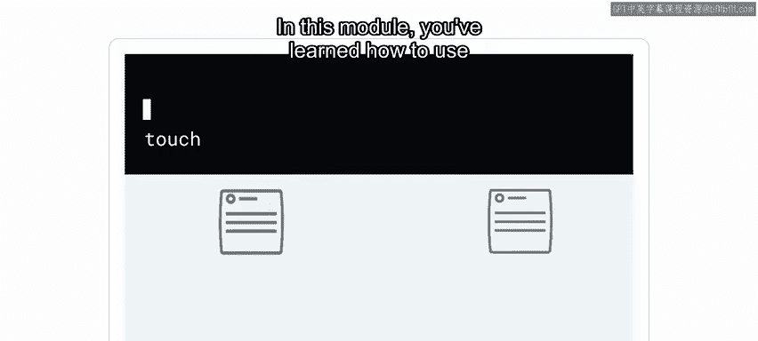
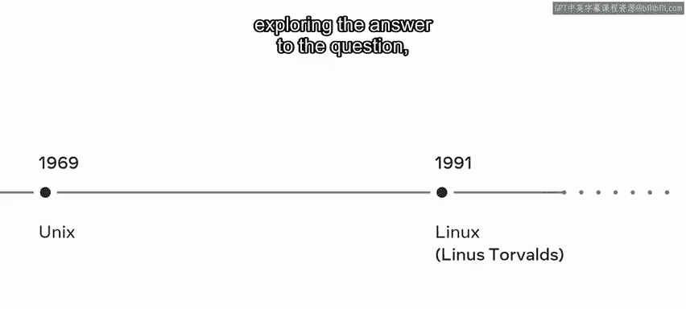
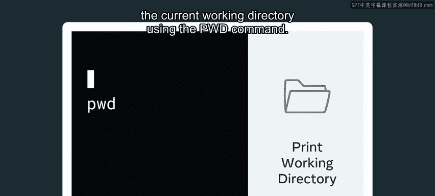
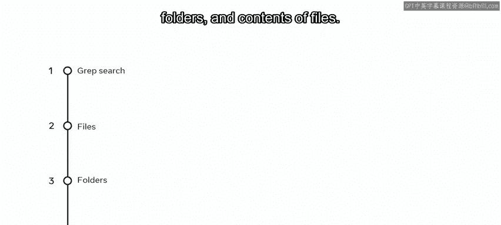

# Meta《数据库工程师（数据库简介／Git／MySQL）｜Meta Database Engineer》中英字幕 - P62：15_模块小结 命令行.zh_en - GPT中英字幕课程资源 - BV1Vw4m1Z7tb

Great work。 You've reached the end of this module on the command line。

 It's now time to review what you've learned during these lessons。 In this module。

 you learned how to use the command line to execute commands in Linux。

 You were introduced to some of the most commonly used commands that traverse， create。

 rename and delete files on your hard drive。 You learned how to use piping and redirection to create powerful workflows that automate your work。

 Having completed this module。 you should be able to De what the command line is in how it is used。

 Exp your hard drive using the command line。 create。

 rename and delete files and folders on your hard drive using Unix commands and use pipes and redirection。

 This module began with a video， exploring the answer to the question。 What are Unix commands。

 You learned how to determine the current working directory using the PwD command。

 You also explored how to create and change directories and。😊。

Using the command line。You can now create a working directory， create two different directories。

 D1 and2 create files and directories inside D1 and D2 you can now also use Gr to search for files。

 folders and contents of files You're now familiar with the command line Well done you're making good progress on your learning journey。

