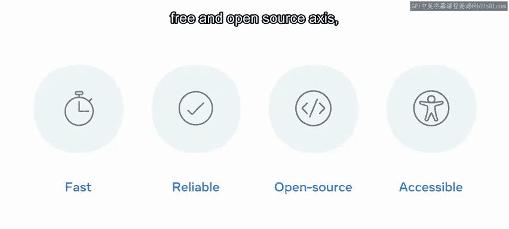
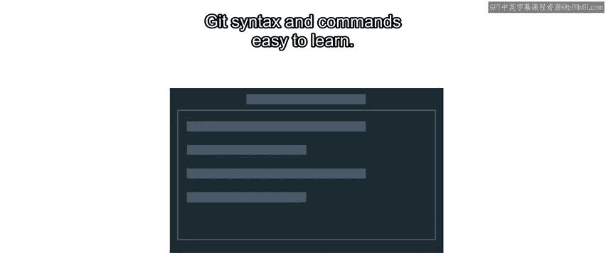
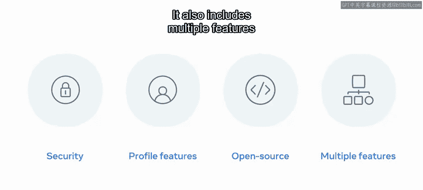

# Meta《数据库工程师（数据库简介／Git／MySQL）｜Meta Database Engineer》中英字幕 - P63：16_什么是Git和GitHub.zh_en - GPT中英字幕课程资源 - BV1Vw4m1Z7tb

Are you familiar with version control or version control systems？

Here's a quick example of where they're useful。 Have you ever opened an app on your phone and received a prompt to update to a new version。

 these prompts most likely direct you towards an app store where you then download the latest version。

As you download the new version， you might notice a new layout button or piece of functionality in software and web development。

 developers use version control to track the differences between versions and a popular method of tracking versions is the use of version control technologies like Git and GitHub。

In this video， you'll discover the answer to the question what is Git and GitHub you will learn about the differences between Git and GitHub and how web developers make use of them and explore the benefits and advantages of both services。

😊，Let's start off with Kit。Gitt is a version control system designed to help users keep track of changes to files within their projects。

 Git was designed to address the challenges that its creator Lina Stvalds。

 was having managing the development of the Linux kernel， the operating system for Linux。

Linux has thousands of contributors who commit changes and updates daily。

Gt was designed to help with a challenge of tracking all these changes and updates。

 as well as helping to keep track of changes， Git was also designed to tackle some of the shortcomings of other version control systems。

The benefits that Git offers over similar systems include better speed and performance， reliability。

 free and open source access and an accessible syntax。

It's also important to note that Git is used predominantly via the command line。

Developers tend to find Git， syntax and commands easy to learn。

 The other service commonly used by developers is Gitthub Gitthub is a cloud based hosting service that lets you manage Git repositories from a user interface。

 A Git repository is used to track all changes to files in a specific folder and keep a history of all those changes。

It incorporates Gi version control features and extends these by providing its own features on top。

 some of the most common of these features include access control， pull requests and automation。

You will learn more about these later in this course。

The features are split out into different pricing models to suit different size teams and organizations。

 it's also important to point out that GitHub is very popular among web developers。

 it's like a social network。For example， projects can be private or public users on GitHub have their own profile。

 which other users can follow public projects can accept code contributions from anyone across the globe。

And it also includes multiple features outside of its core development tools like documentation。

 ticketicking and project features。 You're now familiar with Git and Gitthub version control systems。

 along with the benefits and advantages that they offer。

 This is just the beginning of your version control journey with Git and Gitthub。 Great work。

