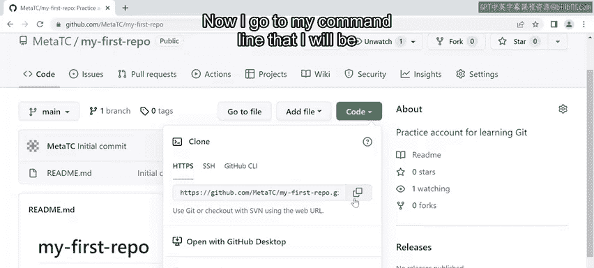
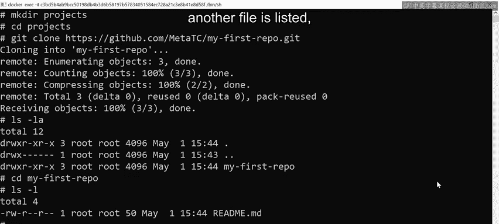
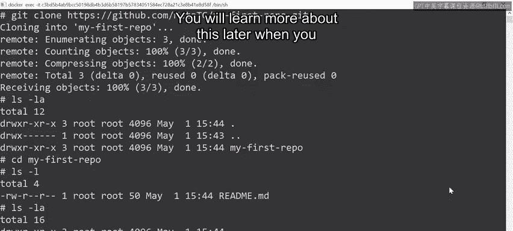

# Meta《数据库工程师（数据库简介／Git／MySQL）｜Meta Database Engineer》中英字幕 - P64：17_创建和克隆存储库.zh_en - GPT中英字幕课程资源 - BV1Vw4m1Z7tb

Okay， so I have just logged in to the Github website Once there I click on the green button with the text createate repository。

 When I click on the button， I am redirected to the create a new repository screen where I'll be prompted for who the owner is。

 I choose my account as the owner option for this example。 Next， I need to input a repository name。

 So I type a name called my dash first dash repo。 notice that the input field has a green tick icon beside it。

 This is just Github letting me know that this name is available to create the repository。

 If it's not， I will see an X icon and be prompted to rename it。 Okay。

 so now I need to type a value for the description input for this。

 I type practice account for learning Git the next option I want you to know about is if you want the repository to be public or private。

 public just means that anyone on the Internet can see the repository。

I still have control over who can make changes to it。

 It's just available on the viewable aspect of it on the internet。 The next option is private。

 meaning it's not available for anyone to see。 I can only allow access by granting people access to the repository。

 The next few options are about initialization。 I can initialize a repository with a read me file。

 a git ignore file and a license if one is required。

For now I'm just going to choose the Readme file option and then click the createreate Reository button Okay so a repo has now been set up and I can see that I have one single file in the repository called Readme。

Md MD is just short for markdown a popular method for creating documentation because it's shorthand for creating HTML pages This allows me to do things like creating titles and texts I can insert images and various other web page elements。

Notice that the main branch has also been created， and it's important to know that every repository you create will have a single main branch at the start。

 This is also known as the main line。 Next， I'm presented with additional button options。

 The first is labeled Go to file。 Then there is add file which you can use to add a new file from the UI。

 And finally， a green button labeled code。 clicking this button provides me with a Github Ui options for cloning down the repository。

 First is the option for Https， which contains the Https URL of the repository。

 and I can use this to pull it down by using the Git cloneone command。 Next。

 there is an option for SH。 But to use that， I have to set up my SSH keys and assign them to the user accounts。

 And finally， I have the Github CI option underneath notice that there are additional options for Github desktop if I would like。

😊，To use that and finally I can also download a compressed zip file containing all the files and folder structures for this demo。

 I will show you how to use Https to begin select the Https option and click on the copy button to copy the HtTPS URL for Clning Now I go to my command line that I will be using to run the commands to clone the repository I'm currently in my home directory Okay so what I usually like to do is create a directory for all repositories that I'm working on at the moment first I create a directory using the command make D then I type the name of the directory I want to create which is projects Next I can Cd into that and now I can run the commands to clone the project from the Github UI to do this I type the command Git clone and paste the HttPS URL I copyied earlier。

Finally， I press enter on my keyboard。 Notice that I receive a message stating that git is cloning into the my first repo folder。

 It then displays messages about all the objects that have been received。

 It also displays a 100% status message。 and then finally， a statement that simply says done。 Now。

 I can list the directory by running the L S dash L A command， which means list all directories。

 Notice that I have my repository， which I named my first repo。

This is the name of the repository that we set up on GitHub Finally if I enter inside that folder using the CD command。

 I can see a single file， the readmeat。md file if I use the lsla command another file is listed which is just named dogit you will learn more about this later when you explore how to use this for source control。

