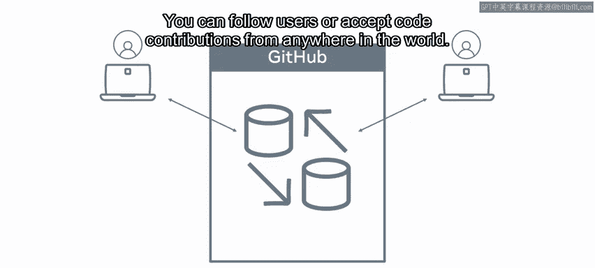
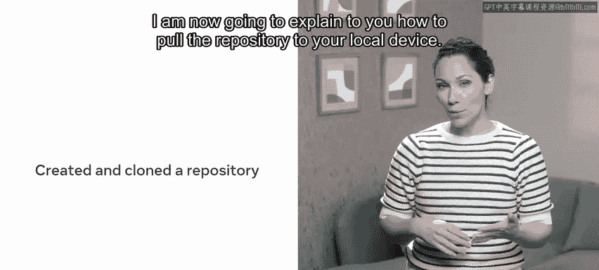
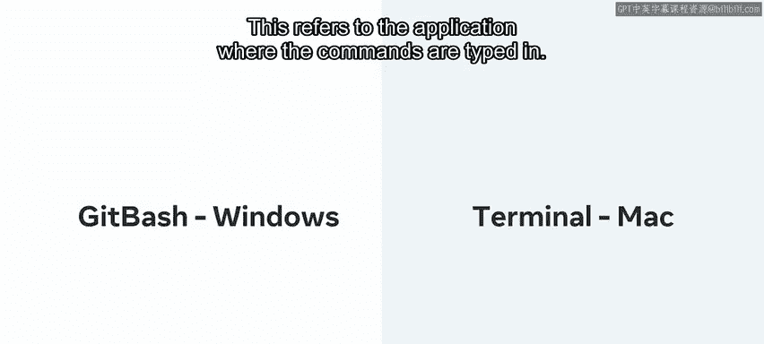
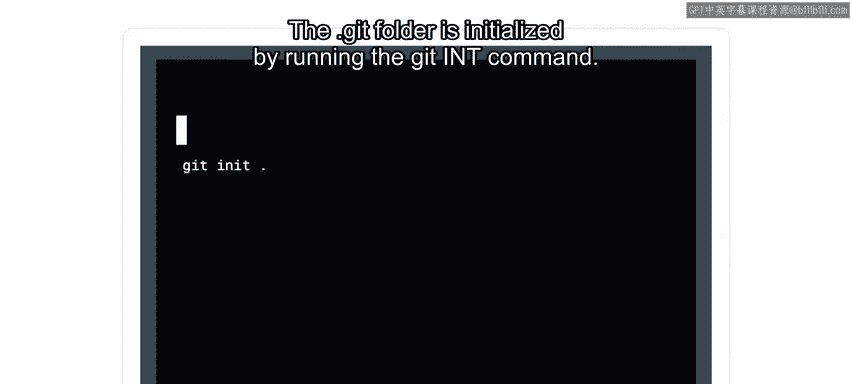
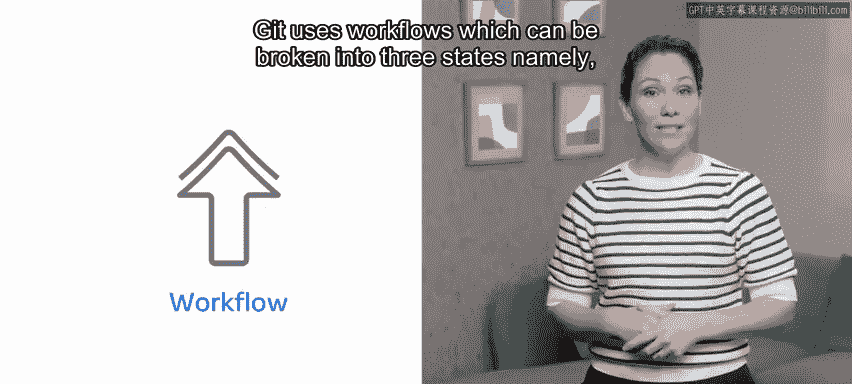
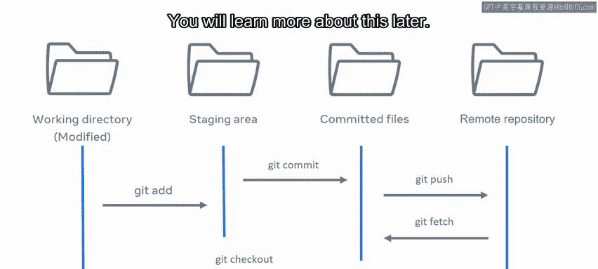

# Meta《数据库工程师（数据库简介／Git／MySQL）｜Meta Database Engineer》中英字幕 - P65：18_Git的工作原理.zh_en - GPT中英字幕课程资源 - BV1Vw4m1Z7tb

As you now know， GitHub is a cloud based hosting service that lets you manage Git repositories from a user interface。

 it's like a social network， you can follow users or accept code contributions from anywhere in the world。

In a previous video you created and cloned a repository to your local device。

 I am now going to explain to you how to pull the repository to your local device and will be demonstrating commands that you can use in Getbaash shellll for Windows users and terminal for Mac users。

This refers to the application where the commands are typed in。

 Let's move to the directory I want by typing C and the name of the directory。

 my first repo Once inside the directory， run the list all command by typing L S space dash L A L A is short for list all。

There are four items in this directory， I will focus on two of them， the dot get item and the Readme。

md item。Let's start with a readme dot MD file This item was added when I created the repository on GitHub。

 the other item is a folder called dot Kit， which is a hidden folder used to track all the changes in Linux any folder starting with a dot is a hidden folder。

This folder is automatically created when you create a repository and you will learn more about it later in this course in the command I ran。

 I edit the switch L， so we would list all files and folders including the hidden ones the dotget folder is initialized by running the Git init command As the repository was created on GitHub。

 it was not required for us to run it。

GitHub handled all of this as part of its create new Repo flow。

Now let's focus on Git workflow Git uses workflows which can be broken into three states。

 namely modified， staged and committed。

Now I will go over each state and then provide an example of adding a new file to my Git repository to show it in action let's start with a first state。

 adding， removing and updating any file inside the repository is considered a modified state Git knows the file has changed but does not track it This is where the staging state comes in let's turn to it now in order for Gi to track a file it needs to be put in the staged area。

Once added， any modifications are tracked， which offers a security blanket prior to committing the changes。

 then the last state is the committed state。Committing a file in Git is like a save point in many ways。

 Git will save the file and have a snapshot of the current changes。

Let me introduce you to an example that summarizes the workflow clearly。

Suppose you have a workflow that contains the three stages just mentioned as well as the remote repository。

 a file is added from the working directory to the staging area from there the file is committed and then pushed to the remote repository。

From the remote repository， the file can now be fetched and checked out or merged to a working directory。

You will learn more about this later。 Well done。 You've covered some of the gi fundamentals and now know what is inside a Git folder and understand the Git workflow。

