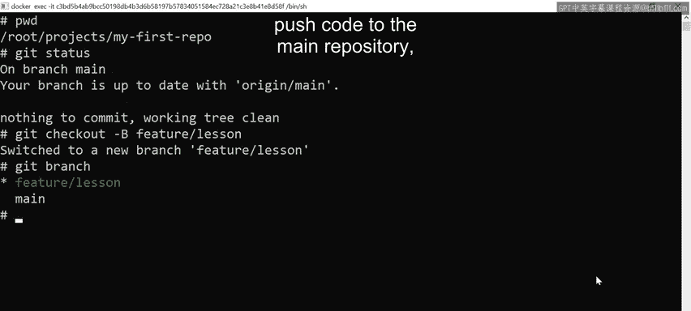
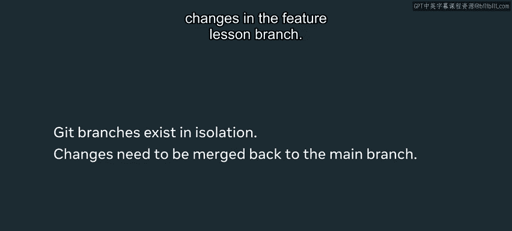
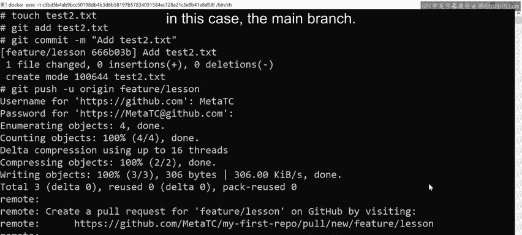
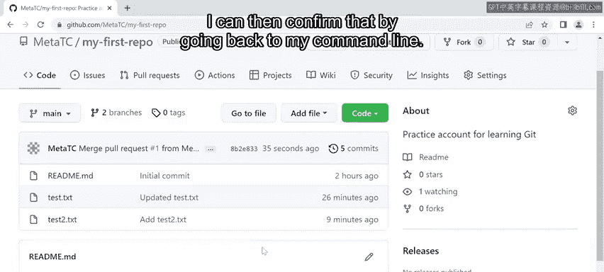
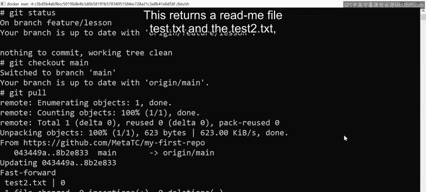
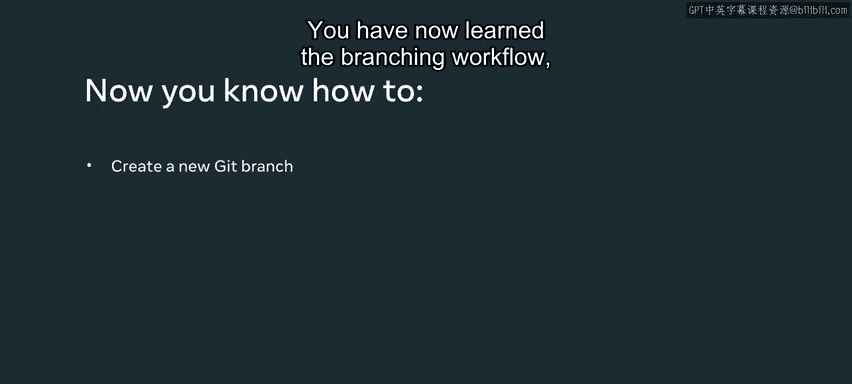

# Git版本控制：20：分支管理 🪵


在本节课中，我们将要学习Git中一个核心且强大的功能——分支。分支允许你在不影响主代码线的情况下开发新功能、修复错误或进行实验。我们将通过一个完整的流程，学习如何创建分支、在分支上工作、推送分支、创建拉取请求以及最终将更改合并回主分支。

## 概述

分支是Git版本控制系统的基石，它支持并行开发。通过创建独立的分支，团队成员可以在隔离的环境中工作，而不会干扰主分支的稳定性。完成工作后，可以通过拉取请求和代码审查流程，将更改安全地合并回主分支。

上一节我们介绍了Git的基本提交和工作流，本节中我们来看看如何利用分支进行更高效、更安全的协作开发。

## 创建新分支

首先，我们需要确保处于正确的项目目录中。可以使用 `pwd` 命令来确认当前工作目录。

```bash
pwd
```

接下来，执行 `git status` 命令是一个好习惯，它能确保当前工作区是干净的，没有未提交的更改。

```bash
git status
```

确认无误后，就可以创建新分支了。创建分支主要有两种等效的方法：

以下是两种创建分支的命令：
*   **`git checkout -b <branch-name>`**：此命令会**创建**一个新分支，并立即**切换**到该分支。
*   **`git branch <branch-name>`**：此命令仅**创建**一个新分支，但不会自动切换过去。





在本例中，我们使用第一种方法，创建一个名为 `feature/lessons` 的分支。

```bash
git checkout -b feature/lessons
```

创建并切换后，可以使用 `git branch` 命令来验证。当前所在的分支前会有一个星号 (*) 标记。

```bash
git branch
```

现在，我们所做的任何修改都只会影响这个新的 `feature/lessons` 分支。主分支 (`main`) 完全感知不到这些更改，即使我们将代码推送到远程仓库也是如此，因为分支是独立存在的。

## 在分支上进行开发

要让主分支识别到特性分支上的更改，需要先将特性分支合并回去。在此之前，通常需要一个代码审查环节，这就是拉取请求的用武之地。

现在，我们在新分支上添加一些内容。首先，创建一个简单的文本文件。

```bash
touch test2.txt
```

然后，使用 `git add` 命令将新文件添加到暂存区。

```bash
git add test2.txt
```



接着，使用 `git commit` 命令提交这次更改。

```bash
git commit -m "Add test2.txt file in feature branch"
```

## 推送分支与创建拉取请求

提交完成后，需要将本地分支推送到远程仓库（如GitHub）。

```bash
git push -u origin feature/lessons
```

命令中的 `-u` (或 `--set-upstream`) 参数是良好的实践，它建立了本地分支与远程分支的追踪关系，简化了后续的推送和拉取操作。

推送成功后，GitHub会检测到新分支，并通常会提示你基于此分支“比较并创建拉取请求”。拉取请求的目的是让团队成员对分支上的更改进行同行评审，验证代码是否正确，并确保其符合团队的代码标准和测试要求（如单元测试、集成测试）。

接下来，我们打开GitHub的网页界面。在仓库页面，可以看到新推送的分支以及创建拉取请求的按钮。点击后，进入创建页面。

在拉取请求界面，可以看到我们正在将 `feature/lessons` 分支与 `main` 分支进行比较。差异部分清晰地显示了新增的 `test2.txt` 文件。填写必要的标题和描述后，点击“创建拉取请求”。

团队其他成员会收到通知，并可以审查代码、提出意见、批准或请求更改。这种方式比所有人直接在 `main` 分支上工作要清晰得多，尤其适用于功能紧密关联或可能被他人代码影响的场景。独立分支使项目管理更容易，并且你可以创建任意数量的分支。

## 合并更改与清理

由于这是一个演示项目，没有其他评审者，我们可以直接合并这个拉取请求。在GitHub的拉取请求页面，点击“合并拉取请求”并确认。

合并后，系统会询问是否删除远程的特性分支。在实际项目中，这取决于团队策略，你可以选择删除以保持仓库整洁，也可以保留。此处我们选择保留。

现在，`test2.txt` 文件中的更改已经合并到了远程的 `main` 分支中。

## 同步本地主分支

最后，我们需要回到本地的命令行环境，将远程主分支的最新更改拉取到本地。

首先，确认当前仍在特性分支，然后切换回主分支。

```bash
git checkout main
```

接着，执行 `git pull` 命令，获取并合并远程仓库的最新更改。

```bash
git pull
```



操作完成后，你可以使用 `ls` 命令列出目录文件，验证 `test2.txt` 文件已经成功出现在本地主分支中。

```bash
ls
```

## 总结





本节课中我们一起学习了Git分支管理的完整工作流。我们实践了从创建新分支 (`git checkout -b`)、在分支上提交更改，到推送分支 (`git push -u`)、在GitHub上创建拉取请求进行代码审查，最后将分支合并回主分支并同步本地仓库 (`git checkout main`, `git pull`) 的全过程。掌握这个工作流，是你与其他开发者进行高效、安全协作的关键。