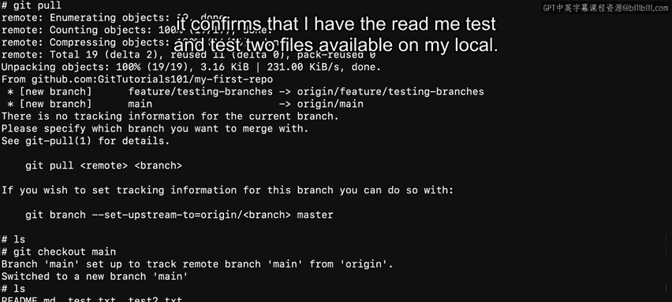

# Git与GitHub入门：第21章：远程与本地仓库 🖥️➡️☁️

在本节课中，我们将要学习Git中**本地**与**远程**仓库的核心概念、区别以及它们之间如何协作。理解这两者对于团队高效协作至关重要。

## 概述

在互联网普及之前，为了备份和传输，将项目文件保存到不同的机器上是一个繁琐的过程。这需要手动地在机器之间逐个复制文件，导致团队工作效率低下。如今，云计算提供了一种更高效的方式来实现这一目标。本节视频将解释GitHub上远程与本地仓库的区别。

## 本地与远程仓库的概念

上一节我们介绍了Git工作流中的修改、暂存和提交。本节中，我们来看看如何将你的更改从本地推送到远程仓库。

*   **远程**：指的是开发者可以推送更改到的任何其他远程仓库。这可以是一个集中式的仓库，例如由GitHub提供的仓库，或者其他开发者设备上的仓库。
*   **本地**：指的是你的个人机器，可以是笔记本电脑、台式机甚至移动设备，并且只有你可以访问。

为了演示这两者的实际运作，假设我们有一个名为 `CodingProject1` 的项目，它位于GitHub上并拥有一个唯一的URL。换句话说，这个项目存储在**远程服务器**上。

## 克隆、拉取与推送

在本课中，你会听到一些新术语，如克隆、推送、拉取和仓库。别担心，这些很快都会得到解释。

当用户想要将此项目复制到其本地设备时，他们需要执行以下操作之一：如果是第一次，则进行**克隆**；或者**拉取**以获取最新的更改。

以下是克隆和同步项目的基本步骤：

1.  **克隆项目**：用户首先需要在本地机器上选择一个文件夹。然后，`CodingProject1` 从服务器被克隆并复制到所选文件夹中。
2.  **本地修改**：用户随后可以对项目进行更改。
3.  **推送更改**：用户可以将这些更改**推送**回服务器。
4.  **拉取更新**：其他在同一代码库上工作的用户在其本地机器上看不到这些更改，除非他们从服务器**拉取**最新的更改。


Git的优势之一在于，你可以离线工作，然后在准备好时提交你的更改。

## 实践操作示例

现在，让我们通过一个例子来具体看看如何在GitHub中完成这些操作。

首先，我将使用 `git init` 命令创建一个新的**本地仓库**。

```bash
mkdir my_second_repo
cd my_second_repo
git init
```

这将返回一行信息，告诉我一个空的仓库已在指定路径下初始化。如果我执行另一个命令 `git remote`，它会返回空白。原因是我只初始化了一个**本地仓库**，它还没有连接到位于GitHub或另一台服务器上的中央仓库。目前，它只在我机器的本地可用。

现在，我将退出这个目录，并进入我之前创建的另一个仓库（`my_first_repo`）。这个仓库已经通过远程URL连接到了GitHub。

```bash
cd ../my_first_repo
git remote -v
```

Git会告诉我它设置为 `git@github.com:git-tutorials-101/my-first-repo.git`。接下来，我将把这个URL设置给我们新创建的第二个仓库。

```bash
cd ../my_second_repo
git remote add origin git@github.com:git-tutorials-101/my-first-repo.git
```

这里通常使用的名称是 `origin`。再次执行 `git remote -v` 命令，现在它已设置为指向GitHub上的仓库。

接下来，我将使用 `git pull` 命令，它将连接GitHub服务器并从该仓库拉取所有更改。

```bash
git pull
```

现在，我的本地已经有了所有更改，但当我检查目录时，它是空的。原因是我还没有建立一个与服务器仓库分支匹配的本地分支。幸运的是，我可以通过执行以下命令来改变这一点：

```bash
git checkout main
```

这将在我的本地建立一个 `main` 分支，用于跟踪远程的 `main` 分支。现在，当我使用 `ls` 命令检查文件夹时，它确认我的本地已经有了 `README.md`、`test` 和 `test2` 文件。



## 总结

本节课中，我们一起学习了GitHub中**本地**与**远程**仓库的区别。这有助于你为在开发团队内更高效地交换数据做好准备。理解如何克隆、拉取和推送是使用Git进行协作开发的基石。下次见！