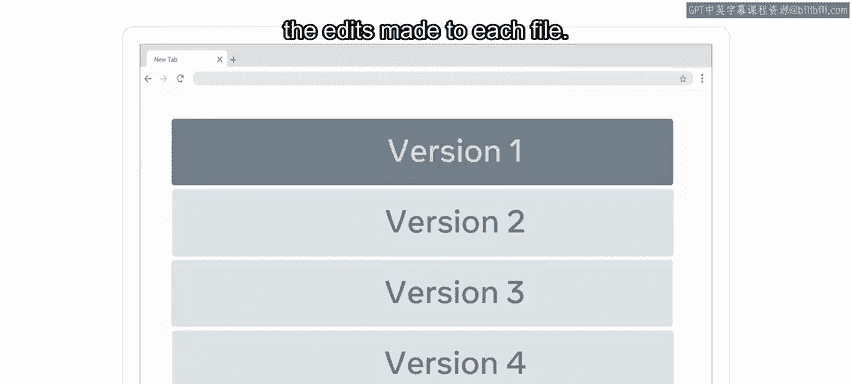
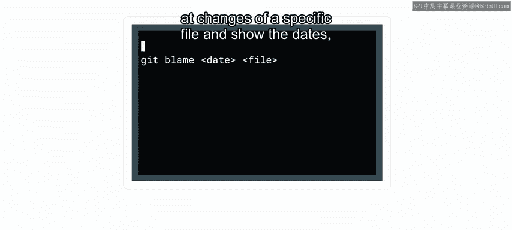
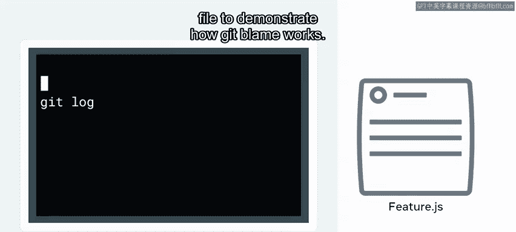
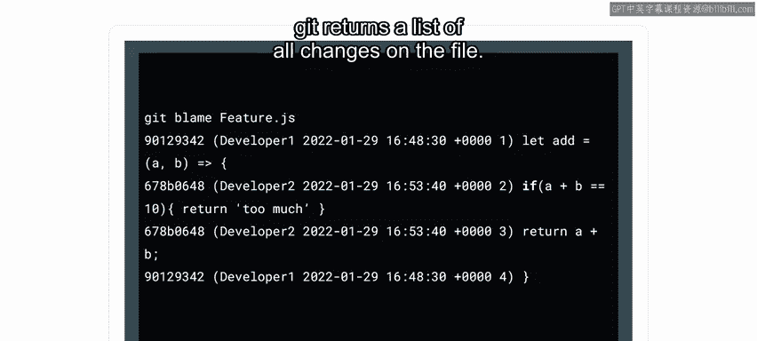
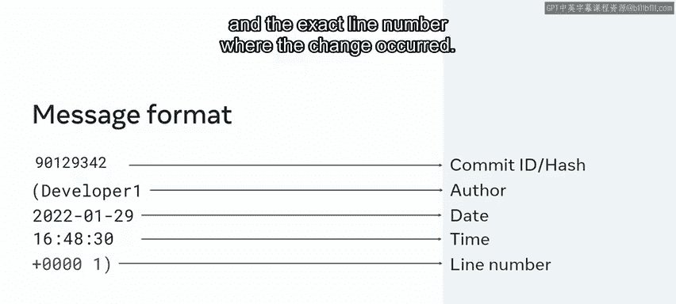
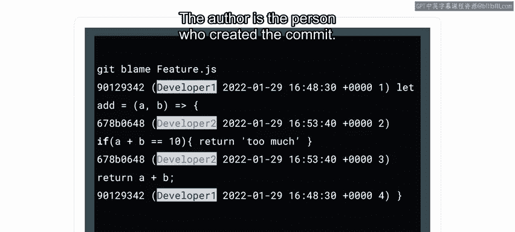
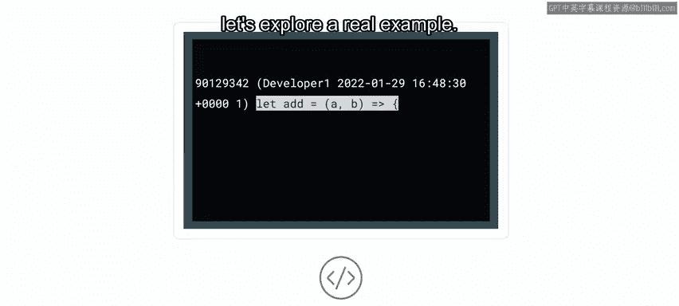
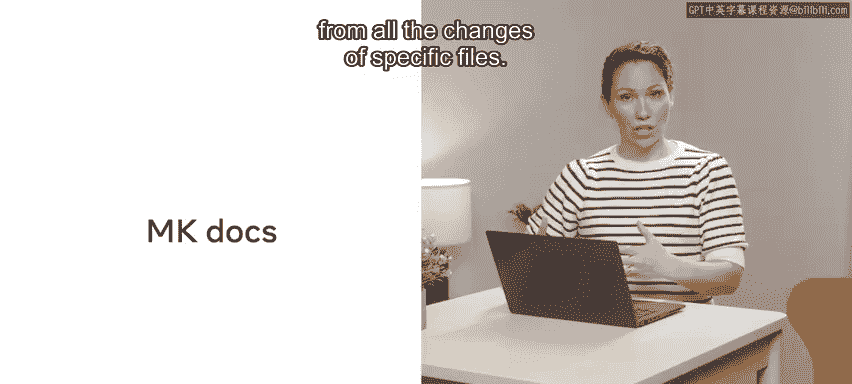
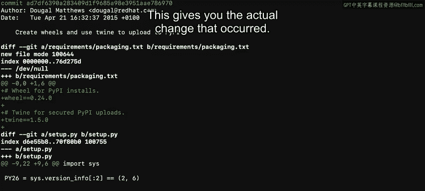

# Meta《数据库工程师（数据库简介／Git／MySQL）｜Meta Database Engineer》中英字幕 - P73：26_blame.zh_en - GPT中英字幕课程资源 - BV1Vw4m1Z7tb

One day you might be overseeing a big team of developers can you imagine how complex it gets to keep track of everyone's changes and updates to files？

Fortunately， Git has a very helpful command for keeping track of who did what and when It's called get blame In this video。

 you will learn about get blame， and I will demonstrate how it is used with a few examples。😊。

One of the core functions of Git is its ability to track and record the full history of changes for every file in the repository in order to view and verify those changes。

 Git provides a set of tools to allow users to step through the history and view the edits made to each file the Git blame command is used to look at changes of a specific file and show the dates。

 times and users who make the changes。

By now， you should know how to use commands like Git Lo to see the changes made。

I will now use the feature。jS file to demonstrate how GitBlame works。

Let's get started with a get blameme command。To run the get blame command。

 type gett Bla and the name of the file in this case， feature do JS After pressing En。

 git returns a list of all changes on the file to understand what is happening。

 Let's break down the blame messages and go through it line by line。

Firstly， let me guide you through the format of each line every line will start with the ID and then the author。

 the date and time when the change was made and the exact line number where the change occurred。

Then the actual change or content is also returned。 The I D is a reference I D of the commit。

 The same I D might appear in several lines。 This happens when a single commit has been made by the same developer。

The author is the person who created the commit the timestamp is the date and time when the changes were committed。

Line number represents the location in the file or the exact line where the changes were made。

The content is the code that was added to the file。

Now that you know the meaning of each line in the blame output。

 let's explore a real example in this example you will check who made changes。

 when the changes were made and also what changes were added。

For the purposes of demonstration， I will be using a public repository called MK Docs。

 MK Docs has various different contributions from many different developers。

 so it's a good way to see a log file from all the changes of specific files to begin。

 I will check inside the directory by using the LS command and passing in L to get a list of all the available files。

 and I'll just pick one。

The file level use is called setup dotpyY， which is a Python file。

So in order to examine the different changes to that file。

 I create a command called gett blameme and then pass in the name of the file。

 set up dot PY and press enterter。The output will list all the changes made by all the different developers。

 it will also indicate the timestamps and line numbers， as well as the actual changes that were made。

Now I will talk you through the output。Starting from the left of the list is what's called a hash dashash ID It just represents the commit of when a change occurred。

 then the name of the developer who worked on the file is listed。

 and then you have the timestamp when the change went in。Next is the line number in sequential order。

 and finally the actual change that was implemented。

I can scroll through the list of changes all the way to the end of the file。

 depending on the size of the file or whatever number of lines it has。If I want to exit out。

 I click on Q。This will clear the screen to make it easier。

Take note that gett blameme on its own and by passing the file name we list the entire file。

In a lot of cases you will work with very large files and then youll need a way to abbreviate the output or chop it down based on say line numbers Fortunatelyly。

 GitBme offers a flag for that to do this I type gett blameme and pass in the flag ofL and specify the starting line number and the endline number I will type 5 comma 15 then pass in the file name again。

 set up do py and press enter。This time a smaller subset is returned that only starts at line 5 and ends on line 15。

The output indicates that there are four different changes made by five different developers across these lines Let me give you a few more tips around Get blame now。

Firstly， you can change the format of how the list is displayed。

This is similar to what you can do with the LS command on the UniX commands。

 you can also pass in a L flag for changing the output itself， so again。

 let's run get blameme L followed by the file name and press En。This time。

 there are a few changes to the output。 For instance， the hash dash I D is in its full length form。

 It's not in the shortened version。 The output is now a bit more detailed。

 You can also control if you want to show email addresses or change the date format。

These are the examples of the various things that you can do Secondly。

 another aspect of using GitBlame is that you can see detailed changes or the actual commit changes of a specific hash ID to do that。

 I will run a GitBme command on that file again in order to copy a hash dash ID from the output。

Now I will use that with a get log P and pass in the hash dash ID and press enterter。

This gives you the actual change that occurred just to clarify。

 GiBlame will display to you the point where it was changed。

 Git log will give you the detail of the change I always use the two in conjunction to get more details about what changes occurred。

