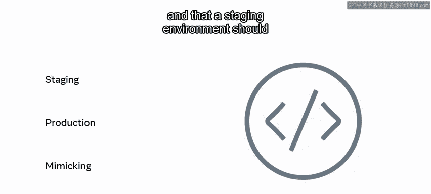
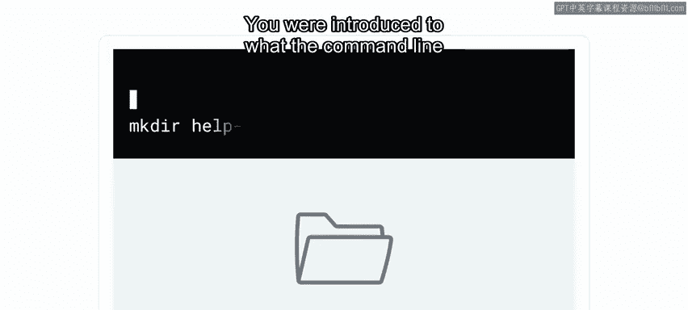
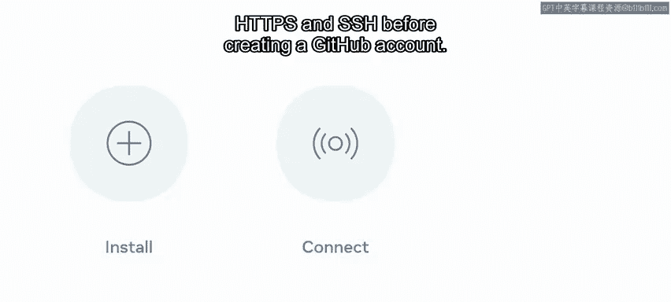
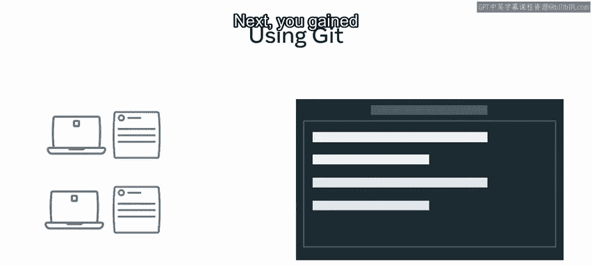
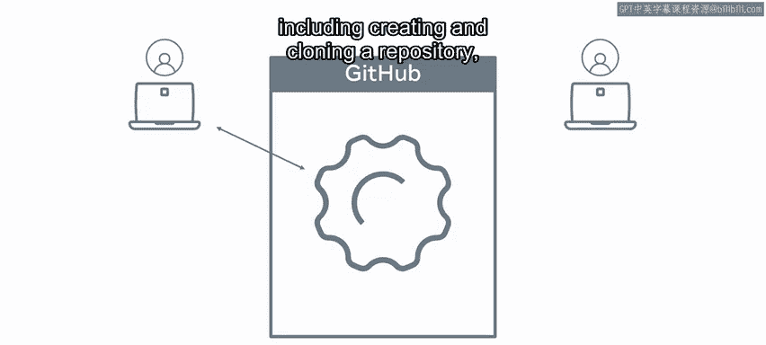
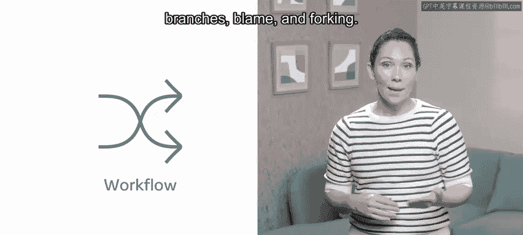
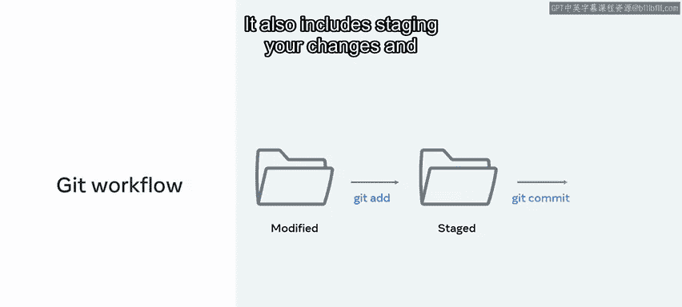

# 数据库工程师课程：P75：版本控制课程回顾 📚

在本节课中，我们将对之前学习的版本控制知识进行系统性的回顾。我们将梳理版本控制的核心概念、命令行操作以及Git技术的具体应用，帮助你巩固所学内容。

## 模块一：版本控制与软件开发工作流回顾

上一节我们完成了课程概述，本节中我们来看看第一个模块的核心内容。你学习了不同的版本控制系统以及高效的软件开发工作流程，这些知识使得现代软件开发者能够在全球范围内协作，而不会互相干扰对方的代码。

你了解了版本控制的历史，并掌握了版本控制（或称Subversion）如何为那些可能存在错误和漏洞的大型软件项目带来秩序，从而管理混乱。

接下来，你深入学习了软件开发者作为全球团队的一部分，为成功协作所利用的各种系统、工具和方法论。

你探索了如何在Git中解决冲突，并理解了版本控制在软件开发中扮演的关键角色。

随后，你继续研究了**暂存环境**与**生产环境**之间的区别。暂存环境应尽可能模拟你的生产环境。



## 模块二：Linux命令行操作回顾

在模块二中，你学习了如何使用命令行在Linux中执行命令。你被介绍了命令行的概念，并学会了使用命令来遍历、创建、重命名和删除硬盘上的文件。



然后，你了解到使用**管道**和**重定向**来创建强大的工作流是多么容易，这将自动化你的工作，为你节省时间和精力。

最后，你进一步探索了命令行，发现了标准输入、输出流、可用于改变命令行为的**标志**以及`grep`命令。

## 模块三：Git技术与实践回顾

在模块三中，你对Git技术及其在软件开发项目中用于管理团队文件的方式建立了坚实的理解。

首先，你学习了如何在各种操作系统上安装Git，然后在创建GitHub账户之前，如何通过HTTPS和SSH连接到GitHub。



接下来，你对Git的工作原理获得了实践性的理解，包括创建和克隆仓库、添加、提交、推送和拉取操作。你还探索了如何在某些与工作流相关的概念中使用仓库，例如**分支**、**追溯**和**复刻**。

以下是本模块涉及的核心Git命令示例：
```bash
git clone <repository_url>  # 克隆远程仓库
git add <file>              # 将文件更改添加到暂存区
git commit -m "message"     # 提交暂存区的更改
git push origin main        # 将本地提交推送到远程仓库
git pull origin main        # 从远程仓库拉取更新
```



最后，未评分的实验环节提供了一个机会，让你通过复刻一个仓库、创建一个分支并提交更改来完成一个实践性的版本控制练习。该练习还包括暂存你的更改以及向源仓库发起一个拉取请求。





## 总结与展望 🎯

本节课中，我们一起回顾了版本控制的核心概念、Linux命令行的高效用法以及Git在团队协作中的实际应用。你已掌握了从理论到实践的关键步骤。



完成本次回顾后，是时候将你所学的一切付诸实践了。你准备好继续前进了吗？

祝你好运。