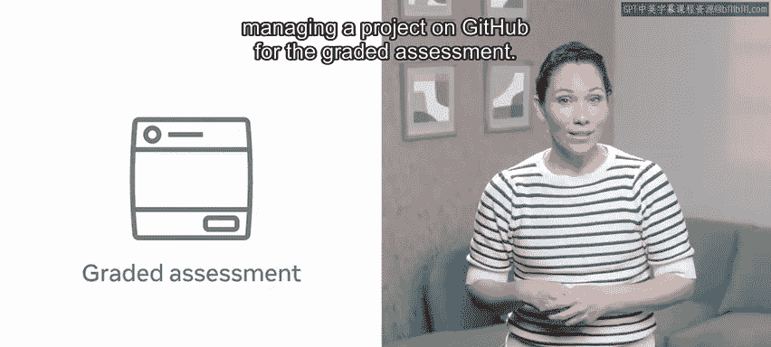
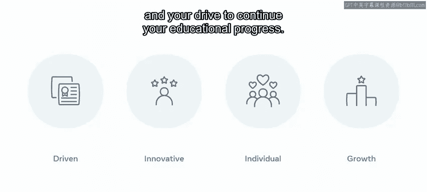

# Meta《数据库工程师（数据库简介／Git／MySQL）｜Meta Database Engineer》中英字幕 - P76：29_恭喜您完成了版本控制.zh_en - GPT中英字幕课程资源 - BV1Vw4m1Z7tb

Congratulations on completing the introduction to versionion control course you've worked hard to get here and developed a lot of new skills during the course you should now have a great foundation in the different version control systems and how to create an effective software development workflow and you've also demonstrated your skillet by managing a project on GitHub for the grade assessment。

Following completion of this course， you are now able to implement version control systems。

 navigategate and configure documents， files and directories using the command line。

 create and manage a Github repository， and manage code revisions。

 The key skills measured in the labs showed your ability too De the current working directory and make and change directories and files using the command line。

 create， clone， commit and push to a repository， create a repository with forking and manage a project on Github。

 So what are the next steps， You've established a good foundation so far。

 But there is always more to learn whether you're just starting out as a technical professional or student This project will enable you to prove your knowledge and ability。

 your project experience shows employers that you are self- drivenn and innovative。

 It also speaks volumes about you as an individual and your drive to continue。

newYour educational progressOnce you've completed all the courses in this professional certificate。

 you'll receive courseurra certification certifications provide globally recognized and industry endorsed evidence of mastering technical skills。

 Congratulations once again on reaching the end of this course。 It's been a voyage of discovery。

 Best of luck and do continue to pursue your own learning objectives to their final goal。

