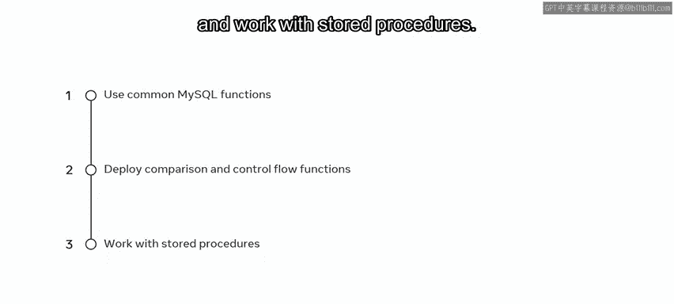

# Meta《数据库工程师（数据库简介／Git／MySQL）｜Meta Database Engineer》中英字幕 - P78：1_课程介绍.zh_en - GPT中英字幕课程资源 - BV1Vw4m1Z7tb

Welcome to the next course in database engineering The focus of this course is on database structures and management with MySQL Let's take a moment to review some of the new skills that you'll gain in these modules In the first module of this course。

 you'll learn how to filter data using logical operators perform joins on tables and make use of aliases group data using the group by and having clauses and deploy the any and all operators in the database。

In the second module you'll explore key concepts around the topics of updating databases and working with views for example。

 you'll learn how to insert and update data using the MySQL replace statement。

 make use of constraints in a MySQL database， and change the structure of tables using Alter and copy table statements。

You'll also learn how to use subqueries and how to combine them with comparison operators。

 and you'll discover how to create virtual tables with a MySQL C View statement。In moduleule3。

 you'll explore functions and MysQL stored procedures by the end of this module。

 you should know how to make use of common MysQL functions like numeric string and date functions。

 deploy comparison and control flow functions， and work with stored procedures。

During these modules you'll encounter activities to test your knowledge and skills you'll receive the opportunity to demonstrate some of this learning along with your practical database skill set in the lab project and you'll also demonstrate your knowledge of these topics in a graded assessment so what are you waiting for Let's get started。

