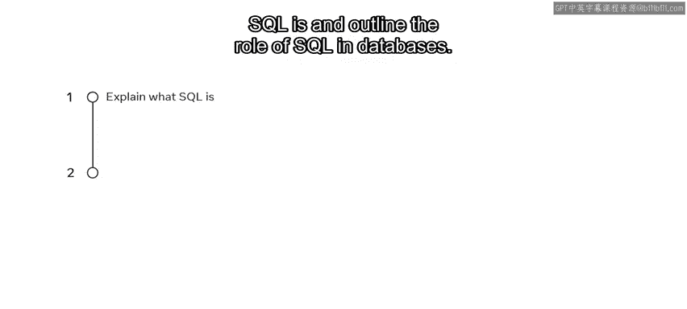
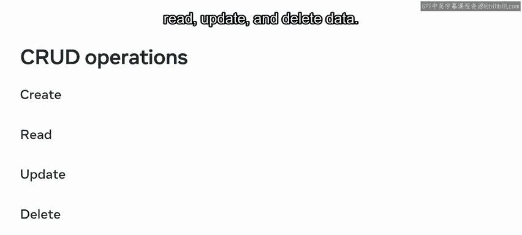
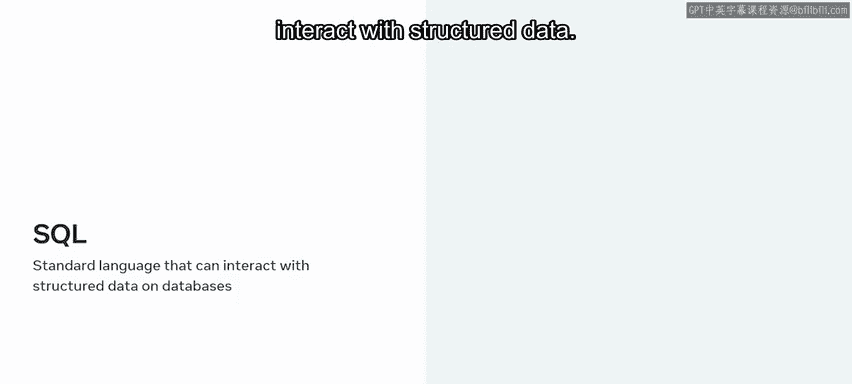
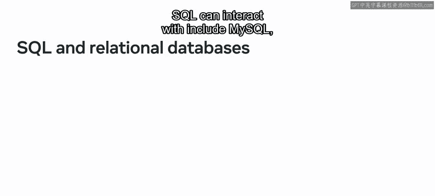
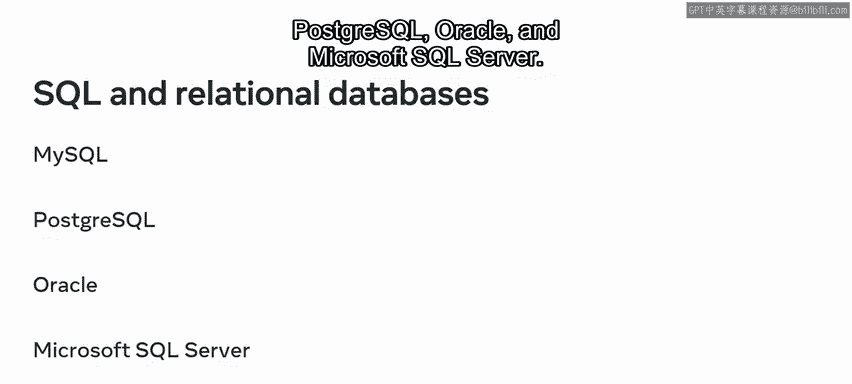
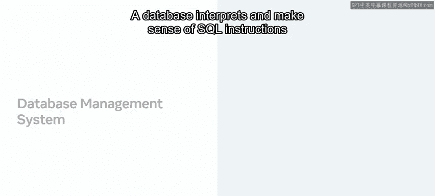
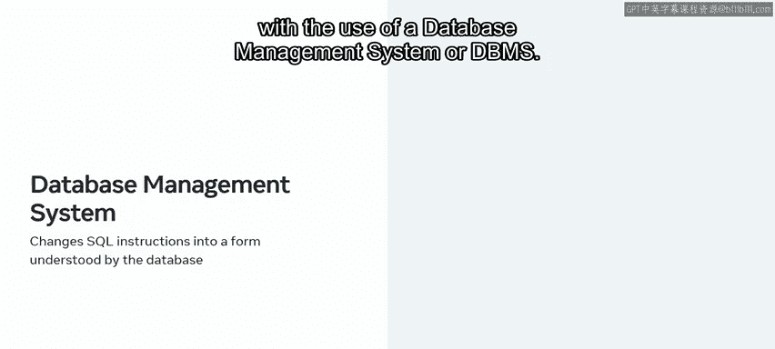
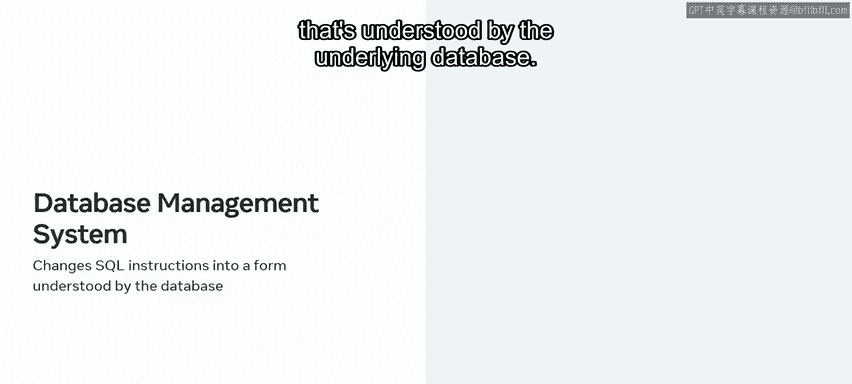

# Meta《数据库工程师（数据库简介／Git／MySQL）｜Meta Database Engineer》中英字幕 - P7：6_什么是结构化查询语言.zh_en - GPT中英字幕课程资源 - BV1Vw4m1Z7tb

At this stage in the course， you're probably familiar with the basics of databases and how they store and manage data。

 but it's also important that you know how to interact with databases in order to work with data。

As a data engineer， you can interact with databases using structured query language。

 or as more commonly known SQL， also pronounced as SQL。Over the next few minutes。

 you'll learn how to explain what SQL is and outline the role of SQL and databases。😊。

So what sort of interactions do database engineers need to establish with databases？

Some of the operations you could carry out in the data might require you to create， read， update。

 and delete data。

These operations are also known asCD operations。You might already be familiar with some of these operations。

 if not， don't worry， they be covered in depth at later stages in this course。

Let's find more about SQL。SQL is a standard language that can be used with all databases。

It's particularly useful when working with relational databases。

 which require a language that can interact with structured data。

Some examples of relational databases that SQL can interact with include MySQL， PostgresSQL。

 Oracle and Microsoft SQL Server， the next question this raises is how does a database interpret or read and execute instructions given using SQL？

A database interprets and makes sense of SQL instructions with the use of a database management system or DBMS。

As a web developer， you'll execute all SQL instructions on a database using a DBMS。

The DBMS takes responsibility for transforming SQL instructions into a form that's understood by the underlying database。

This was just a very quick introduction to SQL At this early stage。

 you should be able to explain what SQL is and explain the role of SQL in databases。😊。

In the upcoming videos， you'll learn more about SQL and develop a deeper understanding of the language。

