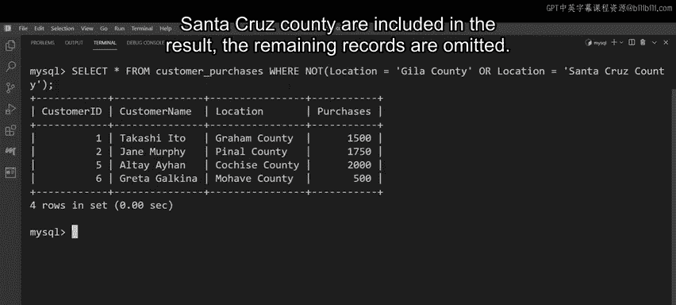

# 数据库工程师：P80：使用AND、OR和NOT逻辑运算符过滤数据 🔍

在本节课中，我们将学习如何在SQL的`WHERE`子句中使用逻辑运算符（`AND`、`OR`、`NOT`）来组合多个条件，从而对数据库表中的数据进行更精确的筛选。掌握这些运算符是构建复杂查询的基础。

## 回顾WHERE子句

在探索如何使用多个条件过滤数据之前，我们先简要回顾一下`WHERE`子句的工作原理。理解这一点对于使用逻辑运算符至关重要。

当需要过滤数据库表中的数据时，可以在SQL的`SELECT`语句中添加`WHERE`子句，以指定数据应如何被筛选的条件或规则。

一个基本的`SELECT`语句结构如下：
```sql
SELECT column1, column2, ...
FROM table_name
WHERE condition;
```
它从`SELECT`关键字开始，指定要查询的列，使用`FROM`关键字指定要查询的表，最后通过`WHERE`子句添加过滤条件。

然而，正如你将学到的，也可以在`WHERE`子句中指定多个条件，这些条件需要使用逻辑运算符来组合。

## 理解AND和OR运算符

本节中，我们来看看`AND`和`OR`这两个核心逻辑运算符。`AND`运算符与`WHERE`子句一起使用，用于检查所有组合条件是否都满足“真”值。而`OR`运算符则检查组合条件中是否有任何一个满足“真”值。

让我们分别探讨一下这两个逻辑运算符的语法。

### 使用AND运算符

`AND`运算符用于组合多个条件，要求所有条件同时为真，记录才会被包含在结果集中。

其基本语法结构为：
```sql
SELECT column1, column2, ...
FROM table_name
WHERE condition1 AND condition2 AND condition3 ...;
```
SQL语句会检查记录是否满足所有这些条件。如果满足，则该记录被包含在结果集中。

### 使用OR运算符

`OR`运算符也用于组合多个条件，但只要其中任何一个条件为真，记录就会被包含在结果集中。

其基本语法结构为：
```sql
SELECT column1, column2, ...
FROM table_name
WHERE condition1 OR condition2 OR condition3 ...;
```
这意味着，如果表中某条记录至少满足一个条件，它就会被包含在查询结果集中。


## 探索NOT运算符

上一节我们介绍了`AND`和`OR`，本节中我们来看看`NOT`逻辑运算符。`NOT`运算符的工作方式与其他运算符略有不同，它只选择那些不满足`WHERE`子句中指定条件的记录。

换句话说，它对条件评估后的结果进行反转或否定。

要使用`NOT`运算符，只需在`WHERE`子句后键入`NOT`，然后跟上所需的条件。

其基本语法结构为：
```sql
SELECT column1, column2, ...
FROM table_name
WHERE NOT condition;
```

## 实践案例：Lucy’s Shrubbery的客户数据分析

现在，让我们花几分钟时间，通过Lucy’s Shrubbery的案例来了解这些运算符的实际应用。Lucy’s Shrubbery正在审查其账户，需要生成关于客户及其购买记录的特定详细信息。

他们可以通过使用逻辑运算符过滤数据来完成此任务。

在Lucy’s Shrubbery的数据库中，有一个名为`CustomerPurchases`的表，该表包含了完成查询所需的数据。数据分为以下四列：`CustomerID`、`CustomerName`、`Location`和`Purchases`。

### 任务一：使用AND组合条件

Lucy’s Shrubbery首先需要识别出来自“Hela County”地区且购买金额超过$2,000的客户。这需要两个搜索条件。

以下是完成此查询的步骤：

1.  编写基本的`SELECT`语句框架。
2.  在`WHERE`子句中添加第一个条件：`Purchases > 2000`。
3.  使用`AND`运算符连接第二个条件：`Location = ‘Hela County’`。

完整的SQL语句如下：
```sql
SELECT *
FROM CustomerPurchases
WHERE Purchases > 2000 AND Location = ‘Hela County’;
```
`AND`运算符在这里组合了两个条件，确保在过滤表数据时同时评估这两个条件。只有当一条记录的`Purchases`列值大于2000**并且**`Location`列值为“Hela County”时，它才会被包含在结果中。

执行此查询后，结果集包含两条记录，即Benjamin Claus和Julie Mur。

### 任务二：使用OR组合条件

接下来，Lucy’s Shrubbery需要识别出来自“Hela County”或“Santa Cruz County”的客户。`OR`逻辑运算符非常适合此任务。

以下是完成此查询的步骤：

1.  编写`SELECT`语句。
2.  在`WHERE`子句中添加第一个条件：`Location = ‘Hela County’`。
3.  使用`OR`运算符连接第二个条件：`Location = ‘Santa Cruz County’`。

完整的SQL语句如下：
```sql
SELECT *
FROM CustomerPurchases
WHERE Location = ‘Hela County’ OR Location = ‘Santa Cruz County’;
```
`OR`运算符确保只要记录满足至少一个条件（位于Hela County**或**Santa Cruz County），就会被包含在结果中。

执行此查询后，结果返回三条记录。

### 任务三：使用NOT排除条件

最后，Lucy’s Shrubbery需要检索**不**居住在“Hela County”或“Santa Cruz County”的客户的详细信息。他们可以使用`NOT`逻辑运算符来执行此任务。

其写法与之前类似，但在`WHERE`子句后键入`NOT`，然后列出条件。由于有多个条件，需要用括号将它们括起来。

完整的SQL语句如下：
```sql
SELECT *
FROM CustomerPurchases
WHERE NOT (Location = ‘Hela County’ OR Location = ‘Santa Cruz County’);
```
`NOT`运算符检查记录，找出那些对给定条件（位于所列任一位置）不产生“真”值的记录。换句话说，就是找出不在“Hela County”或“Santa Cruz County”的记录。

执行此查询后，输出显示了`CustomerPurchases`表中的四条记录。



## 总结

本节课中，我们一起学习了SQL中三个核心的逻辑运算符：`AND`、`OR`和`NOT`。
*   `AND`要求所有条件同时为真。
*   `OR`要求至少一个条件为真。
*   `NOT`用于否定一个条件，选择不满足该条件的记录。

通过Lucy’s Shrubbery的实践案例，我们看到了如何将这些运算符应用于`WHERE`子句中来构建更具体、更强大的数据查询。理解并熟练运用这些运算符，是进行有效数据筛选和分析的关键一步。如果觉得这些例子有点复杂，请不要担心，在本课程的后续视频中将会回顾如何使用这些运算符的详细示例。目前，你只需要能够识别每个运算符并解释其基本语法即可。