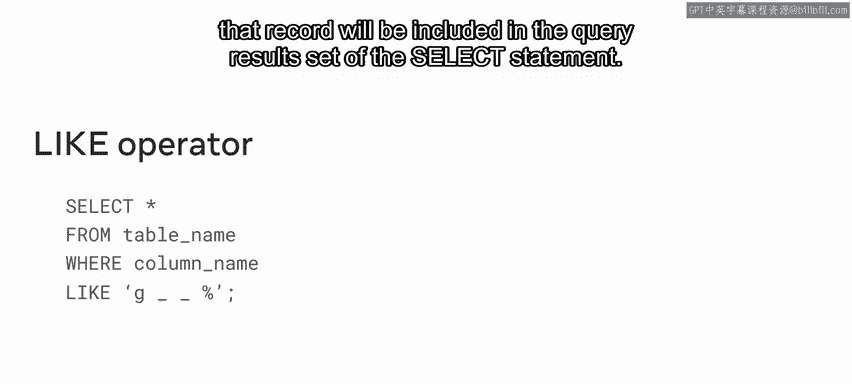
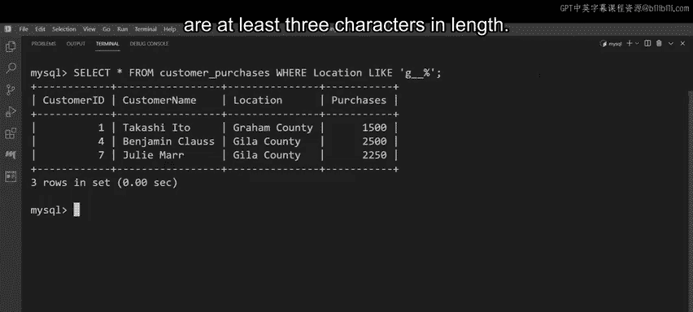

**数据库工程师：4：使用IN、BETWEEN和LIKE逻辑运算符过滤数据** 🎯

在本节课中，我们将学习如何使用IN、BETWEEN和LIKE这三个逻辑运算符来执行更复杂的数据过滤任务。这些运算符能帮助我们基于多个值、特定范围或特定模式来筛选数据，是数据库查询中不可或缺的工具。

---

### **逻辑运算符概述**

上一节我们介绍了基础的AND和OR运算符。本节中，我们来看看IN、BETWEEN和LIKE运算符，它们能处理更具体的过滤需求。

IN运算符允许在WHERE子句中指定多个值。  
BETWEEN运算符选择给定范围内的值。  
LIKE运算符用于基于模式匹配来过滤数据。

---

### **IN运算符详解**

IN运算符的语法与典型的SELECT过滤语句略有不同。在WHERE子句后，必须键入应用IN运算符的列名，然后添加IN运算符及括号内的值集合。

**语法示例：**
```sql
SELECT * FROM table_name
WHERE column_name IN (value1, value2, ...);
```
如果某条记录的指定列值与集合中的任意值匹配，则该记录将包含在查询结果集中。IN运算符就像是多个OR条件的简写形式。你也可以使用NOT IN来获取与IN运算符相反的结果。

---

### **BETWEEN运算符详解**

BETWEEN运算符也需要在WHERE子句后指定列名，然后应用BETWEEN运算符及两个必需的边界值。这两个值定义了范围的起始和结束。

**语法示例：**
```sql
SELECT * FROM table_name
WHERE column_name BETWEEN value1 AND value2;
```
该运算符选择此给定范围内的值，适用的值类型包括数字、文本和日期。如果记录的指定列值落在指定的值范围内，则该记录将包含在查询结果集中。

---

### **LIKE运算符与通配符**



LIKE运算符用于基于模式匹配过滤数据。该运算符放在WHERE子句和指定列名之后，然后添加要与列数据匹配的模式。此模式可以使用通配符编写。

以下是两种主要的通配符：
*   **百分号（%）**：代表零个、一个或多个字符。
*   **下划线（_）**：代表一个单个字符。

**模式示例：**
例如，模式 `'G__%'` 表示搜索以字母G开头且长度至少为三个字符的值。每个下划线代表一个字符，而百分号代表零个或多个字符。

**语法示例：**
```sql
SELECT * FROM table_name
WHERE column_name LIKE 'pattern';
```
如果记录的指定列值与给定模式匹配，则该记录将包含在查询结果集中。

---

### **实战演示：Lucy Shrub数据库**

假设Lucy Shrub公司正在审查其账户，需要生成关于客户及其购买记录的特定详细信息。他们可以通过使用IN、BETWEEN和LIKE逻辑运算符过滤数据来完成此任务。

数据库中存在一个名为`customer_purchases`的表，包含以下列：`customer_id`、`customer_name`、`customer_location`、`purchases`（每位客户的单次购买金额）。

#### **使用IN运算符**

Lucy Shrub需要找出位于“Hela County”或“Santa Cruz County”且购买金额超过2000的客户。使用IN运算符可以简化多个OR条件。

**查询语句：**
```sql
SELECT * FROM customer_purchases
WHERE purchases > 2000 AND customer_location IN ('Hela County', 'Santa Cruz County');
```
执行此查询将返回三条记录，与使用多个OR运算符的结果相同。

#### **使用BETWEEN运算符**

接下来，Lucy Shrub需要购买金额在1000到2000之间（包含边界值）的客户详情。

**查询语句：**
```sql
SELECT * FROM customer_purchases
WHERE purchases BETWEEN 1000 AND 2000;
```
BETWEEN运算符是筛选购买值大于等于1000且小于等于2000的记录的一种更快捷、更简便的方法。

#### **使用LIKE运算符**

最后，Lucy Shrub需要查找`customer_location`列中，以字母G开头且长度至少为三个字符的所有值。这需要使用LIKE运算符配合通配符。

**查询语句：**
```sql
SELECT * FROM customer_purchases
WHERE customer_location LIKE 'G__%';
```
执行此查询后，输出结果将包含三个以G开头且长度至少为三个字符的值。所有不匹配该模式的值都已从结果表中省略。

---



### **总结**

本节课中，我们一起学习了如何使用IN、BETWEEN和LIKE逻辑运算符来组合条件并过滤数据。IN运算符简化了多值匹配，BETWEEN运算符方便了范围查询，而LIKE运算符结合通配符则实现了灵活的模式匹配。掌握这些运算符能显著提升你从数据库中提取特定信息的能力。