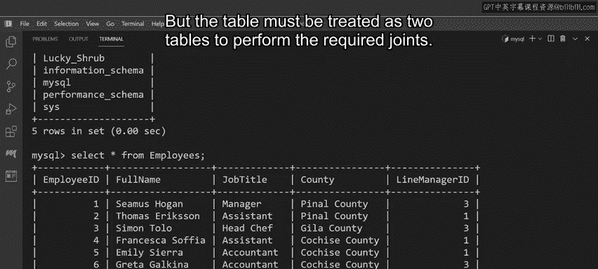
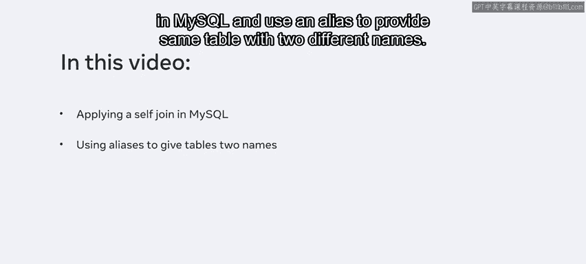
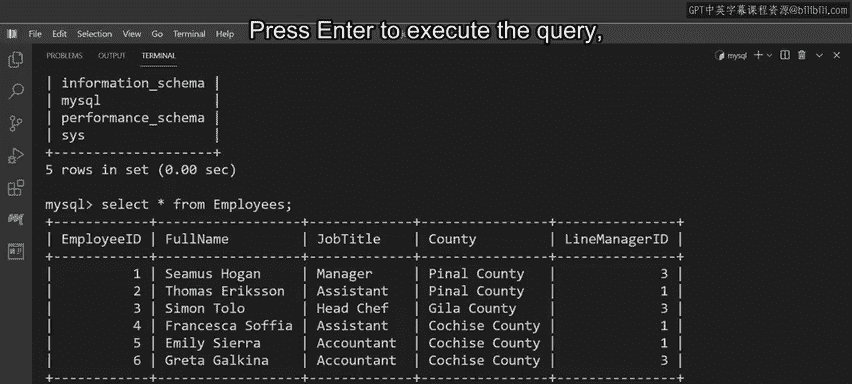
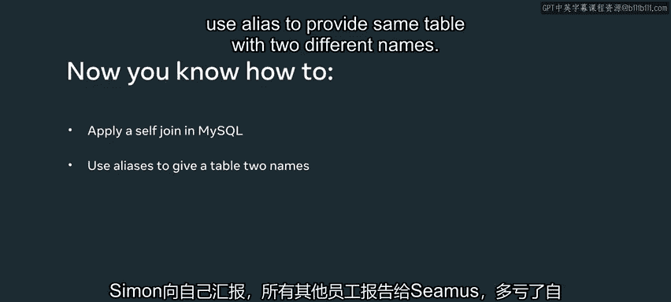

# Meta《数据库工程师（数据库简介／Git／MySQL）｜Meta Database Engineer》中英字幕 - P86：9_自连接.zh_en - GPT中英字幕课程资源 - BV1Vw4m1Z7tb

The Lucy Shroub databaseb has a table calledEmployees， which lists all staff in the business。

Some of these staff members are line managers and other employees report to these line managers。

Looky Shrub needs to query the data from this table to determine which roles everyone is assigned they can complete this task using the selfjo clause。

 a special join case This clause lets Luc Shrub create a join between rows on the same table so that they can extract specific information。

 but the table must be treated as two tables to perform the required joins。

Over the next few minutes， you'll help Luc Sub with this query and by the end of this video you'll be able to apply the selfjo concept in MySQL and use an alias to provide same table with two different names。

Let's begin by reviewing the employee table from the Lucy Shrub database。

This is the table that stores the required information on employees and their line managers。

The table includes five columns， employee ID， full name， job title， county， and line manager ID。

In this table， the primary key employee ID values are also used in the line Manager ID column to show who manages each employee in the Lucky shop firm。

So your main task is to list the full name of all line managers and the employees they manage。

The full names of both sets of employees exist within the full name column。To complete this task。

 you can create the employee's table as two identical tables。

 then create an inner join to investigate each employee ID and match it with a line manager ID。

Then extract the full name value and print it as either line manager or employee and remember that the line managers are also employees。

😊，Before writing the query， remember that the self join clause creates two tables from one。

 in other words， know you're dealing with two tables in your query， not just one。

 so let's begin with a SQL select statement。The statement uses E1 with an as keyword to declare an alias for the first employee table。

 and it also uses E2 with an as keyword to declare an alias for the second employee table。

Remember that the employee table is the same in both cases In addition。

 your statement queries the full name column from the E1 table and it uses the as keyword to declare a suitable alias name of line manager from the left table it then queries the full name column from the E2 table and uses the as keyword to declare an alias of employee from the right table name columns from both employee tables。

 but only once there's a match between the column values。In this instance， the condition is E1。

empeeid equal to E2。line manager ID In other words。

 the condition matches the employee ID with the line manager ID If it finds a value of true。

 then the full name is returned from the left table and displayed in the line manager column and the full name is also returned and displayed as an employee from the right table。

 press enter to execute the query the output result set links the line managers with the employees they manage。

A quick summary of the output result setth shows that the employees Seamus and Greta report to the line manager Simon。

 Simon reports to himself， and all other staff report to Seamus。Thanks to the selfJoin clause。

 Luc Sb have now determined which employee is in which role。

 and you should now be able to apply the selfjoin concept in MySQL and use alias to provide the same table with two different names。

 good work。

