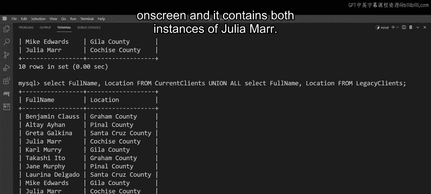

# Meta《数据库工程师（数据库简介／Git／MySQL）｜Meta Database Engineer》中英字幕 - P87：10_MySQL UNION运算符.zh_en - GPT中英字幕课程资源 - BV1Vw4m1Z7tb

Looky Shrub are filing their end of year tax returns and must provide information on all employees that they have hired over the last 12 months。

 There are several full time employees in the business。

 and there are several part time employees who were recently hired to help with the holiday season。

But the records for the full time and part time employees are stored in separate tables。😊。

So how can Luc Shrub combine these records into one table， they can use the MysQL union operator。

Over the next few minutes， you'll discover how the Union operator works and by the end of this video you'll be able to。

Demonstrate an understanding of the Union operator and explain how the Union operator is used in MySQL。

Let's begin with a definition of the union operator。

The union operator is used to combine result sets from multiple statements in the same query for example。

 you can use the Union operator to join two select statements in order to combine their result sets and present as one table。

So how does the Union operator work？Let's look at the syntax and find out。

You begin with a select statement， followed by the names of the columns that must be queried。

The Fr keyword is then used to target the table in which the records are located。Next。

 you add a union operator followed by a select statement that queries the required records from the second table。

The union operator essentially creates a union between the two select statements；

 there are a few best practices that must be observed when creating SQL select statements with a union operator。

Every select statement must have the same number of columns。

 all related columns have similar data types， and all related columns must have the same order in every select statement。

 but what about cases where the same value exists in both tables but appears only once in the combined set of results？

Like a name or a location。This happens because the Union operator only returns distinct values from the targeted tables。

To list all values， including duplicated data， you can use the all keyword。

The use of the all keyword after the Union operator ensures that all values remain。

 even duplicated ones。Let's explore a working example of the Union operator。As you saw earlier。

 Luc Sub need to gather information on all employees that they have hired over the last 12 months。

 but the data for their full time and part time employees is stored in separate tables。

 let's help them out。

Lucky Shrub need to combine the records from two tables into one， using the MySQL Union operator。

Both the full time employees and part time employees tables include the same four columns。

 employee ID， full name， contact number and location。

Ly Srub need to query the full names and addresses or locations of all employees。

To combine the results from both tables， you can write two select statements that target the full name and location columns。

One statement targets the full time employeess table。

 the other targets the part time employees table， and a union operator is placed in between both statements to combine the results。

Before executing these statements， you must check that each of these select statements includes the same number of columns；

 in addition， all columns must contain the same data types and must be placed in the same order in both statements。

Finally， click Enter to execute the query。The output places the results of both select queries into the one table that contains two columns。

 full name and location。These columns hold all required records for all Luc Shruub's parttime and fulltime employees。

 However， Luc Shrub has two employees named Julia Mar。

 one who works parttime and another who works full time。

 but only one Julia Mar appears in the combined set of results。

 This is because the union operator only returns distinct values。

 Yet its interpreted boat instances of Julia Mar as a duplicated value。 Fortunatelyly。

 you can use the union operator to generate an output that contains boat employees。

Just write the same select statements once again with a union operator in between。

But this time place the all keyword after the union operator。As you learned earlier。

 the all keyword ensures that the output retains all results from both tables。

 even if they duplicate values。Finally， click Enter to execute the query。

The output is then generated on screen and it contains both instances of Julia Mur。

Thanks to the Union operator， Luc Shrub now have all the information they need。

And having helped them out， you should now be able to demonstrate an understanding of the union operator and explain how the union operator is used in MySQL well done。

