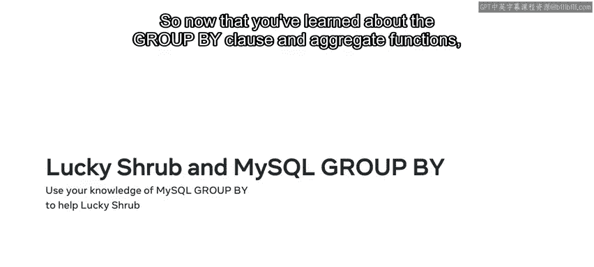
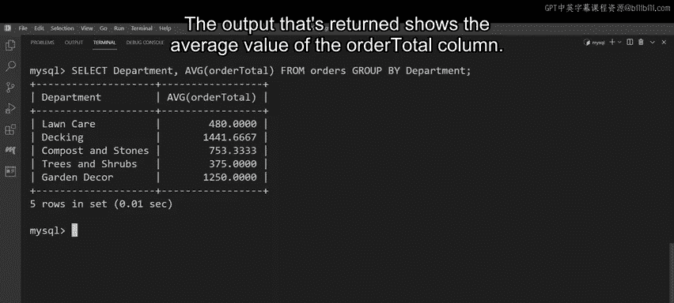

# 数据库工程师课程：第11章：MySQL GROUP BY 子句 🗂️

在本节课中，我们将学习如何使用 MySQL 的 `GROUP BY` 子句。我们将了解如何将具有相似值的记录分组，以便分析数据并生成汇总报告。课程将涵盖 `GROUP BY` 的基本语法及其与聚合函数的结合使用。

## 概述

`GROUP BY` 子句是 SQL 语法中用于根据指定列将表中的行分组为汇总行（也称为子组）的工具。它通常与聚合函数结合使用，以对每个子组执行计算。

## GROUP BY 子句详解

上一节我们介绍了 `GROUP BY` 的基本概念，本节中我们来看看它的具体语法和规则。

`GROUP BY` 子句的语法结构如下：
```sql
SELECT column_name(s)
FROM table_name
WHERE condition
GROUP BY column_name(s);
```
*   `SELECT` 语句后跟需要查询的列名。
*   `FROM` 子句指定包含这些列的表名。
*   `GROUP BY` 子句后跟一个由逗号分隔的列名列表，数据将根据这些列进行分组。
*   如果查询中包含 `WHERE` 子句，则 `GROUP BY` 子句必须放在 `WHERE` 子句之后。
*   确保 `SELECT` 子句中列出的列包含 `GROUP BY` 子句中列出的列。

## 聚合函数回顾

`GROUP BY` 子句经常与聚合函数一起使用。聚合函数对一个或多个值执行计算，并为每个子组返回单个值。

以下是数据库开发人员常与 `GROUP BY` 子句搭配使用的主要聚合函数：
*   **`SUM`**：用于将给定列的值相加并返回总和。
*   **`AVG`**：用于计算列值的平均值。
*   **`MAX`**：返回一个或多个给定列的最大值。
*   **`MIN`**：确定一个或多个给定列的最小值。
*   **`COUNT`**：用于计算给定列值出现的次数。

## 结合 GROUP BY 与聚合函数

了解了基本语法和聚合函数后，现在我们来看看如何将它们结合起来使用。

结合 `GROUP BY` 与聚合函数的 `SELECT` 语句语法如下：
```sql
SELECT column1, AGGREGATE_FUNCTION(column2)
FROM table_name
GROUP BY column1;
```
*   首先输入 `SELECT` 语句，后跟列列表。
*   然后根据需要在任何列上应用聚合函数，例如，使用 `MAX(column1)` 计算 column1 的最大值。确保将列名放在括号内。
*   接着包含 `FROM` 子句和表名。
*   最后包含 `GROUP BY` 子句，后跟数据应据以分组的列名。确保这些列也出现在 `SELECT` 的列列表中。

## 实践案例：分析订单数据

现在，我们将运用所学知识，通过一个案例来帮助 Lucky Shrub 公司分析其订单数据。



假设 Lucky Shrub 公司需要分析其订单数据。他们的 `orders` 表包含五列：`order_id`、`department`、`order_date`、`order_quantity` 和 `order_total`。表中存在多条具有相同部门值的记录。

### 基础分组

首先，我们需要将记录按部门分组，使每个部门只对应一行记录，以便于分析。

以下是按部门分组的基本查询：
```sql
SELECT department
FROM orders
GROUP BY department;
```
执行此查询后，输出结果会将 `department` 列中的所有记录简化为若干个组，业务中的每个部门对应一行记录。

### 使用 COUNT 函数

Lucky Shrub 的报告需要显示每个部门收到的订单数量。我们可以使用 `COUNT` 函数来生成这些数据。

查询语法与之前的几乎相同，关键区别在于必须在 `SELECT department` 后添加 `COUNT` 函数及括号内的列名。
```sql
SELECT department, COUNT(order_id)
FROM orders
GROUP BY department;
```
此查询指定了包含数据的列，`COUNT` 函数会统计订单记录中每个部门出现的次数。执行后，输出结果将返回五个部门及其各自的订单总数。

### 使用 SUM 函数

接下来，我们计算每个部门从这些订单中获得的总收入。可以使用相同的语法，但这次对 `order_total` 列使用 `SUM` 聚合函数。
```sql
SELECT department, SUM(order_total)
FROM orders
GROUP BY department;
```
执行查询后，输出结果返回所选数字列的总和。换句话说，它汇总了每个部门每次出现的 `order_total` 列的值。

### 使用 MIN 函数

现在，我们来确定每个部门的最小订单数量。再次使用相同的语法，但使用以 `order_quantity` 列为目标的 `MIN` 函数。
```sql
SELECT department, MIN(order_quantity)
FROM orders
GROUP BY department;
```
运行查询后，输出结果返回该列的最小值。

### 使用 AVG 函数

最后，Lucky Shrub 还需要每个部门的平均订单总额。最后一次编写语法，这次可以使用 `AVG` 聚合函数来查询 `order_total` 列。
```sql
SELECT department, AVG(order_total)
FROM orders
GROUP BY department;
```
返回的输出结果显示了 `order_total` 列的平均值。



## 总结

本节课中我们一起学习了如何使用 MySQL 的 `GROUP BY` 子句将行分组为子组，以及如何将该子句与 SQL 聚合函数（如 `COUNT`、`SUM`、`MIN`、`AVG`）结合使用来分析数据并生成汇总报告。通过帮助 Lucky Shrub 公司的实践案例，我们掌握了从基础分组到应用多种聚合函数进行数据分析的完整流程。