# Meta《数据库工程师（数据库简介／Git／MySQL）｜Meta Database Engineer》中英字幕 - P90：13_模块小结 MySQL简介.zh_en - GPT中英字幕课程资源 - BV1Vw4m1Z7tb

Congratulations， you've reached the end of the first module in this course。

Let's take a moment to recap on some of the key skills you've gained in this module's lessons。

In the first lesson， you received an introduction to the course in which you learned why MySQL is a key language for database engineers and how metata uses MySQL。

 and you enhance your knowledge by reviewing some key additional resources。

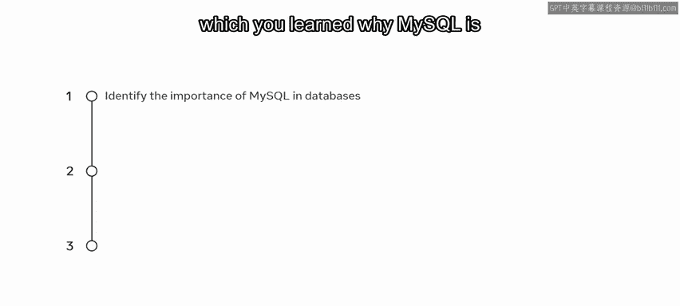

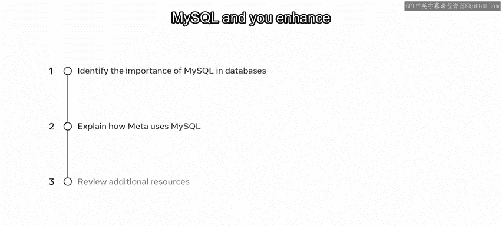

In lesson two， you explored the topic of filtering data you began the lesson by learning about the concepts of data filtering and logical operators。

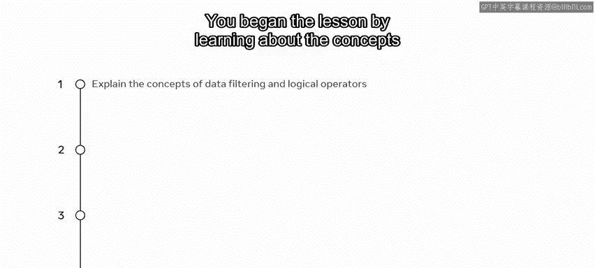

You then discovered how to use logical operators to filter your data sets。

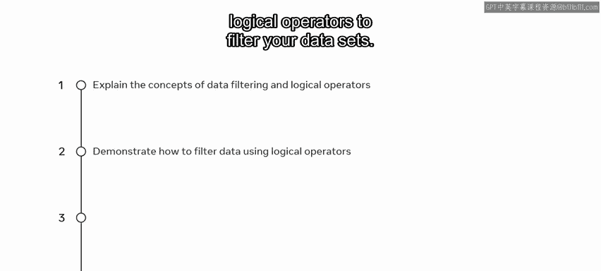

Next， you completed a reading in which you explored some real world examples of data filtering。

Finally， you reviewed some additional resources on the topics of data filtering and logical operators you then progressed to lesson three in which you learn the skills required to join tables you first learned about the concept of aliases and how they can be used in MySQL。

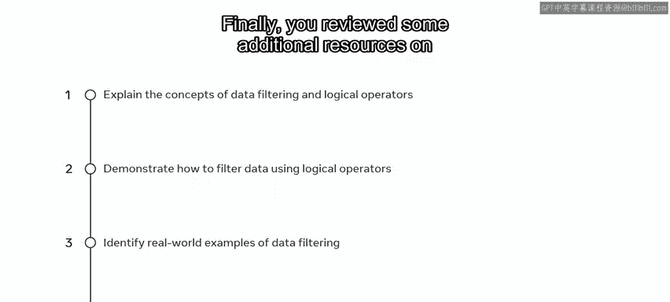

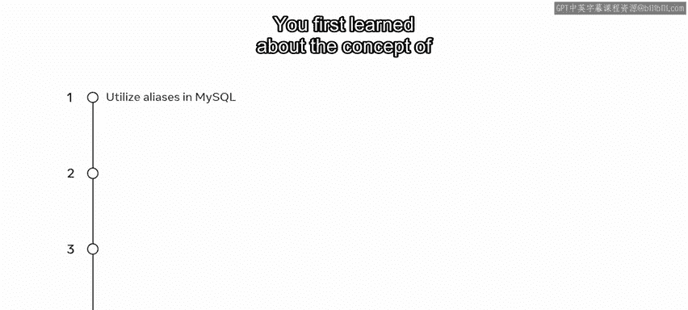

You then learned how to identify different types of joins and how to utilize them in your database tables。

 and you demonstrated these new skills in a lab environment。 Next。

 you learned about the concept of a union operator and you demonstrated its use in your databases。

 Finally， you enhanced your knowledge of these topics by exploring additional reading materials。

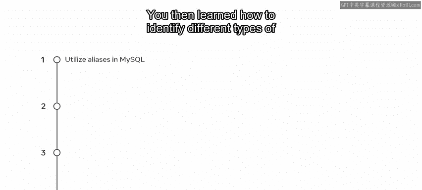

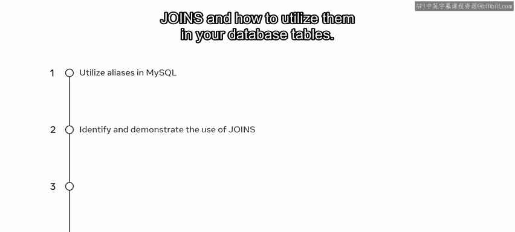

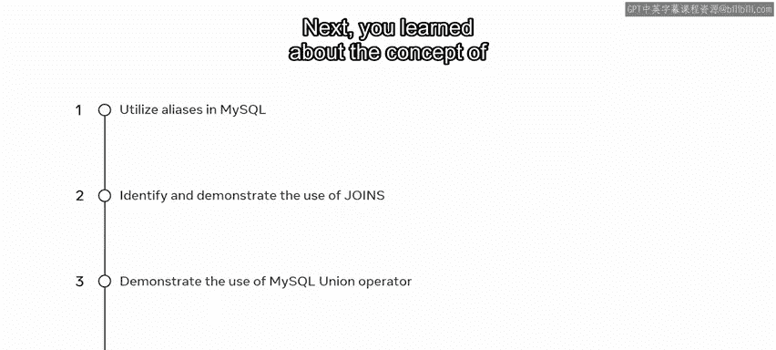

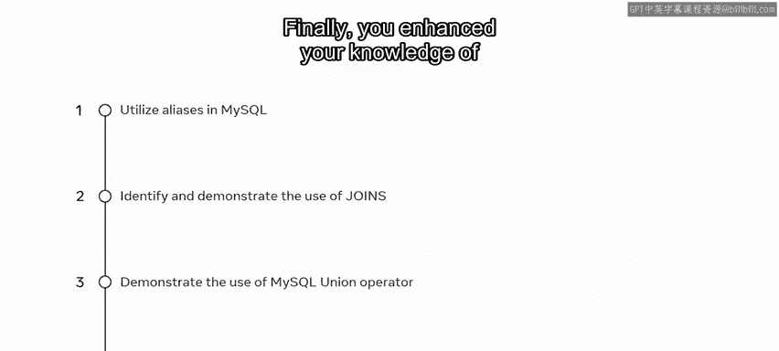

In the fourth and final lesson you gain skills in grouping data you began the lesson by learning how to identify and make use of the group by clause。

 you then learned how to use a having clause。

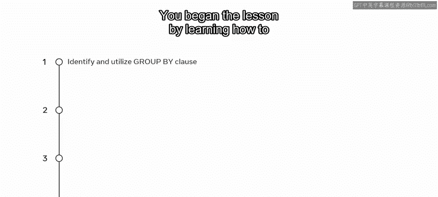

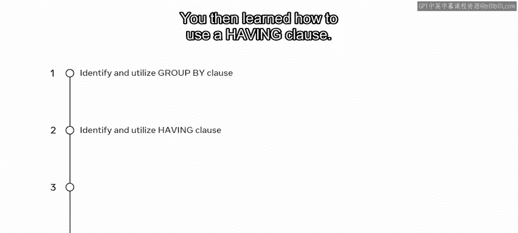

Next you completed a reading in which you learned how to utilize the MySQL any and all operators Finally you were challenged to demonstrate these new data grouping skills within a lab environment。

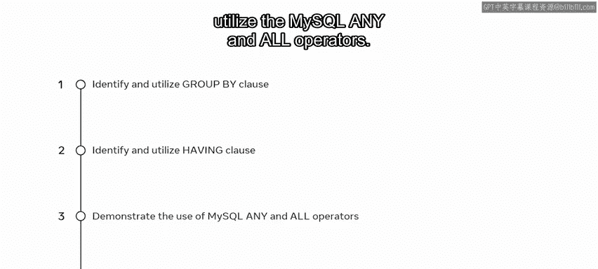

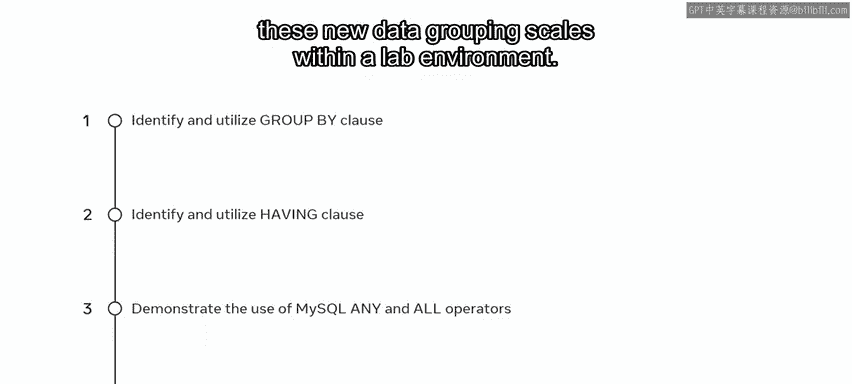

You should now be able to filter data， join tables and group data in a database using MySQL Great work I look forward to guiding you through the next module in which you'll discover how to update databases and work with views。

