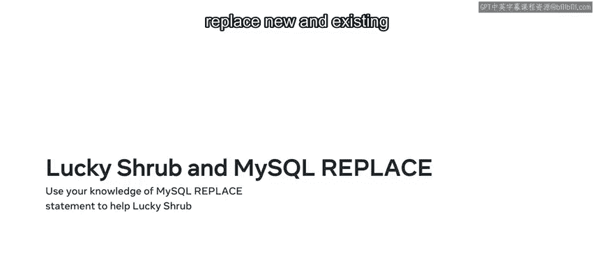
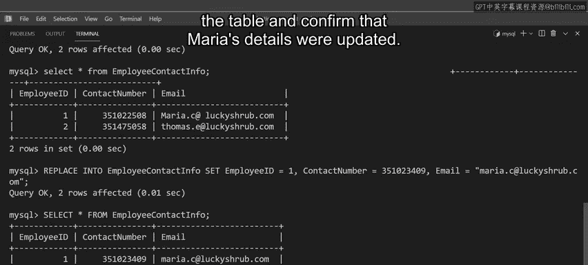

# 数据库工程师：P91：MySQL REPLACE语句详解 🛠️

在本节课中，我们将要学习MySQL中的`REPLACE`语句。这是一种用于插入或更新表中数据的强大命令，尤其适用于需要替换现有记录的场景。我们将通过一个园艺中心的案例，了解其工作原理、语法以及具体应用。

## 概述 📋

`REPLACE`命令用于向表中插入新数据或更新现有数据。与标准的`INSERT`和`UPDATE`命令不同，`REPLACE`会首先检查是否存在重复的主键或唯一键。如果找到重复项，它会先删除现有记录，然后用新数据替换它。

上一节我们介绍了数据操作的基本概念，本节中我们来看看`REPLACE`这个特殊的命令如何工作。

## REPLACE命令的工作原理 ⚙️

`REPLACE`命令首先通过检查现有记录的主键或唯一键，来判断新数据记录是否已存在于表中。

*   如果**没有**匹配的键，则`REPLACE`会像普通的`INSERT`语句一样，直接添加新数据。
*   如果**找到**匹配的键，则该命令会删除现有记录，并用新记录替换它。

这个过程可以确保数据的唯一性，同时简化了“插入或更新”的操作逻辑。

## REPLACE命令的语法 📝

为了更好地理解`REPLACE`命令，我们先快速回顾一下`INSERT`命令的语法。它们的相似性将帮助你更快掌握`REPLACE`。

以下是`INSERT`命令的基本语法：
```sql
INSERT INTO table_name (column1, column2, ...)
VALUES (value1, value2, ...);
```

`REPLACE`命令的工作方式非常相似。你需要写出表名、列名和值，唯一的区别是语句必须以`REPLACE`命令开头。

`REPLACE`命令有两种主要语法形式。



**第一种语法（类似INSERT）**：
```sql
REPLACE INTO table_name (column1, column2, ...)
VALUES (value1, value2, ...);
```

**第二种语法（使用SET关键字）**：
```sql
REPLACE INTO table_name
SET column1 = value1, column2 = value2, ...;
```
`SET`子句为选定的列赋值。如果不使用`WHERE`子句指定条件，它会定位所需的数据记录，然后用新的值集进行替换。如果在`SET`子句中未指定某列的值，则`REPLACE`命令会使用默认值或将值设置为`NULL`。

## 实战演练：为Lucky Shrub更新员工联系信息 🌿

现在你已经熟悉了`REPLACE`命令的工作原理，让我们花点时间看看如何帮助Lucky Shrub在其数据库中插入和替换新旧员工记录。

Lucky Shrub的员工联系记录存储在`employees_contact_info`表中。该表包含三列：作为主键的`EmployeeID`、`ContactNumber`和`EmailAddress`。

### 任务1：插入新员工记录

你需要为新员工Shamus Hogan插入一条新数据记录，详细信息如下：`ID`为1，以及联系电话和电子邮件地址。

你可以使用标准的`INSERT`命令添加此数据：
```sql
INSERT INTO employees_contact_info (EmployeeID, ContactNumber, EmailAddress)
VALUES (1, ‘123-456-7890‘, ‘shamus@example.com‘);
```
执行此查询后，新员工记录被添加到表中。

对于员工Thomas Erickson，你可以使用`REPLACE`命令完成相同的操作：
```sql
REPLACE INTO employees_contact_info (EmployeeID, ContactNumber, EmailAddress)
VALUES (2, ‘987-654-3210‘, ‘thomas@example.com‘);
```
执行查询后，使用`SELECT`语句检查表记录，可以看到Thomas和Shamus的联系详情都已存在。

### 任务2：替换离职员工记录

假设Shamus决定离开Lucky Shrub，你需要将他的详细信息替换为新员工Maria Carter的详细信息。

如果你尝试使用`INSERT`命令更新表，并给Maria分配`ID`为1，系统会返回一个“重复条目”的错误。这是因为`ID` 1作为主键值已经分配给了Shamus，而主键在表的每一行中都必须具有唯一值。

那么，如何用Maria的记录替换Shamus的记录呢？只需再次键入语句，但这次使用`REPLACE`命令而不是`INSERT`：
```sql
REPLACE INTO employees_contact_info (EmployeeID, ContactNumber, EmailAddress)
VALUES (1, ‘555-123-4567‘, ‘maria@example.com‘);
```
MySQL接受了该语句且没有报错。查询表后确认，记录已成功替换。

### 任务3：更新现有员工信息

Maria最近更改了她的联系电话，该号码也需要在表中更新。你可以使用`REPLACE`命令的`SET`语法来更新这条数据记录：
```sql
REPLACE INTO employees_contact_info
SET EmployeeID = 1, ContactNumber = ‘555-999-8888‘, EmailAddress = ‘maria@example.com‘;
```
**注意**：必须为所有列设置值，否则它们将被设置为`NULL`或默认值。

执行查询后，再次使用`SELECT`语句检查表，可以确认Maria的详细信息已更新。

## 总结 🎯



本节课中我们一起学习了MySQL的`REPLACE`语句。我们了解到，`REPLACE`是一种结合了插入和更新功能的命令，它通过检查主键或唯一键来决定是新增记录还是替换已有记录。我们通过Lucky Shrub的案例，实践了如何使用`REPLACE INTO ... VALUES ...`和`REPLACE INTO ... SET ...`两种语法来插入新数据、替换旧数据以及更新现有信息。掌握`REPLACE`命令能让你更高效地处理需要维护数据唯一性的场景。