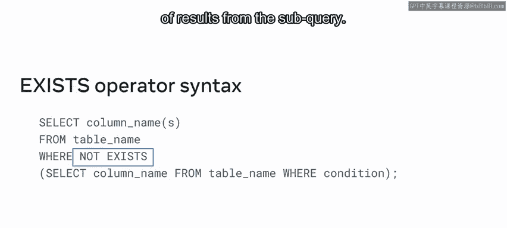
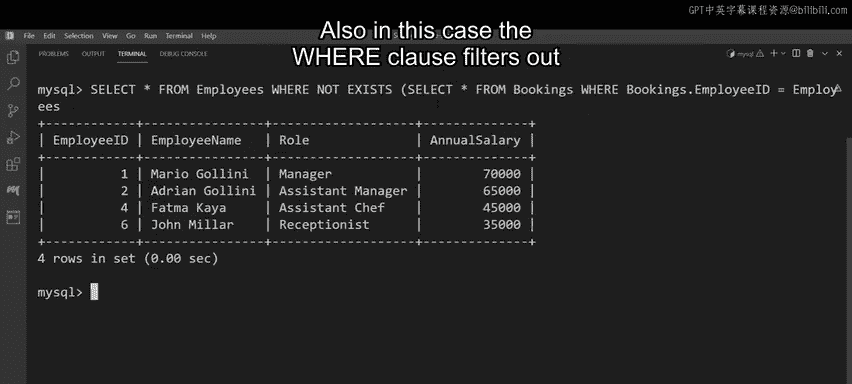

# Meta《数据库工程师（数据库简介／Git／MySQL）｜Meta Database Engineer》中英字幕 - P97：20_子查询和复杂比较运算符.zh_en - GPT中英字幕课程资源 - BV1Vw4m1Z7tb

Little Le restaurant need to perform complex queries in their database and standard subqueries might not be enough for this task。

 so they'll need to use multiple row subqueries with complex comparison operators。

Over the next few minutes， you'll explore soap queries and complex comparison operators and learn how to。

Explain how subqueries interact with complex comparison operators and demonstrate the use of subqueries in a complex data retrieval scenario。

As you might already know， a key advantage of a subquery is that you can compare it against other values using an operator。

 however， there are more complex operators that can be used with multiple row subqueries。

The any operator returns data for any values that meet the specified condition。

All returns data for all values， and the Sm operator returns data for one or more matching values。

Let's look at how to write multiple row sub queries using the all， any and SoM operators。

These comparison operators let you perform a comparison between a single common value and a range of other values。

They result in multiple records or target multiple values within a table。

Sbqueries can also be used with the exists and not exist operators。

The Ex operator tests for the existence of rows in the results set returned by the silk query。

It returns true if the sub queryry returns one or more records。On the other hand。

 the notex operator checks for the nonexistence or absence of results from the Sub query。Nod exists。

 returns true when the sub query does not return any row of results。

Let's review the syntax for the exists and not exist operators。

The syntax is very similar to a standard soap query。

The key difference is that the exists operator is placed after the wear clause to determine the existence of the value specified in the sub query。

Or you can use the not exists operator to check for the nonexistence or absence of results from the So query。

Let's look at a demonstration of how subqueries are used with these operators。

The little Lemon restaurant need to identify all employees earning an annual salary that's less than or equal to the annual salary earned by all employees in the following roles。

Manager， assistant manager， head chef and head waiter。

The data required to complete this query is in the employee's table。

The table has four columns as follows， employee ID， employee name， role and annual salary。

You can extract the data required from this table using two queries。

An outer query to identify all employees who are earning an annual salary that's less than or equal to the specified values。

 and a So query that extracts the data of annual salaries earned by employees who were in the roles specified earlier。

Let's begin with the Outer query。It starts with a select command and then asterisk。

Then add a from clause that targets the employee's table。Next。

 write aware clause followed by the annual salary column name。Finally。

 write a less than or equal to operator。Now you must write the sub queryry within parenthses。

Write a select command to select the annual salary column。

Then a from clause to target the employee's table。Next。

 write aware clause followed by a condition that extracts data from the row column。Finally。

 in parenthses， write the required roles， manager， assistant manager， head chef， and head waiter。

These queries must return a result that lists all employees earning an annual salary that's less than or equal to the annual salary earned by all employees in the roles specified。

So to ensure that you get the desired result， place the all operator after the less than or equal to comparison operator。

 but before the subquery。Then execute the query to return the output。

The sub query executes first and identifies the salaries of the manager， assistant manager。

 head chef， and head weighter roles。These salaries are the values that the Outer query uses。

 the values are 70，000， 65，000， 50，000 and 40，000。So the outer query filters out the employees who earn an annual salary less than or equal to all these values。

The final output shows that the employees with IDs of five and6 earn an annual salary less than or equal to the other roles。

On the other hand， the any operator compares the results of the Sub query to determine whether it can exclude records from the outer query that satisfy the conditions for any of the values returned by the sub query。

Little Lemon's next task is to identify employees earning an annual salary that's greater than or equal to the annual salary earned by any employee in the four roles specified earlier。

 you can use the same query as before， but remember that this time you're checking for values that are greater than or equal to those in the soap query。

So change the comparison operator in the where condition of the outer query to a greater than or equal2 operator。

Now， just before the sub query， replace the all operator with the any operator。Finally。

 press Enter to execute the query。The output shows that there are five employees who earn a salary greater than or equal to the other roles。

For their final query， little Lemon need to determine if their head。

 chef and waiter are assigned to a booking。They can do this using the exists or not exist operators。

The query involves two actions。In the first action。

 the outer query extracts details of employees and in the second action。

 the sub query determines if the head chef or head waiter have been assigned to a booking。

The required data is held in the bookings table。This table has six columns as follows。Booking ID。

 table number， first name of guest， last name of guest， a column for each booking slot or time。

 and a column that shows the ID of the employee assigned to the booking。

Begin by writing the outer query as follows， select asterisk fromEmployee。Then add a wear clause。

The sub query must determine if there are any employees in the role of head chef or head waiter assigned to a booking。

So add the Ex operator after the wear clauses。Then write the soap query in parenthses as follows。

A select command and an asterisk。A f clause targeting the bookings table。A warehouse clauses。

And a condition， the must term results for the required employees if they're assigned to a booking。

Press enterter to execute the query and generate the output。

So the exists operator has checked for the existence of the specified results in the So query。

And that is found that these results exist， therefore， the operator result is true。

The result is that the outer query filters out the details of the two employees who are assigned to these three bookings。

Now， let's replace exists with the not exists operator to see what results are returned。

The output returns the same three records as before； however。

 the notex operator checks for the nonexistence of results from the sub query。Also in this case。

 the WarE clause filters out employees that do not exist in the results obtained by the S query。

This returns results of four employees that don't exist in the Sques results； In other words。

 this is the data for employees who don't meet the subque's criteria and aren't identified in the results。

You should now be able to explain how subqueries interact with comparison operators and demonstrate the use of subqueries in a complex data retrieval scenario well done。

