# 入门 4：3_什么是数据库 📚

在本节课中，我们将要学习数据库的基本概念。我们将探讨什么是数据，什么是数据库，并了解数据在数据库中是如何被组织和存储的。课程结束时，你将能够在概念层面描述数据库，识别现实世界中数据库的应用实例，并理解数据在数据库中的组织方式。

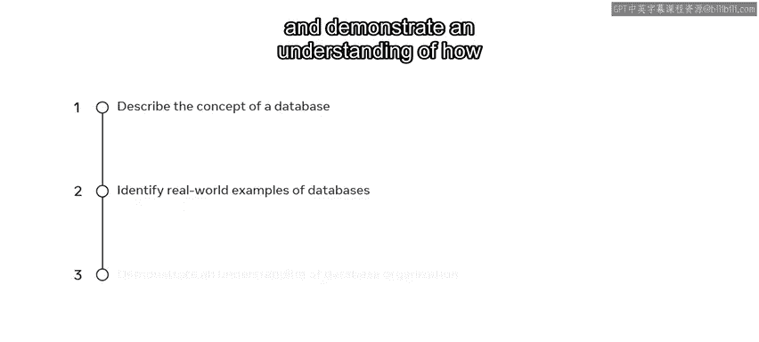

## 什么是数据？🔍

我们日常的在线生活都离不开数据和数据库。例如，在社交媒体上发布照片、在工作中下载文件、在线玩游戏，这些都是使用数据库的例子。

那么，数据究竟是什么？简单来说，数据是关于任何事物的**事实和数字**。例如，如果收集一个人的数据，那么这些数据可能包括其姓名、年龄、电子邮件和出生日期。

或者，数据也可以是与在线购物相关的事实和数字。这可能包括订单号、商品描述、订单数量、日期，甚至是客户的电子邮件。

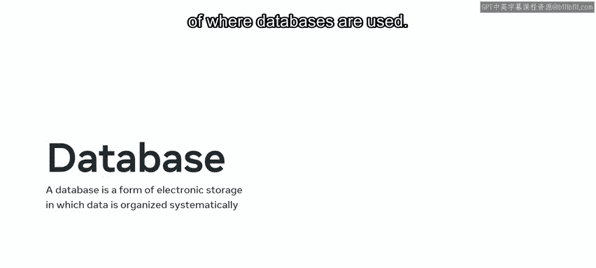

数据对个人和组织都至关重要。但这些数据都存储在哪里呢？

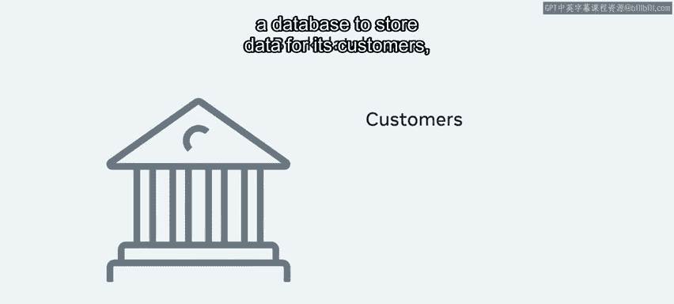

## 什么是数据库？🗄️

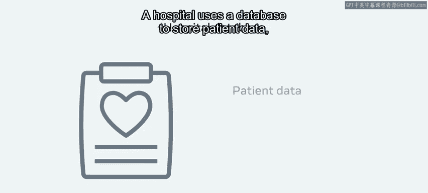

在我们的数字世界中，数据不再存储在纸质文件中。相反，开发者使用一种叫做**数据库**的东西。数据库是一种电子存储形式，数据在其中被**系统化地组织**。它以电子方式存储和操作数据，使其更易于管理、更高效、更安全。

现实世界中有许多使用数据库的例子。例如，银行可以使用数据库来存储客户数据、银行账户和交易记录；医院使用数据库来存储患者数据、员工数据、实验室数据等等。

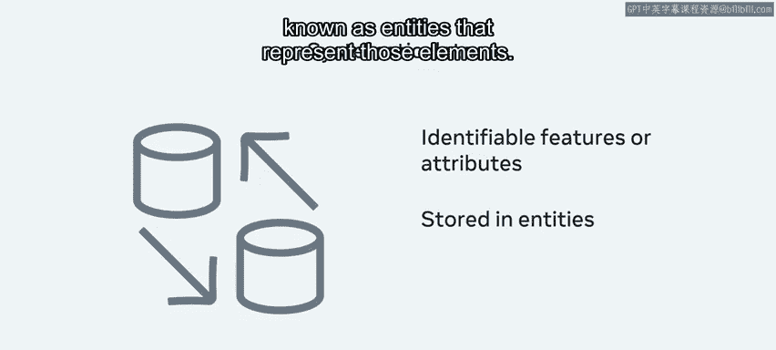

## 数据库的组织形式 📊

你可能会问，数据库到底是什么样子的？数据库看起来像是**系统化组织的数据**，这种组织通常类似于电子表格或表格。

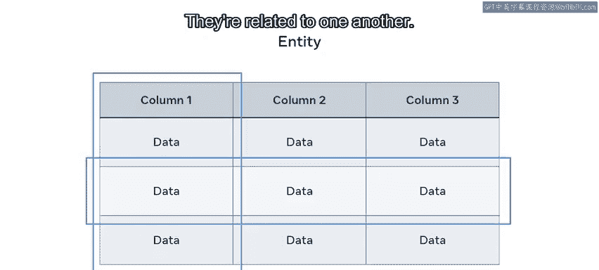

“系统化”具体是什么意思？所有数据都包含可以被识别的**元素、特征或属性**。例如，一个人可以通过年龄、身高或发色等属性来识别。这些数据被分离并存储在代表这些元素的**实体**中。

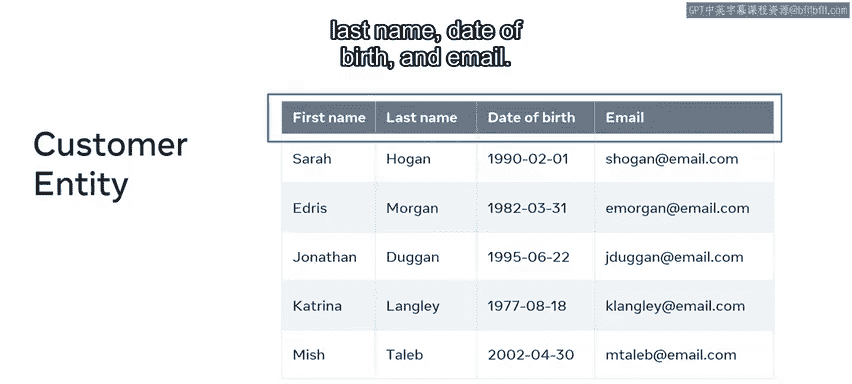

正如你刚刚学到的，一个**实体**就像一张**表格**。它包含行和列，用于存储与特定元素相关的数据。换句话说，这些是**关系型元素**，它们彼此关联。这些实体可以是物理的，如员工、客户或产品；也可以是概念性的，如订单、发票或报价单。

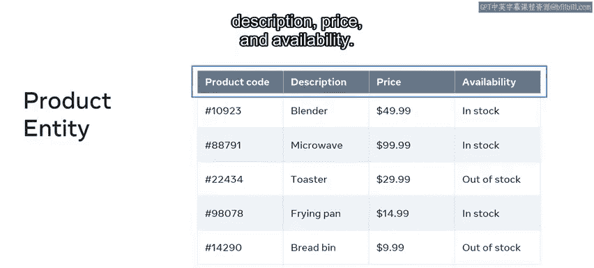

实体随后以类似表格的格式，根据与元素相关的**属性**来存储数据。例如，一个在线商店可以在一个“客户”实体中保存客户数据，该实体包含与客户相关的特定属性。这些属性可以包括名字、姓氏、出生日期和电子邮件。

同样，产品数据可以存储在一个“产品”实体中，其属性包括产品代码、描述、价格和库存状态。

## 关系型数据库的核心概念 🔗

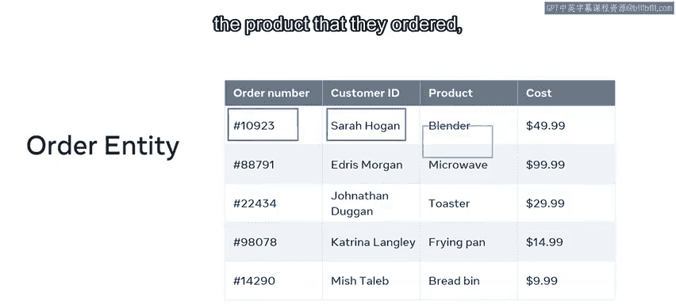

在关系型数据库的世界里，这些实体被称为**关系**或**表**。属性成为表的**列**，而表的每一行代表该实体的一个**实例**。

让我们以刚才探讨的在线商店例子中的实体为例。这两个例子可以合并成商店从客户那里收到的订单列表。在数据库中，这些数据可以呈现为一个“订单”表或实体。数据可以被组织成行，每行包含一个唯一的订单号、下订单的客户姓名、他们订购的产品以及该产品的价格。

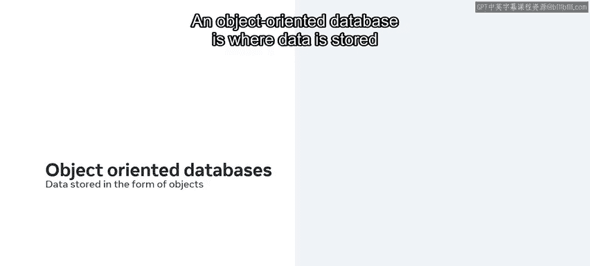

## 其他类型的数据库 🌐

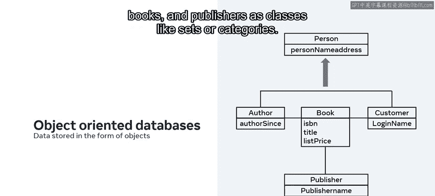

在数据库中组织数据的方式有很多种。关系型数据库并不是你作为数据库工程师会遇到的唯一一种数据库类型，你将接触到许多不同类型的数据库。

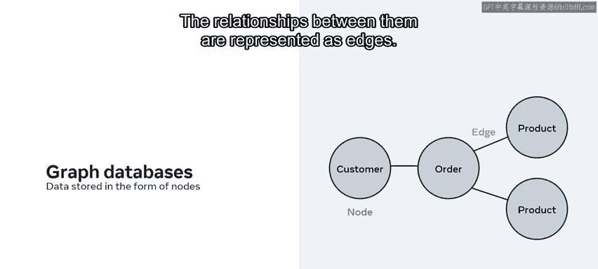

以下是其他几种常见数据库类型的例子：

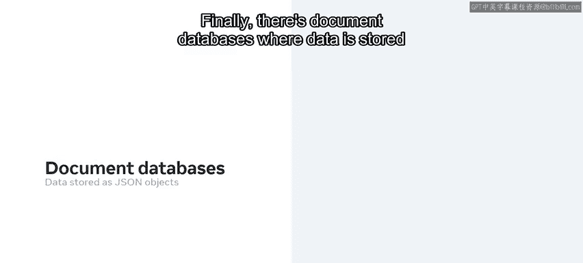

*   **面向对象数据库**：在这种数据库中，数据以**对象**的形式存储，而不是表格或关系。例如，一个在线书店的数据库可以将作者、客户、书籍和出版商呈现为**类**（类似于集合或类别）。这些类的**对象**或**实例**则保存实际的数据。
*   **图数据库**：这种数据库以**节点**的形式存储数据。在这种情况下，像客户、订单和产品这样的实体被表示为节点。它们之间的**关系**则被表示为**边**。
*   **文档数据库**：这种数据库将数据存储为 **JSON**（JavaScript对象表示法）对象。数据被组织成类似于表的**集合**。在每个集合中，是用JSON编写的记录数据的**文档**。例如，客户文档保存在“客户”集合中，而订单和产品文档则分别存储在“订单”和“产品”集合中。

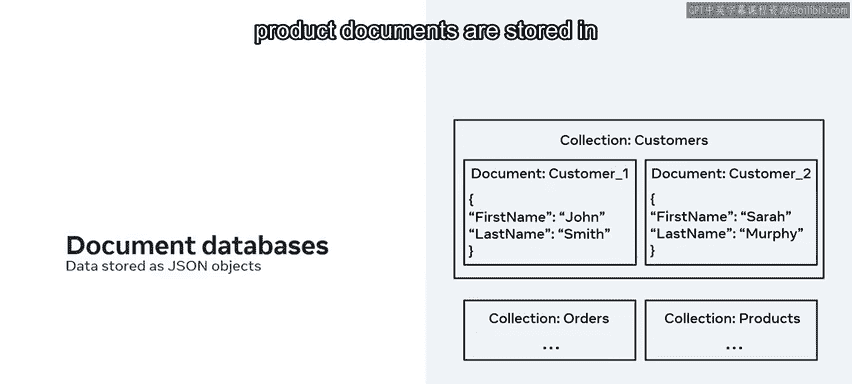

## 数据库的存储位置 ☁️

那么数据库本身存储在哪里呢？数据库可以托管在组织内部的专用机器上，也可以托管在**云端**。目前，**云数据库**是更受欢迎的选择。这是因为它们允许你通过云平台存储、管理和检索数据，并通过互联网访问数据，同时为数据管理等提供了成本更低的选项。

## 总结 📝

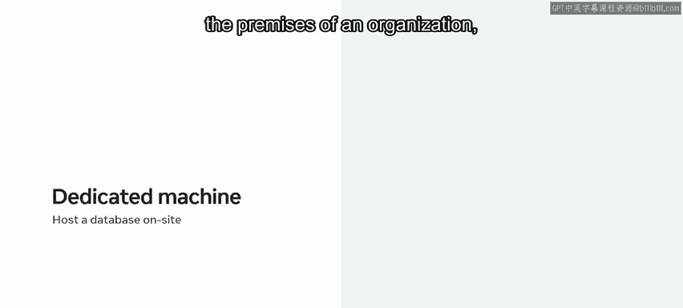

本节课中，我们一起学习了数据库的基础知识。我们首先定义了**数据**是事实和数字，然后介绍了**数据库**作为系统化组织数据的电子存储系统。我们深入探讨了数据在关系型数据库中的组织形式，包括**实体**、**表**、**行**和**列**。此外，我们还简要了解了其他类型的数据库，如面向对象数据库、图数据库和文档数据库。最后，我们讨论了数据库可以存储在本地或云端。现在，你应该对数据库的概念有了基本的理解，能够识别数据库的应用实例，并说明数据在数据库中的组织方式了。这是一个很好的开始，很快你就能自己存储和管理数据了。