# 入门 6：替代类型的数据库 🗄️

在本节课中，我们将要学习“大数据”和“云数据库”等术语的含义，识别不同类型的数据库，并解释数据库是如何响应大数据等新趋势而演变的。

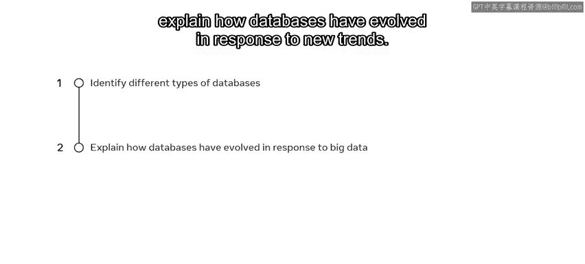

***

数据库已经存在很长时间，并受到许多不同趋势的影响，但在近几十年里，它们经历了巨大的变化。得益于互联网的发展，数据库现在必须能够存储不断增长的非结构化数据。然而，这带来了困难，因为它们主要存储结构化数据。让我们简要了解一些不同类型的数据库，以及它们是如何受到这一趋势影响的。

***

### 关系型数据库的局限性与NoSQL的兴起

关系型数据库在存储数据方面存在局限性，因为它们主要存储结构化数据。然而，现在数据库需要存储越来越多的非结构化数据。

因此，近年来的趋势是转而依赖 **NoSQL数据库**。

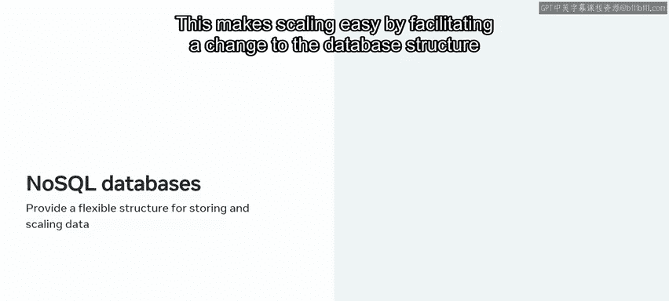

NoSQL数据库是一种以多种不同格式存储数据的数据库类型。本质上，它们为数据库提供了**灵活的结构**。这使得扩展变得容易，因为它便于更改数据库结构本身，而无需复杂的数据模型。

NoSQL数据库被社交媒体平台、物联网、人工智能以及其他生成海量非结构化数据的应用程序所使用。

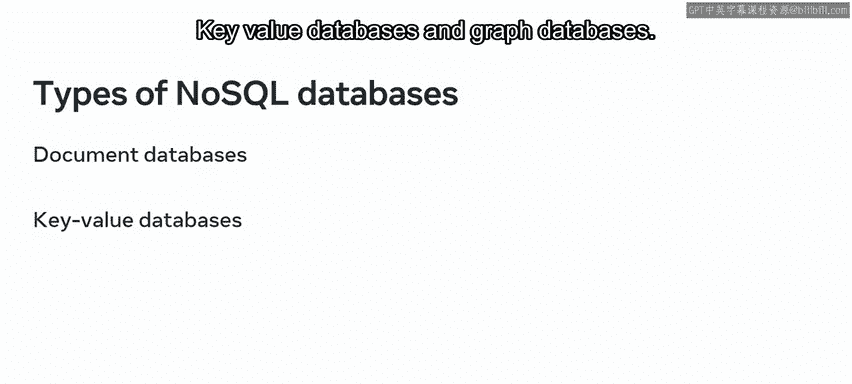

以下是NoSQL数据库的主要类型：
*   **文档数据库**
*   **键值数据库**
*   **图数据库**

***

### 深入大数据与云数据库

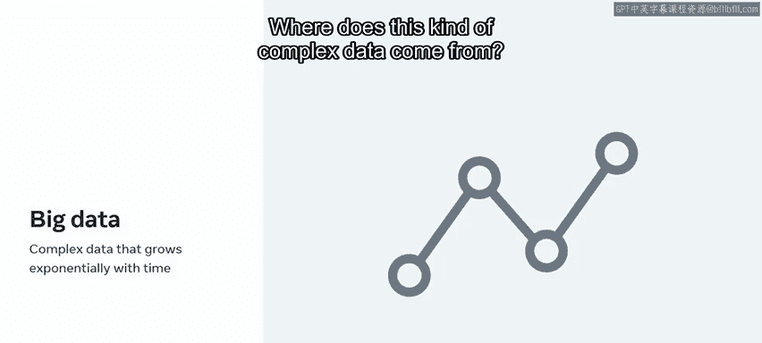

现在您已经熟悉了不同类型的数据库，让我们更深入地看看大数据和云数据库。本质上，这些术语用于描述我们在处理数据和数据库方法上的近期变化。

让我们从大数据开始。

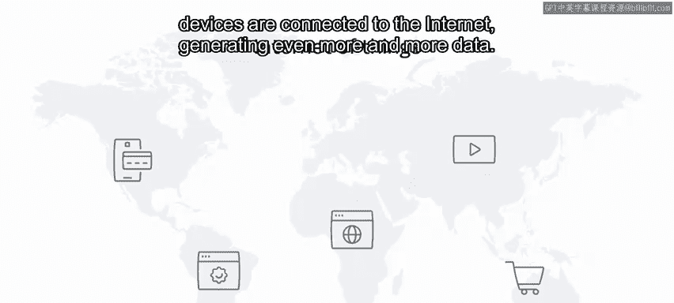

**大数据**是可能随时间推移而体积增长的复杂数据。换句话说，是可能随时间呈指数级增长的数据。但这种复杂的数据从何而来？

社交媒体平台、在线购物网站和其他服务每时每刻都在生成海量数据，因为它们捕捉着全球数十亿用户的行为。随着物联网（IoT）的发展，越来越多的设备连接到互联网，生成的数据也越来越多。

这就是复杂数据或大数据的产生方式。

所有这些数据都是高度非结构化或半结构化的。传统的数据库系统可以使用表、记录和关系来处理结构化数据，但大数据是一个全新的挑战。大数据是从许多不同来源收集的结构化、半结构化和非结构化数据的组合，它为数据增添了更多力量，因为它可以解决传统结构化数据无法处理的复杂业务问题。

最后，大数据有助于提供独特的见解，从而帮助改善决策。因此，它在许多行业都受到高度重视。

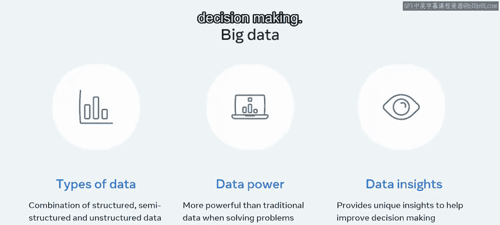

以下是几个行业应用大数据的例子：

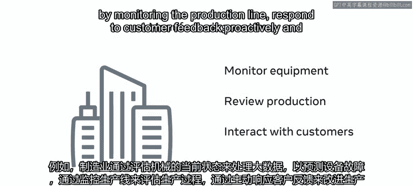

*   **制造业**：处理大数据以预测设备故障、评估生产过程、主动响应客户反馈以及通过监控当前销售来预测未来需求。
*   **零售业**：处理大数据以预测客户需求、改善客户体验、分析客户行为和消费模式，并识别定价改进机会。
*   **电信业**：利用大数据分析和网络使用分析来规划基础设施投资、设计满足客户需求的新服务、分析服务质量数据以预测客户满意度，并规划客户保留机制。

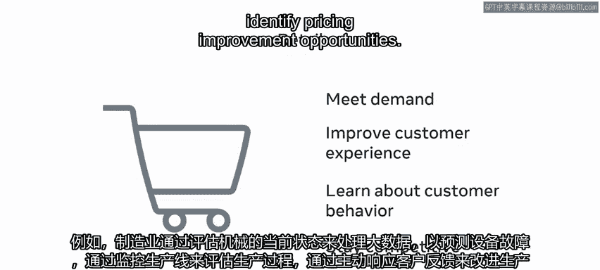

***

### 云数据库与商业智能

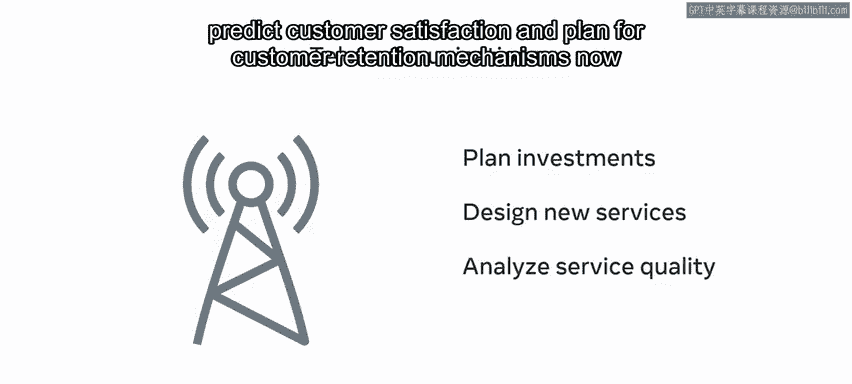

现在您已经熟悉了大数据及其如何助力业务，让我们转向数据库的另一个趋势：**云数据库**的使用。

组织正在向云端迁移，以摆脱处理物理服务器基础设施（如维护和存储成本）的困难。

云存储服务的一些例子包括Dropbox和iCloud。通过这些云存储服务，可以将文档和其他数据存储在云端，这是一个更经济实惠的解决方案。

数据库的另一个趋势是**商业智能**。传统上，数据库只是存储数据的手段。但现在，组织利用与商业智能相关的技术和策略来处理他们的数据。

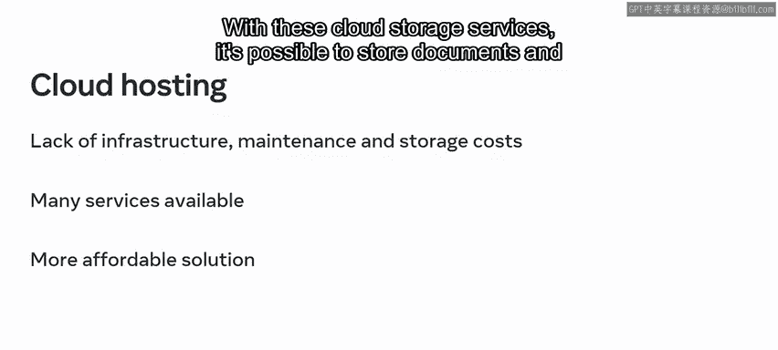

通过这些技术，组织可以分析其数据并提取有价值的信息，以帮助他们做出明智的业务决策。

***

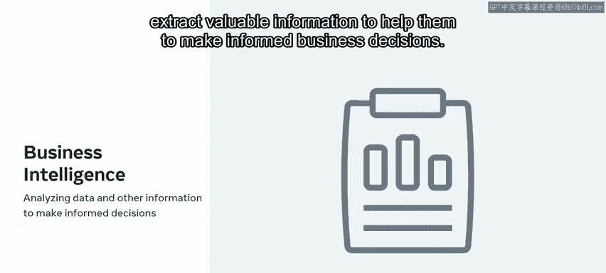

数据库技术中不断涌现新的趋势，并且会随着时间的推移而持续进步。目前，以上是您应该了解的几种主要趋势。

在本节课中，我们一起学习了NoSQL数据库、大数据、云数据库和商业智能等关键概念，了解了它们如何应对数据存储和处理的新挑战，并在不同行业中发挥重要作用。